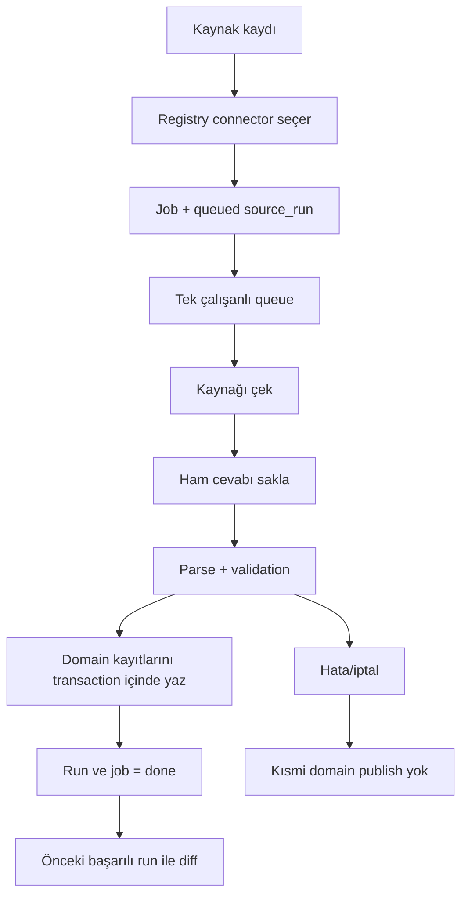

# 30A Studio — Master Devir / Çalışma Mantığı

> **Bu dosya projenin ana devir-teslim belgesidir.**
>
> Yeni bir geliştirici veya yapay zekâ projeye devam etmeden önce önce bu dosyayı, sonra `docs/DEVIR/` altındaki belgeleri okumalıdır. Domain belgeleri (`M2`–`M10`) ayrıntılı teknik kayıt niteliğindedir. Kod ile belge çelişirse gerçek kod ve güncel veritabanı davranışı incelenmeli, ardından bu belge aynı geliştirme turunda güncellenmelidir.
>
> Bu paket 3 Ekim 2026 itibarıyla `bemonths/tatilya` reposunun durumu esas alınarak hazırlanmış, en son 9–10 Ekim 2026'da GÖREV-10 (v0.12.0 yayını, aylık konaklama pencereleri, güncelleme zamanı göstergesi, OpenStreetMap günlük ihtiyaç ölçüleri, restoran fiyat seviyesi gözden geçirmesi, tarayıcının yalnız engelde kullanılması) ile güncellenmiştir.

## 1. Bir bakışta mevcut durum

| Alan | Güncel durum |
|---|---|
| Repo | `bemonths/tatilya` |
| Yerel çalışma klasörü | `C:\Users\1\Documents\Codex\2026-09-29\referenced-chatgpt-conversation-this-is-an\outputs\30a-studio` |
| Başlatma | `baslat.bat` |
| Stable branch | `main` @ `9adc235661700dbe0f0bf117fa532f86149a79c1` (GÖREV-11: kanıt paketi, günlük ihtiyaçta resmî acil sağlık ve büyük süpermarket ayrımı, referans tablosu genişlemesi ve trafik; 10 Ekim 2026'da GÖREV-12 Adım 1 ile fast-forward) |
| Stable tag | `v0.14.0` → `9adc235` — **v0.14.0 — kanıt paketi, büyük süpermarket ayrımı, resmî acil sağlık noktaları ve izleyici sorularından gelen referanslar** (önceki: `v0.13.0` → `4187c1c`, `v0.12.0` → `fdd59f6`, `v0.11.0` → `9f2d65a`, `v0.10.0` → `1f4e80b`, `v0.9.0` → `7110f88`, `v0.8.0` → `de6685f`, `v0.7.0` → `7f25e3c`, `v0.6.0` → `a938367`) |
| Stable uygulama sürümü / şema | `0.14.0` / `14` (main ve `v0.14.0`) |
| Aktif geliştirme dalı | `gorev-12-yazar-ozeti` — kanıt paketinden yazar özeti (aynı üretimden kısa Türkçe Markdown: tablolar, her tablo satırının K kimlik aralığı, blok başına bir kez kullanım notu, kaynak listesi), sayı listesi ayrı CSV ve yalnız yapılandırılmış alanlardan (ad, adres, yol numarası gürültüsü yok), şablonlarda oynak konular ve "Yayından önce kontrol edilecek satırlar", yönetici kararları (okul bölgesi video dili, bölge kutusu dışındaki acil servis kuralı, plaj hukuku her videodan önce) |
| Aktif dal durumu | Uygulama `0.14.0`, şema `14` (değişmedi; paket biçimi `30a-studio-kanit-paketi/2`); gerçek veri kopyasında denendi; gerçek veride "Kanıt paketi" ekranından iki paket yeniden üretildi (toplayıcı çalışmadı); main'e alınmadı; karar yöneticinin |
| Eski araştırma dalı | `v0.7-lodging-inventory` — yalnız konaklama keşif belgeleri; main'e alındı. Adı v0.7.0 sürümüyle ilgili değildir. |
| Son CI | main @ 9adc235 (38058332541) ve etiket `v0.14.0` (38058336127) başarılı; görev dalının sonucu `docs/gorevler/GOREV-12/RAPOR.md` içinde |
| Test tabanı | Görev dalında 733 Python testi + 60 frontend testi (main/v0.14.0: 716 + 59) |
| Gerçek connector'lar | Plaj erişimleri, NWS hava, restoran dizini, mahalle dizini, NCEI iklim normalleri, NDBC deniz suyu sıcaklığı, HURDAT2 kasırga geçişleri (`/2`: yalnız tropikal/subtropikal evreler); Book>Direct konaklama aramaları (main'de `bookdirect-lodging/1`, görev dalında `/2`); görev dalında ayrıca kiralama şirketi fiyatları (`agency-lodging-rates/1`) |
| Plaj–mahalle eşlemesi | Ayrı, gözden geçirilebilir katman `studio/destinations/thirty_a_beach_neighborhoods.csv`. v0.7.0'da v1, v0.8.0/main'de v3 (9 resmî rehber + 6 ilçe alt bölüm + 16 ilçe alt bölüm (bitişik) + 13 komşu erişimlerle tutarlı + 9 program türetimi; kilitli) |
| Gerçek veritabanı | 10 Ekim 2026'da (GÖREV-11) tam yedekten (`work/yedek/20261010-1548/`) sonra normal kullanımla şema 14'e yükseltildi (uygulamanın kendi yedeği `data/backups/studio-v13-*`); günlük ihtiyaç toplayıcısı çalıştı (ilk denemede Overpass sunucu hatası, ikincide tamam), referans tablosu yüklendi, iki kanıt paketi üretildi (`data/evidence/`). 10 Ekim 2026'da (GÖREV-12) tam yedekten (`work/yedek/20261010-1739/`) sonra uygulama gerçek veriyle açıldı ve "Kanıt paketi" ekranından iki paket (dört dosyalı) yeniden üretildi; yalnız `evidence_packs` 2 → 4, GÖREV-11 paketleri yerinde. Şema 14; main'deki 0.14.0 açar. |
| Mevcut production destinasyonu | 30A / South Walton, Florida |
| Konaklama durumu | Tarihli arama anlık görüntüleri, aylık pencere kuralıyla (çekim ayından sonraki 12 ayın 15'ini içeren hafta); kiralama şirketlerinin kendi sitelerinden fiyat (24 şirket): 10 Ekim 2026 aylık çekiminde 1.131 ilan şirket sitesinde bulundu, 1.080 ilana en az bir ayda fiyat alındı; Alys Beach'in kendi envanterinden 73 ev (hepsi fiyatlı); 12/13 mahallede Book>Direct ilanlarıyla fiyat. Ayrıntı `docs/M10-KONAKLAMA-PROFILI.md`, `docs/M11-KONAKLAMA-FIYATLARI.md` |
| Restoran bilgileri | Görev dalında işletmelerin kendi sitelerinden: 138 restoranın 113'ünde site çalışıyor; 66 restoranda fiyat seviyesi (GÖREV-09'da 33), seviyesi olmayan her restoranın tek satırlık nedeni; 91 restoranda saat, 94'ünde menü, 46'sında rezervasyon bilgisi. Günlük ihtiyaç (GÖREV-11 çekimi): OpenStreetMap'ten 42 nokta + zincirin sitesinden 1 + kurumların sitelerinden 4; acil servis ve acil bakım yalnız resmî kaynaklı. Ayrıntı `docs/M12-RESTORAN-BILGILERI.md`, `docs/M13-GUNLUK-IHTIYAC.md` |

## 2. Projenin amacı

30A Studio yalnız bir scraper veya veri tabanı değildir. Uzun vadeli amaç, **30A / South Walton gibi mikro-destinasyonlar için güvenilir veri toplayan ve bu veriyi YouTube içerik üretim zincirine kanıt katmanı olarak veren yerel bir içerik stüdyosu** oluşturmaktır.

İlk gerçek kullanım alanı İngilizce, yüz göstermeyen, yaklaşık 15–17 dakikalık YouTube videolarıdır. İçerik yaklaşımı “mekânı tanıt” değil, **gerçek bir tatil kararını çöz** yaklaşımıdır.

Örnek karar soruları:

- Hangi 30A mahallesi hangi tatil tipi için daha uygun?
- Hangi bölgede plaj erişimi daha rahat?
- Hangi tarihler hava açısından daha mantıklı?
- Hangi bölgede restoran/konaklama seçeneği daha güçlü?
- Maliyet, ulaşım, sezon, kalabalık, deniz koşulları ve hizmet çeşitliliği nasıl değişiyor?

Programdaki veri, videoda istatistik yağdırmak için değil; AI'ın ve editörün **kanıta dayalı araştırma, karşılaştırma ve senaryo üretmesi** için kullanılır.

## 3. Uzun vadeli ürün modeli

30A yalnızca ilk destinasyondur. Sistem baştan şu modelle tasarlanmıştır:

```text
Destinasyon
├─ Kaynaklar
├─ Canonical alt bölgeler
├─ Plajlar
├─ Hava
├─ Restoranlar
├─ Konaklama
├─ Etkinlikler
├─ Ulaşım
├─ Fiyat / müsaitlik snapshot'ları
├─ Araştırma / evidence pack
└─ İçerik üretimi
```

Bugün production'da yalnız `30a` vardır. Gelecekte Napa Valley, Lake Tahoe, Cape Cod vb. destinasyonlar aynı motoru kullanabilmelidir.

Bu yüzden yeni geliştirmelerde şu ayrım korunur:

> Bu davranış generic core'da mı olmalı, yoksa yalnız bu destinasyona özel connector/profile içinde mi kalmalı?

## 4. Temel veri ilkeleri

1. **Kaynağın kimliği ve otoritesi doğrulanmadan veri ana kaynak kabul edilmez.**
2. **Verinin ne anlama geldiği doğrulanmadan tabloya yanlış semantik ile yazılmaz.**
3. Eksik alan tahmin edilmez; mümkünse `NULL` bırakılır.
4. `fetched_at`, kaynağın kendi `source_updated` zamanı değildir.
5. Adres/koordinattan mahalle tahmini yalnız açıkça tasarlanmış ayrı bir eşleme katmanında yapılabilir; connector bunu sessizce yapmaz.
6. Kaynağın yayınladığı bir alan “listelenmedi” ise “yok” anlamına gelmez.
7. Stable external ID tercih edilir; isimden kimlik üretmekten kaçınılır.
8. Kısmi crawl sonucu başarılı snapshot olarak yayımlanmaz.
9. Ham cevaplar ve SHA-256 izi korunur.
10. Başarısız/iptal run önceki başarılı snapshot'ı bozmaz.
11. Dynamic search sonucu “tam inventory” diye adlandırılmaz.
12. Kaynak keşfinde öncelik: API → structured JSON → HTML → public network endpoint → gerekiyorsa bilgisayardaki gerçek tarayıcı (madde 14'teki kurulum).
13. İlk tercih API, JSON ve HTML'dir; gerekiyorsa gerçek tarayıcı kullanılır. Doğrulama istemeyen siteler kendi kimliğini söyleyen HTTP istemcisiyle okunur; bir kez doğrulama gösteren site bundan sonra yalnız tarayıcıyla okunur. (Verimlilik tercihi; 7 Ekim 2026, GÖREV-07; 8 Ekim 2026, GÖREV-09.)
14. **Bilgi toplama ilkesi** (7 Ekim 2026, GÖREV-07 yönetici kararı; GÖREV-03'te konan robots.txt kuralının yerine): Amaç, ziyaretçinin karar vermesi için gereken bilgiyi eksiksiz toplamaktır. Herkese açık yayımlanmış her bilgi alınabilir: resmî siteler, işletmelerin kendi siteleri, menüler, PDF'ler, harita ve veri servisleri. Gerekirse gerçek tarayıcıyla okunur; robots.txt ve bot doğrulaması tek başına engel sayılmaz. İstekler siteyi yormayacak hızda yapılır; her bilginin kaynağı, erişim tarihi ve ham kopyası saklanır. Giriş gerektiren hesaplara girilmez, ücretli içerik aşılmaz. Doğruluk kuralları aynen geçerlidir: kaynağın söylemediği şey yazılmaz, hesaplanan ya da türetilen değer öyle etiketlenir. Tarayıcı ve insan doğrulaması (8 Ekim 2026, GÖREV-09 Adım 1b; kullanıcı kararı): Playwright'in otomasyonla açtığı test tarayıcısı kullanılmaz. Bilgisayarda kurulu gerçek Chrome (yoksa Edge) normal bir uygulama gibi başlatılır: bütün siteler için tek kalıcı profil (`work/tarayici-profili/30a-studio`, repoya girmez) ve yalnız 127.0.0.1'e açık uzaktan hata ayıklama portu; kod tarayıcıya CDP üzerinden bağlanır (Playwright `connect_over_cdp`). Otomasyon bayrağı ve Playwright'in otomasyon açılış ayarları yoktur; kullanıcı aracısı, dil, saat dilimi ve pencere boyutu tarayıcının ve bilgisayarın kendi değerleridir. Tarayıcı zaten açıksa yeniden bağlanılır, profil ikinci kez açılmaz; profil çekimler arasında korunur. Tarayıcı yalnız bir site doğrudan isteği engellediğinde (doğrulama sayfası ya da ret) kullanılır: veri doğrudan alınabiliyorsa doğrudan alınır, yalnız JavaScript ile çizilen bir sayfa için tarayıcı açılmaz (kullanıcı kararı, 9 Ekim 2026). Doğrulama gösteren alan adı veritabanında işaretlenir (`browser_hosts`; ısınma listesi bundan çıkar). Restoran sitelerinde her çekimde önce doğrudan istek yapılır; engel çıkarsa yalnız o alan adının sayfaları tarayıcıyla okunur, aynı restoranın diğer sayfaları doğrudan kalır. Doğrudan isteği sürekli engelleyen korumalı kiralama siteleri (yapılandırmada `protected`; 9 Ekim 2026'da oversee.us ve exclusive30a.com doğrudan isteğe yine 403 doğrulama sayfası verdi) tarayıcı oturumundan okunur. Uzun bir çekimden önce bu siteler ayrı sekmelerde açılır (`python -m studio.sources.browser_verification isinma`) ve kullanıcıya sohbette tek liste halinde bildirilir; kullanıcı hepsini bir kerede doğrular, sonra çekim başlar. Çekim sırasında doğrulama çıkarsa o site sona bırakılır, diğerleri devam eder; en sonda kullanıcıya bir kez haber verilir ve 15 dakika beklenir; olmazsa site atlanır ve kayda yazılır. Doğrulamayı kullanıcı yapar; Claude Code çözmeye çalışmaz. Tarayıcının özelliklerini sahte değerlerle değiştiren gizlenme eklentileri ve parmak izi sahteciliği (stealth eklentileri, navigator özelliklerinin yamalanması, başka bir tarayıcıyı taklit etme), CAPTCHA çözme servisleri, proxy ya da IP değiştirme kullanılmaz. Uygulama içi tarayıcı bir site için izin isterse kullanıcıdan onay istenir. (Yöntem: `studio/sources/browser_verification.py`.)

Ayrıntı: `docs/DEVIR/03_VERI_KAYNAKLARI_VE_DOGRULAMA.md`.

## 5. Çalışan teknik yığın

- Python 3.12+
- FastAPI
- Uvicorn
- SQLite
- HTTPX
- HTML/CSS/Vanilla JavaScript
- Server-Sent Events
- `ThreadPoolExecutor`
- pytest
- frontend testleri için Node built-in test runner

PySide6/Qt kullanılmaz. Node tabanlı frontend build sistemi yoktur.

Yerel uygulama varsayılan olarak `http://127.0.0.1:8830` adresinde çalışır.

`baslat.bat`:
- proje klasörüne geçer,
- gerekirse `.venv` oluşturur,
- bağımlılıkları kurar,
- `python -m studio` başlatır.

Varsayılan DB: `data/studio.sqlite3`  
Ham cevaplar: `data/raw/`  
Yedekler: `data/backups/`

## 6. Multi-destination omurgası

v0.6 ile 30A sistemin kendisi olmaktan çıkarıldı ve ilk `destination` haline getirildi.

Production kaydı:

```text
id       = 30a
name     = 30A
subtitle = South Walton, Florida
```

Destination-scoped temel yapılar:
- `destinations`
- `regions`
- `sources`
- `jobs`
- `source_runs`
- `entities`
- `destination_weather_anchors`

Önemli kurallar:
- Aynı URL farklı destinasyonlarda kullanılabilir.
- Aynı bölge adı farklı destinasyonlarda kullanılabilir.
- Source başka destination'a normal edit ile taşınamaz.
- Job/run hangi destinasyon için üretildiyse provenance bunu korur.
- Diff başka destinasyondaki run ile karşılaştırmaz.
- NWS connector generic'tir.
- İklim connector'ları (`ncei-climate-normals`, `ndbc-water-temperature`, `hurdat2-storm-proximity`) generic'tir; istasyonlar, kıyı koridoru ve yarıçaplar `destination_climate_stations` ve `destination_storm_corridors` tablolarından gelir.
- South Walton Beaches, Restaurants ve Neighborhoods connector'ları 30A'ya özeldir.
- Profil varlıkları (ör. plaj–mahalle eşleme dosyası) `studio/destinations/` altında destinasyon profiliyle durur; generic çekirdeğe gömülmez.

Frontend seçimi server-global değildir. Seçim `localStorage["studio.destination_id"]` ile tutulur. Destination değişince eski async cevapların yeni ekrana yazılması engellenir.

## 7. Connector modeli

Genel connector sözleşmesi `studio/sources/base.py` içindedir.

Connector şu sorumlulukları taşır:
- `name`
- `version`
- `raw_filename`
- `method`
- `diff_enabled`
- `supports(source)`
- `collect(..., context=ConnectorContext)`
- `store_records(...)`
- `read_records(...)`
- `comparison_value(...)`

`ConnectorContext` runtime'da destination'a ait:
- destination kaydı,
- canonical regions,
- weather anchors,
- iklim istasyonları ve kasırga kıyı koridoru (şema 8)

gibi yapılandırmayı taşır. Kayıt farkı kapalı connector'lar gerekçeyi isteğe bağlı `diff_reason` alanıyla verir.

Yeni domain connector'ı mümkün olduğunca generic `source_collection → job → run → raw → atomic publish` akışını kullanmalıdır.

## 8. Job / source_run / raw artifact akışı



Önemli:
- `run.id` bugün job kimliğiyle aynıdır.
- Ham artifact SHA'sı DB katmanında gerçek dosya baytlarından hesaplanır.
- İptal edilmiş iş geç gelen sonucu publish edemez.
- Domain yazımı hata verirse transaction geri alınır.
- Başarısız/iptal run tarihsel olarak kalır.

## 9. Bugün çalışan domain'ler

### 9.1 Plaj erişimleri

Kaynak: `https://www.visitsouthwalton.com/beach-bay-access-locations/`  
Connector: `south-walton-beaches`  
Yöntem: HTML içindeki JSON  
Scope: 30A-specific

Toplanan başlıca alanlar:
- external ID
- ad
- kaynak yerleşim adı
- adres
- koordinatlar
- erişim tipi
- kaynakta listelenen olanaklar

Örnek live snapshot'larda 53 kıyı erişim kaydı görülmüştür; bu sayı sabit kabul kriteri değildir.

### 9.2 NWS hava

Source record URL: `https://www.weather.gov/`  
API: `https://api.weather.gov`  
Connector: `nws-weather`  
Scope: generic

Destination'ın `destination_weather_anchors` kayıtlarını kullanır.

30A için üç örnek nokta:
- Batı 30A
- Orta 30A
- Doğu 30A

Bunlar canonical mahalle merkezi değildir; hava örnek noktalarıdır.

Toplanır:
- NWS point/grid bilgisi
- 12 saatlik forecast dönemleri
- saatlik forecast
- aktif alerts

Rolling forecast olduğu için generic record diff kapalıdır.

### 9.3 Restoranlar

Kaynak: `https://www.visitsouthwalton.com/listings/culinary-experiences/`  
Connector: `south-walton-restaurants`  
Yöntem: HTML dizin + detay  
Scope: 30A-specific

Kapsam: 13 canonical mahalle; Miramar Beach, Seascape ve Sandestin hariç.

Alanlar:
- stable listing path identity
- ad
- açıklama nullable
- adres
- telefon
- e-posta
- website
- cuisines
- meals served
- amenities
- source neighborhood provenance

Gerçek kullanıcı snapshot'ında 138 restoran ve 141 restoran-bölge ilişkisi korunmuştur. Bunlar kaynak değişebileceği için sabit test sayısı değildir.

GÖREV-09: `south-walton-restaurants/2` posta kodu olmayan şehir satırını ayrıştırıyor ("Canopy Road Café": şehir Inlet Beach, eyalet FL).

### 9.10 Restoran bilgileri — işletmelerin kendi siteleri (`gorev-09-kapsama-restoran`, uygulama 0.12.0, şema 12)

Generic `restaurant-sites/1` toplayıcısı: girdi destinasyonun son restoran dizini çekimi; her restoranın kendi sitesi (ve yayımladığı menü/sipariş platformu sayfaları) okunur: site durumu, menüler ve kalemler (fiyat metniyle; birden fazla boyda en düşük fiyat; "market price" sayıya çevrilmez), saatler, rezervasyon, çocuk menüsü, açık hava, su kenarı, köpek; her değer kaynak url, erişim zamanı, SHA-256 ve yöntem etiketiyle. Menü bölümleri gözden geçirilmiş tabloyla sınıflanır (`studio/sources/menu_sections.csv`); ana yemek ortancası ve fiyat seviyesi ($ <15, $$ 15–25, $$$ 25–40, $$$$ ≥40; en az 5 ana yemek) okuma anında hesaplanır ve "bizim sınıflamamız" diye etiketlenir. Görüntü menüleri bir kişi okur (`studio/destinations/thirty_a_menu_readings.csv`, SHA'ya bağlı); dizinde sitesi olmayanların resmî sitesi gözden geçirilmiş dosyada (`thirty_a_restaurant_sites.csv`). Doğrulama gösteren ya da JavaScript ile menü çizen siteler gerçek Chrome ile okunur (§4 madde 14). GÖREV-09 gerçek çekimi: 952 istek, 42 dk; 112 çalışan site, 33 fiyat seviyesi. Ayrıntı: `docs/M12-RESTORAN-BILGILERI.md`.

GÖREV-10 (`gorev-10-aylik-gunluk`, uygulama 0.13.0, şema 13) — fiyat seviyesi gözden geçirmesi: seviyesi olmayan her restoran tek tek incelendi. Yeni okuma yolları: schema.org menüleri (Popmenu), Toast sipariş sayfası verisi, ohbz menü tasarımları (iki biçim), SinglePlatform menü sayfaları (gömme kodunun yüklediği `places.singleplatform.com/<yer>/menu_widget` sayfası doğrudan okunur; her menü kendi adıyla), menü platformu iframe'leri, ARIA sekmeli menüler, çerçeveli siteler. Kurallar: ekler, içecek ve çocuk kalemleri hiçbir zaman ana yemek değildir; "ADD EGG +2" gibi ek notları başlık sayılmaz; $8 altı 87 "ana yemek" tek tek gözden geçirildi (`thirty_a_menu_item_classes.csv`); tapas menüsünde "küçük tabak ortancası", prix fixe'de "sabit menü fiyatı" ayrı; kahve/tatlı/dondurma yerleri "ana yemek sunmuyor"; elle okunan menüler "elle okundu" (aynı belge ya da sayfada hâlâ görünen ad ve fiyatlarla); seviyesi olmayan her restoranın tek satırlık nedeni (`level_reason`); inceleyen kişinin `seviye_notu` kararı seviyeden önce gelir. **Tarayıcı yalnız engelde (kullanıcı kararı, 9 Ekim 2026):** her sayfa önce doğrudan istenir; yalnız doğrulama sayfası ya da ret gösteren alan adının sayfaları tarayıcıyla okunur (`RoutedPages`); JavaScript ile çizilen menü için tarayıcı açılmaz; tarayıcı okumadan önce açılır pencereyi (Escape ve pencerenin kendi "Kapat" düğmesi) kapatır. Ayrıntı: `docs/M12-RESTORAN-BILGILERI.md`, sayılar `docs/gorevler/GOREV-10/RAPOR.md`.

### 9.11 Aylık konaklama pencereleri ve güncelleme zamanı göstergesi (GÖREV-10, şema 13)

**Pencere kuralı (bizim varsayımımız):** çekim ayından sonraki 12 ayın her biri için ayın 15'ini içeren Cumartesi–Cumartesi haftası (7 gece); 21 günden yakın pencere atlanır, 13. ay eklenir. Destinasyon yapılandırmasında (`destination_lodging_sources.window_rule`), generic hesap `studio/sources/windows.py`. Book>Direct ve kiralama şirketi toplayıcıları aynı kuralı kullanır ve kuralı çekim kaydına yazar. Okuma anında: sorgudan pencereye gün, mevsim grupları (Aralık–Şubat kış …; "bizim gruplamamız") ve aynı hafta karşılaştırması (yalnız iki çekimde de fiyatlı aynı ilanlar; eşleşen ilan sayısı her zaman yazılır; etiket "aynı evlerin aynı hafta için <tarih1> ve <tarih2> tarihlerinde sorgulanan fiyatları; bizim hesabımız"). Ayrıntı: `docs/M11-KONAKLAMA-FIYATLARI.md`.

**Güncelleme zamanı göstergesi (zamanlanmış görev yok):** ana ekranda (Veri kaynakları) "Güncelleme zamanı gelenler" bölümü: her toplayıcının son başarılı çekimi, önerilen aralık (`destination_refresh_intervals`; 30A: Book>Direct ve kiralama şirketi fiyatları 1 ay, restoran dizini ve işletme siteleri 3 ay; diğerleri tanımsız), zamanı gelip gelmediği ve nedeni (hiç çekilmedi · önerilen aralık doldu · pencere kuralı son çekimden sonra değişti), tahmini süre. "Zamanı gelenleri başlat" düğmesi önce uygulamanın kendi yedeğini alır (`data/backups/toplu-*.sqlite3`, son 6), sonra zamanı gelenleri sırayla (konaklama → kiralama şirketleri; restoran dizini → işletme siteleri) normal iş akışıyla başlatır; girdisini üreten adım tamamlanmazsa sonraki adım atlanır; "Toplu çalıştırmayı durdur" ile durdurulur; uygulama kapanırken süren toplu çalıştırma "yarıda kaldı" olur (`refresh_batches`, `studio/refresh.py`). Kullanıcı düğmeyle kendisi başlatabilir; bu uygulamanın normal kullanımıdır (CLAUDE.md). Bilgisayarda zamanlanmış görev oluşturulmaz (kullanıcı kararı, 9 Ekim 2026).

### 9.12 Günlük ihtiyaç ve arabasız tatil ölçüleri (GÖREV-10, şema 13)

Generic `openstreetmap-daily-needs/1` toplayıcısı: destinasyonun bölge kutusu ve kategorileri için OpenStreetMap'e (Overpass API) çekim başına tek küçük sorgu (süpermarket ve market, küçük market, eczane, acil sağlık, bisiklet kiralama); ham yanıt SHA-256'sıyla. Süpermarketler zincirlerin kendi mağaza bulucularıyla elle karşılaştırılır (`thirty_a_chain_stores.csv`); OpenStreetMap'te olmayan açık mağaza "zincirin kendi sitesi" kaynağıyla eklenir. Okuma anında: son konaklama çekimindeki her ilandan her kategorinin ve ilçenin halka açık plaj erişimlerinin en yakınına **kuş uçuşu** uzaklık; mahalle başına ortanca ve 1 mil içindeki ilan payı; mahalle başına restoran sayısı dizinden. Atıf: "© OpenStreetMap katkıcıları, ODbL". Mahalleler sekmesinde tablo ve nokta listesi. Video dili: "OpenStreetMap'e göre, kuş uçuşu"; "yürüme mesafesi" denmez. Ayrıntı: `docs/M13-GUNLUK-IHTIYAC.md`.

GÖREV-11 (`gorev-11-kanit-paketi`, şema 14): "süpermarket ve market" kategorisi **büyük süpermarket** (destinasyon yapılandırmasındaki zincir listesi: Publix, Walmart, Winn-Dixie, Aldi, Target, The Fresh Market, Whole Foods, Trader Joe's; bütün kelimeyle eşleme) ve **yerel ve gurme market** diye; "acil sağlık" **acil servis** ve **acil bakım** diye ayrıldı. Acil servis ve acil bakım yalnız resmî kaynakla doğrulanan noktaları sayar: hastane sistemlerinin ve acil bakım zincirlerinin kendi konum sayfaları gözden geçirilmiş dosyaya yazılır (`thirty_a_health_points.csv`; kaynak etiketi "kurumun kendi sitesi", adres, koordinat ve koordinatın kaynağı); doğrulanamayan OpenStreetMap noktası ölçüye girmez ve raporlanır. Eczane zincirleri (CVS, Walgreens) kontrol edildi; CVS, HCA Florida, Publix, Winn-Dixie ve The Fresh Market bu bilgisayardan okunamadı. Ayrıntı: `docs/M13-GUNLUK-IHTIYAC.md`.

### 9.13 Kanıt paketi (GÖREV-11, şema 14)

Genel çekirdek `studio/evidence/` (şablon okuma, veri blokları, paket, saklama); şablonlar destinasyon tarafında dosya (`studio/destinations/thirty_a_evidence/*.json`). Bir şablon: başlık, ana soru, boyutlar (bölge × karar × dönem × gezgin tipi), parametreler (mahalle) ve her biri bir soru ve veri bloklarından oluşan bölümler. Bloklar her kaynağın son başarılı çekimini ya da profil dosyasını okur; her kanıt satırı Türkçe ifade, ABD birimleriyle değer (°F yanında °C), kapsam, kaynak (çekim kimliği ya da belge SHA-256'sı), etiket (kaynak gerçeği, bizim hesabımız, türetilmiş, yaklaşık), örneklem, M belgesinden kullanım notu ve varsa İngilizce kısa alıntı taşır; eksik veri "veri yok" satırı olur. Başlıkta kaynakların son çekimi ve veriden hesaplanan bilinen boşluklar, sonda sayı kontrol listesi. Çıktı Markdown + JSON, uygulamanın normal kullanımıyla `data/evidence/` altında tarihli ve SHA-256'lı (`evidence_packs`). 30A şablonları: `ilk-video` ve `mahalle-rehberi`. Ayrıntı: `docs/M14-KANIT-PAKETI.md`.

### 9.13a Yazar özeti, ayrı sayı listesi ve oynak konular (GÖREV-12)

Aynı üretimden iki dosya daha: **yazar özeti** (`<paket>-yazar-ozeti.md`; `studio/evidence/summary.py`, paket nesnesinden yazılır, veritabanına sorgu yapmaz; Türkçe, ABD birimleriyle; sayı serileri tablo, her tablo satırı K kimlik aralığıyla biter; her bloğun kullanım notu bir kez ve aynen; diğer satırlar tek satır; adres, SHA-256, alıntı ve İngilizce ifade yok; sonda kaynak listesi) ve **sayı listesi** (`<paket>-sayilar.csv`: `kanit, tur, deger, birim, etiket`). Liste yalnız yapılandırılmış alanlardan gelir (değer ve `ek_degerler`: çeyrekler, örneklem, pay, aralık, dönüşüm); ifade metni taranmaz, bu yüzden "30A"daki 30, yol kimliği, adres ve karar numarası listeye girmez; referans satırı yalnız değer alanıyla girer. Ekler JSON'un `dosyalar` alanında SHA-256'larıyla; şema değişmedi. Şablonlarda `oynak_konular` (30A: `plaj-hukuku`): bu konuların satırları ve bütün çelişkili satırlar paketin ve özetin başında "Yayından önce kontrol edilecek satırlar". Gerçek veride ilk video paketi 843 satır, 1.723 sayı (GÖREV-11: 732 satır, 3.003 sayı), Markdown 466 KB (903 KB), özet 110 KB (hedef 100 KB; içerik düşürülmedi, neden raporda); Rosemary Beach özeti 28 KB. Ayrıntı: `docs/M14-KANIT-PAKETI.md`.

### 9.14 Referans tablosu genişlemesi ve trafik (GÖREV-11)

Referans tablosu 152 satır: plaj erişimi hukuku (anayasa, 2016 ilçe kararı, 2018 kanunu, dava, 2025'te kanunun kaldırılması, 18 Şubat 2026 temyiz kararı; "yeni yasa, özel plaj kalmadı" iddiası doğrulanamadı), erişilebilirlik, ziyaretçi kökeni ve beş okul bölgesinin 2026–27 tatilleri, 13 tekrarlayan etkinlik, kasabaların tarihçesi; her satırın Türkçe ifadesi `thirty_a_references_tr.csv`. FDOT 2025 AADT ve Walton mevsim faktörleri `thirty_a_traffic.csv` (aylık oran bizim hesabımız). Ayrıntı: `docs/M9-REFERANS-TABLOSU.md`.

### 9.4 Mahalleler (v0.7.0)

Kaynak: `https://www.visitsouthwalton.com/neighborhoods/`  
Connector: `south-walton-neighborhoods`  
Yöntem: HTML içindeki JSON dizin + mahalle sayfaları  
Scope: 30A-specific · Şema 7 tablo: `neighborhood_records` · diff etkin (kaynak kimliği)

Kapsam: 13 canonical mahalle; kaynak adı birebir veya açık yazım tablosuyla bağlanır; Miramar Beach, Seascape ve Sandestin kapsam dışı. Hedef mahallelerden biri yoksa çekim başarısız olur.

Alanlar: 24 haneli kaynak kimliği, permalink, ad, canonical bölge, kısa tanıtım cümlesi, temsilî nokta (enlem/boylam — **mahalle merkezi değil, kaynağın temsilî noktası**), kaynak etiketleri, kayıt bazında `modified`, sayfa tanıtım metni (yoksa NULL). Kaynak metinleri iç araştırma kanıtıdır; videoda aynen kullanılmaz, kendi cümlelerimizle ve atıfla kullanılır.

7 Ekim 2026 canlı denemesinde 16 dizin kaydından 13 mahalle kaydedildi, 3'ü kapsam dışı sayıldı; bu sayılar sabit kabul kriteri değildir. Ayrıntı: `docs/M7-MAHALLE-VERISI.md`.

### 9.5 Plaj erişimi–mahalle eşlemesi (v1: v0.7.0; v2: GÖREV-04; v3: v0.8.0)

Plaj kaynağında mahalle alanı yoktur. Eşleme, plaj toplayıcısından ve `beach_records`'tan ayrı, 30A'ya özel, gözden geçirilebilir bir katmandır: `studio/destinations/thirty_a_beach_neighborhoods.csv` (sütunlar: `external_id, plaj_adi, bolge_id, yontem, kaynak, not, belirsiz`). Dosyayı `tools/plaj_mahalle_esleme.py` üretir; dosya commit edilir, uygulama yalnız okur ve yeniden hesaplamaz.

v3 yöntem sırası (yönetici kararıyla kilitlendi): (1) resmî park ve ulaşım rehberindeki (2023-05-04) 9 eşleme olduğu gibi — `resmi_rehber`; (2) erişim noktası Walton County "Subdivision Boundaries" poligonlarından birinin içindeyse ve alt bölüm adı açık ad tablosuyla tek bir mahalleye bağlanıyorsa — `ilce_alt_bolum`; (3) nokta böyle bir poligonun içinde değil ama ad tablosunda bir mahalleye bağlanan ve 30 m veya daha yakın poligonlar tek bir mahalle gösteriyorsa — `ilce_alt_bolum_yakin` (tabloda olmayan bir poligonun içinde olmak engel değil; 30 m içinde farklı mahalleler varsa sonuç yok; 30–75 m kullanılmaz); (4) batıdaki ve doğudaki en yakın kaynaklı erişim (1–3) aynı mahalledeyse o mahalle — `komsu_tutarliligi` (zincirleme yok); (5) kalanlar için mahalle temsilî noktalarına boylam farkıyla en yakın mahalle — `turetim_en_yakin_mahalle_noktasi`, kaynak = mahalle çekiminin run kimliği; en yakın iki aday arasındaki fark 0,003°'den küçükse `belirsiz=evet`. Alys Beach ve Rosemary Beach'e (rehber: halka açık plaj erişimi yok) hiçbir yöntem erişim atamaz; ilçe verisi oraya düşürürse satır "resmî rehberle çelişki" diye işaretlenir (v3'te 1: Winston Lane - 4). Sonuç: 9 resmî, 6 ilçe, 16 ilçe (bitişik), 13 komşu, 9 türetim; belirsiz yok. Ayrıntı ve doğrulama: `docs/M7-MAHALLE-VERISI.md`.

Video dili: "resmî rehber", "ilçe alt bölüm verisi" ve "ilçe alt bölüm verisi (bitişik)" eşlemeleri kaynak gösterilerek söylenebilir ("Walton County subdivision verisine göre"); "komşu erişimlerle tutarlı" ve "program türetimi" eşlemeleri yalnız yaklaşık konum bilgisidir. Plaj ekranı her erişimde mahalle ve yöntem etiketini gösterir, mahalleye göre filtreler; dosyada olmayan kimlik "eşlenmemiş" görünür.

### 9.6 İklim paketi (v0.8.0; kasırga evre kuralı v0.9.0)

Üç generic toplayıcı; destinasyona özel istasyon, koridor ve yarıçaplar SQLite'tan (30A için profil + v8 migration):

- `ncei-climate-normals` — NCEI 1991–2020 aylık normalleri, anahtarsız veri API'si (`/access/services/data/v1`; ilk tercih API olduğu için bu yol). 30A: Destin–Fort Walton Beach Havalimanı (kıyı referansı, sıcaklık normali olan istasyonlar içinde 30A kıyı koridoruna en yakın, 20,5 km) ve DeFuniak Springs (iç kesim karşılaştırması, 44,1 km). Yedi değişken; tamlık/ölçüm bayrakları ve yıl sayıları saklanır; eksik değer NULL.
- `ndbc-water-temperature` — NDBC tarihî yıllık dosyalarından PCBF1 (Panama City Beach, NOS 8729210) su sıcaklığı; yıl-ay ortalaması, ölçüm ve gün sayısı; çok yıllı aylık ortalamaya yalnız en az 20 günü ölçümlü yıl-aylar girer; 404 yıllar kaydedilir; ham ölçümler veritabanına yazılmaz.
- `hurdat2-storm-proximity` — NHC HURDAT2 (güncel dosya adı veri sayfasından okunur), 1 saatlik ara değerleme, programdaki en batı ve en doğu plaj erişimi arasındaki koridora en yakın uzaklık, 50 ve 100 deniz mili içinde ilk giriş ayı ve daire içindeki en yüksek rüzgâra göre sınıf (TD/TS/HU/MH); bütün sezonlar saklanır, dönem okuma anında seçilir.

Hesapladığımız değerler "NOAA verisinden bizim hesabımız" diye etiketlenir; "30A'nın iklimi" denmez. Veri toplama → İklim sekmesi. Ayrıntı, yöntem, sınırlar ve açık konular: `docs/M8-IKLIM-VERISI.md`.

GÖREV-06 (yönetici kararı): kasırga sayımı ve sınıflandırması yalnız fırtınanın tropikal veya subtropikal olduğu evrelere göre yapılır (HURDAT2 TD, TS, HU, SD, SS; EX, LO, WV, DB sayılmaz; ara noktalar aralığın başındaki evreyi taşır). Daireye yalnız tropikal olmayan evrede giren fırtına saklanır ama `non_tropical_only` diye işaretlenip bütün sayımların dışında kalır (`hurdat2-storm-proximity/2`, şema 9). Videoda kasırga rakamları 1991–2025 dönemiyle ve dönem söylenerek verilir.

### 9.7 Elle doğrulanmış referans tablosu (v0.9.0; tamamlama v0.10.0 ve `gorev-08-konaklama-fiyat`)

Toplayıcıyla alınamayan ama videoda söylenecek olgular (plaj kuralları, bayraklar, plaj erişimi, ulaşım, parklar, kasırga sezonu, sezon ve maliyet) `studio/destinations/thirty_a_references.csv` dosyasında, her satır tek olgu olarak tutulur: kaynak, belge konumu, en fazla 25 kelimelik alıntı, erişim tarihi, belgenin SHA-256'sı, güven, durum (`dogrulandi` / `celiskili` / `dogrulanamadi`) ve yeniden kontrol tarihi. Belgeler `work/referans-belgeler/` altında (repoya girmez). Genel okuyucu/doğrulayıcı `studio/destinations/references.py`; API `GET /api/references`; Veri toplama → Referanslar sekmesi salt okunur. South Walton aylık turist vergisi tahsilatları `thirty_a_tdt_collections.csv` dosyasında (Walton County Clerk çalışma kitabı, 1998-10 → 2026-07). Ayrıntı ve video dili: `docs/M9-REFERANS-TABLOSU.md`.

GÖREV-07: yeni durum `yerine_gecildi` (çözülen çelişkide eski satır silinmez, notunda `yerine geçen: <kimlik>` yazar); plajda alkol, 2026 cankurtaran sezonu, ilçenin golf arabası ve düşük hızlı araç kuralları, planlı toplulukların ziyaretçi otoparkı eklendi; 2025 ziyaretçi sayısı yönetici kararıyla çözüldü. 103 satır: 89 doğrulandı, 2 çelişkili, 9 doğrulanamadı, 3 yerine geçildi.

GÖREV-08: eyalet parklarının ücret ve saatleri (uygulama içi tarayıcıda açıldı), 30A hız kararı (2017 haberi ve ilçe tutanağı), ilçenin çok amaçlı yol bakım uzunluğu, Rosemary Beach ve WaterSound ziyaretçi otoparkı tamamlandı. 105 satır: 100 doğrulandı, 2 çelişkili (Timpoochee uzunluğu), 0 doğrulanamadı, 3 yerine geçildi.

### 9.8 Konaklama profili (v0.10.0, şema 10; `bookdirect-lodging/2` görev dalında)

Generic `bookdirect-lodging/1` toplayıcısı: clone adresi, konum filtresi → kanonik mahalle eşlemesi ve örnek tarih pencereleri SQLite'tan (30A: `visitsouthwalton.bookdirect.net`, 14 filtre — Seagrove Beach da Seagrove'a bağlı —, dört Cumartesi–Cumartesi 7 gecelik pencere). Ön yüzün herkese açık istemci anahtarı her çekimde paketten okunur, yalnız bellekte tutulur. Her pencere × filtre için bütün arama sayfaları, sınırlı denemeli canlı fiyat, ilan başına bir fiyat takvimi (ay ay özet); özetler okuma anında. Veri toplama → Konaklama sekmesi. 7 Ekim 2026 gerçek çekimi: 2.655 istek, ~73 dk, 2.389 ilan; tür, oda ve kapasite her mahallede var, fiyat yalnız birkaç ilanda (takvimlerin çoğu gizli, takvimler yalnız Ekim–Mart). Ayrıntı: `docs/M10-KONAKLAMA-PROFILI.md`.

GÖREV-08 (`bookdirect-lodging/2`, şema 11): ilan kaydındaki şirket ilan sayfası (`url`) ve telefonlar saklanıyor; takvimi gizli ilanlarda takvim istenmiyor (1.536 ilan atlandı, sayı çekim kaydında). 8 Ekim 2026 gerçek çekimi: 1.119 istek, 34,2 dk, 2.389 ilan.

### 9.9 Konaklama fiyatları (`gorev-08-konaklama-fiyat`, uygulama 0.11.0, şema 11)

Generic `agency-lodging-rates/1` toplayıcısı: girdi destinasyonun son Book>Direct çekimi; ilan, şirket sitesindeki ilana yalnız Book>Direct bağlantısıyla eşlenir. Hangi şirket sitesinin hangi altyapı uyarlayıcısıyla (`rescms`, `track`, `streamline`, `vr_router`) okunacağı SQLite'taki `destination_agency_sites` yapılandırmasında (30A: 9 şirket). Her ilan × pencere için sitenin herkese açık fiyat/müsaitlik gösterimi: müsaitlik, kira, ücretler, vergiler, genel toplam, en az gece ve giriş günü (site gösteriyorsa), ham yanıtların SHA-256'sı. GÖREV-09 (`/2`, şema 12): 24 şirket, 6 yeni uyarlayıcı, bağlantı çalışmazsa şirket listesiyle adres ya da konum eşlemesi (yöntem saklanır), Alys Beach'in kendi envanteri, Your Friend at the Beach'in yayımlanmış sezon kirası (toplamlardan ayrı), her fiyatta misafir sayısı, korumalı siteler yalnız gerçek tarayıcıdan 6 sn arayla; Sonbahar 2027 penceresi. Gerçek çekim: 10.172 istek, 209 dk. Şirket başına sıralı ve aralıklı; bir şirketin hatası diğerlerini durdurmaz. İnsan doğrulaması isteyen sitede görünür tarayıcı açılır, iş "kullanıcı doğrulaması bekleniyor" durumuna geçer (`job_waits`), kullanıcı doğrular, aynı oturumla devam edilir (15 dk sonra şirket atlanır). Özet okuma anında. Konaklama sekmesinin fiyat bölümü. 8 Ekim 2026 gerçek çekimi: 3.855 istek, 92,5 dk; 510 ilana fiyat. Ayrıntı: `docs/M11-KONAKLAMA-FIYATLARI.md`, keşif `docs/gorevler/GOREV-08/AJANS-KESFI.md`.

## 10. Konaklama — şu an nerede kaldık?

Branch: `v0.7-lodging-inventory`  
HEAD: `23905962126ba9f00f7f8b6223c67c9633e70c2c`

Bu branch'te **kod, şema veya production DB değişmedi**. Yalnız kaynak keşfi ve kanıt belgelendi.

Doğrulanan Book>Direct giriş: `https://visitsouthwalton.bookdirect.net/`

Doğrulanan public clone API host: `admin.bookdirect.net`

Önemli public yol sınıfları:
- clone config: `/show.json`
- list/search: `/lodgings.json`, `/lodgings/search.json`
- detail: `/lodgings/:id.json`

Ancak:
- tarihsiz liste 400,
- tarihsiz search 400,
- tarihsiz bilinen-ID detail 400,
- `checkin` zorunlu,
- farklı tarihlerde farklı ID kümeleri dönüyor.

Dune Allen örneği:
- 2–3 Ekim 2026: 112 benzersiz ID
- 2–3 Kasım 2026: 113 benzersiz ID

Bir tarihin listesinde görünmeyen ID, tarihli detail isteğinde yine 200 dönebildi. Dışlama sebebinin availability, minimum stay veya başka backend scope olup olmadığı **unknown** bırakıldı.

Visit South Walton sitemap'i ve 11 public listing directory incelendi. Statik provider/otel sayfaları bulundu ancak bütün provider veya bütün unit kayıtlarını deterministik veren tarihsiz public inventory yolu bulunamadı.

**Karar:** Book>Direct date-filtered search, statik “tam konaklama envanteri” olarak kullanılmayacak.

Bu kaynak ileride tarih/misafir/rate/availability/minimum stay gibi snapshot tabanlı fiyat-müsaitlik katmanında değerlendirilebilir.

Tam envanter için yeni, deterministik bir public/read/export sözleşmesi bulunmadan "tam envanter" iddiasıyla bir lodging connector geliştirilmemelidir. (GÖREV-07'de yazılan `bookdirect-lodging/1` bu iddiayı taşımaz: tarihli arama anlık görüntüsüdür; M10.) (Şema 7 artık v0.7.0 mahalle verisine aittir; konaklamayla ilgisi yoktur.)

Ayrıntı: `docs/M6-KONAKLAMA-KAYNAK-KEŞFİ.md`

> **7 Ekim 2026 yönetici kararı:** Tarihten bağımsız tam konaklama envanteri şartı kaldırıldı; içerik için gerekli değildir. Konaklama, belirli tarihler için yapılan Book>Direct aramalarının etiketli anlık görüntüleri olarak modellenecek: arama tarihi, giriş/çıkış tarihi, misafir sayısı, mahalle filtresi, dönen kayıtlar ve kaynağın verdiği fiyat alanları. Bu veri hiçbir yerde tam envanter diye adlandırılmayacak.

## 11. Stable release ve test durumu

Stable: main ve tag `v0.14.0` → `9adc235661700dbe0f0bf117fa532f86149a79c1` (uygulama 0.14.0, şema 14; 10 Ekim 2026'da GÖREV-12 Adım 1 ile fast-forward ve açıklamalı etiket "v0.14.0 — kanıt paketi, büyük süpermarket ayrımı, resmî acil sağlık noktaları ve izleyici sorularından gelen referanslar"; main CI 38058332541 ve etiket CI 38058336127 başarılı).

Aktif dal `gorev-12-yazar-ozeti`:
- 733 Python testi ve 60 frontend testi geçti (tam takım art arda en az 3 kez)
- yazar özeti, ayrı sayı listesi (CSV), oynak konular ve yayından önce kontrol listesi (M14); okul satırlarının video dili (M9); bölge kutusu dışındaki acil servis kuralı (M13); şema 14, uygulama 0.14.0; gerçek veride iki paket yeniden üretildi
- main'e alınmadı

Önceki aktif dal `gorev-11-kanit-paketi` (v0.14.0 olarak main'e alındı):
- 716 Python testi ve 59 frontend testi geçti (tam takım art arda en az 3 kez)
- kanıt paketi (M14), günlük ihtiyaçta kategori ayrımı ve resmî kaynaklı acil sağlık (M13), referans tablosu ve trafik (M9); şema 14, uygulama 0.14.0; gerçek veride çalıştı
- 10 Ekim 2026'da main'e alındı (`v0.14.0`)

Önceki stable: `v0.13.0` → `4187c1cb1b4b07650bb0c34b2122ec6ec9f20f6c` (uygulama 0.13.0, şema 13; main CI 38048064609, etiket CI 38048065961). Daha önce: main ve tag `v0.12.0` → `fdd59f6d417d7ba345de61e8931207b3791bce25` (uygulama 0.12.0, şema 12; 9 Ekim 2026'da GÖREV-10 Adım 1 ile fast-forward ve açıklamalı etiket "v0.12.0 — konaklama fiyat kapsaması, gerçek tarayıcı kurulumu ve restoran bilgileri"; main CI 37919592454 ve etiket CI 37919601312 başarılı). Önceki: `v0.11.0` → `9f2d65a`, `v0.10.0` → `1f4e80b`, `v0.9.0` → `7110f88`, `v0.8.0` → `de6685f`, `v0.7.0` → `7f25e3c`, `v0.6.0` → `a938367`.

Önceki aktif dal `gorev-10-aylik-gunluk` (v0.13.0 olarak main'e alındı):
- 692 Python testi ve 57 frontend testi geçti (tam takım art arda en az 3 kez)
- aylık pencere kuralı, güncelleme zamanı göstergesi ve toplu çalıştırma, `openstreetmap-daily-needs/1`, restoran seviyesi gözden geçirmesi, tarayıcı yalnız engelde; şema 13, uygulama 0.13.0; gerçek veride çalıştı
- 10 Ekim 2026'da main'e alındı (`v0.13.0`)

Önceki aktif dal `gorev-09-kapsama-restoran` (v0.12.0 olarak main'e alındı):
- 650 Python testi ve 54 frontend testi geçti (tam takım art arda en az 3 kez)
- gerçek Chrome ile tarayıcı kurulumu (§4 madde 14), `agency-lodging-rates/2`, `restaurant-sites/1`, `south-walton-restaurants/2`, şema 12, uygulama 0.12.0; gerçek veride çalıştı
- main'e alınmadı

Bilinen non-blocking uyarılar:
- Starlette TestClient / httpx deprecation warning
- GitHub Actions Node 20 action'larının Node 24 üzerinde zorlanması uyarısı

## 12. Kullanıcı verisini koruma politikası

`data/` gerçek kullanıcı verisidir.

Yapılmaması gerekenler:
- DB'yi sıfırlamak,
- `data/` klasörünü silmek,
- test için production DB'yi rastgele değiştirmek,
- migration testini doğrudan tek kopya DB üzerinde denemek.

Şema migration'larında:
1. gerçek DB'nin yedeği alınır,
2. mümkünse ayrı copy üzerinde migration denenir,
3. count/FK kontrolleri yapılır,
4. sonra gerçek DB açılır.

**Gerçek veriyi güncelleme kuralı (7 Ekim 2026, GÖREV-04):** Kullanıcı uygulamayı kendisi kullanmaz. Gerçek veritabanı yalnız görev metni açıkça istediğinde ve yalnız uygulamanın normal kullanımıyla (uygulamayı gerçek veri klasörüyle açmak, arayüz veya API üzerinden toplayıcı çalıştırmak) değişir. Bundan önce uygulama kapalıyken `data/` klasörünün tamamı `work/yedek/<YYYYMMDD-HHMM>/` altına kopyalanır. `data/` içindeki dosyalar elle değiştirilmez, silinmez, taşınmaz.

v0.6 migration doğrulamasında raporlanan örnek sayılar:
- 8 sources
- 4 source_history
- 9 jobs
- 6 source_runs
- 159 beach_records
- 6 weather_locations
- 1020 forecast rows
- 138 restaurant_records
- 141 restaurant_regions

Bunlar yalnız o doğrulama anının snapshot'ıdır.

v0.7 (şema 6 → 7) migration denemesi 7 Ekim 2026'da gerçek DB'nin salt okunur kopyasında yapıldı: yukarıdaki satır sayılarının hepsi korundu, `sources` 8 → 9 oldu (yalnız "South Walton · Mahalleler" kaynağı eklendi), boş `neighborhood_records` tablosu oluştu, `foreign_key_check` boş döndü ve yedek alındı. Gerçek `data/` klasörüne dokunulmadı.

Gerçek DB, 7 Ekim 2026'da (GÖREV-04) `data/` klasörünün tam yedeği (`work/yedek/20261007-1318/`) alındıktan sonra uygulamanın normal kullanımıyla şema 7'ye yükseltildi (uygulama yedeği `data/backups/studio-v6-0940e8b1e88246ad87f5c25771e8addf.sqlite3`) ve dört toplayıcı çalıştırıldı. Sonrasında `integrity_check` ok, `foreign_key_check` boş; ayrıntılı sayılar `docs/gorevler/GOREV-04/RAPOR.md` içinde.

v0.8 (şema 7 → 8) migration denemesi 7 Ekim 2026'da gerçek DB'nin `work/` kopyasında yapıldı: eski satırların hepsi korundu, yalnız 8 yeni tablo, 30A iklim yapılandırması (3 istasyon, 1 koridor) ve 3 kaynak eklendi; `integrity_check` ok, `foreign_key_check` boş. Ardından (GÖREV-05) `data/` tam yedeği (`work/yedek/20261007-1533/`, 352 dosya) alındı, uygulama gerçek veriyle açıldı (uygulama yedeği `data/backups/studio-v7-ff556c8bc97447fca0bafa160eb7a9a7.sqlite3`) ve yalnız üç iklim toplayıcısı çalıştırıldı: 168 normal değeri, 182 yıl-ay deniz suyu ortalaması, 227 fırtına geçişi; `integrity_check` ok, `foreign_key_check` boş; ayrıntı `docs/gorevler/GOREV-05/RAPOR.md`.

v0.9 (şema 8 → 9) migration denemesi 7 Ekim 2026'da gerçek DB'nin `work/` kopyasında yapıldı (satır sayıları, kaynaklar ve çekimler aynı; `integrity_check` ok, `foreign_key_check` boş). Ardından (GÖREV-06) `data/` tam yedeği (`work/yedek/20261007-1935/`, 380 dosya) alındı, uygulama gerçek veriyle açıldı (uygulama yedeği `data/backups/studio-v8-14fb0efcabd8429ebdb63c0fdb353ac9.sqlite3`) ve yalnız kasırga toplayıcısı çalıştırıldı (`/2`, 227 geçiş, 10'u işaretli); `integrity_check` ok, `foreign_key_check` boş; ayrıntı `docs/gorevler/GOREV-06/RAPOR.md`.

v0.10 (şema 9 → 10) migration denemesi 7 Ekim 2026'da gerçek DB'nin `work/` kopyasında yapıldı: eski bütün tabloların satır sayıları ve çekimler aynı; yalnız 11 konaklama tablosu, 30A konaklama yapılandırması (1 clone, 14 konum filtresi, 4 pencere) ve 1 kaynak eklendi; `integrity_check` ok, `foreign_key_check` boş. Ardından (GÖREV-07) `data/` tam yedeği (`work/yedek/20261007-2235/`, 384 dosya) alındı, uygulama gerçek veriyle açıldı (uygulama yedeği `data/backups/studio-v9-f6412e0032864a4d8088398d54fe0223.sqlite3`) ve yalnız konaklama toplayıcısı çalıştırıldı (çekim `abe7764d…`, 2.655 istek, ~73 dk, 2.389 ilan, 9.189 arama satırı); `integrity_check` ok, `foreign_key_check` boş; eski çekimler aynı; istemci anahtarı ne ham dosyalarda ne veritabanında; ayrıntı `docs/gorevler/GOREV-07/RAPOR.md`.

v0.12 (şema 11 → 12) migration denemesi 8 Ekim 2026'da gerçek DB'nin `work/` kopyasında iki kez yapıldı (ikincisi `browser_hosts` tablosu eklendikten sonra): eski 41 tablonun satırları aynı; 9 yeni tablo, `destination_agency_sites` 9 → 24, pencere 4 → 5, kaynak 14 → 15; NWS yöntemi "API"; `integrity_check` ok, `foreign_key_check` boş. Ardından (GÖREV-09) `data/` tam yedeği (`work/yedek/20261008-2310/`, 8.016 dosya) alındı, uygulama gerçek veriyle açıldı (uygulama yedeği `data/backups/studio-v11-b5d35eae98694c6c8a7bae7e9c2d2e1d.sqlite3`) ve sırayla restoran dizini, işletme siteleri, konaklama ve kiralama şirketi fiyat toplayıcıları çalıştırıldı; 9 Ekim 2026'da besin değeri tablosu düzeltmesinden sonra ikinci tam yedek (`work/yedek/20261009-0419/`) alınıp işletme siteleri toplayıcısı yeniden çalıştırıldı; `integrity_check` ok, `foreign_key_check` boş; ayrıntı `docs/gorevler/GOREV-09/RAPOR.md`.

v0.13 (şema 12 → 13) migration denemesi 9 Ekim 2026'da gerçek DB'nin `work/` kopyasında yapıldı: eski bütün tabloların satırları aynı; 7 yeni tablo (yenileme aralıkları ve toplu çalıştırma, günlük ihtiyaç), aralık 4, bölge kutusu 1, kategori 5, kaynak 15 → 16; üç restoran tablosu yeni değerlerle yeniden kuruldu; `integrity_check` ok, `foreign_key_check` boş. Ardından (GÖREV-10) `data/` tam yedeği (`work/yedek/20261009-1851/`, 21.453 dosya, 695 MB) alındı, uygulama gerçek veriyle açıldı (uygulama yedeği `data/backups/studio-v12-ab66a150d6054b4b9b783df2a2c3c146.sqlite3`), restoran dizini, işletme siteleri ve OpenStreetMap çalıştırıldı; uygulama kapatılıp yeniden açıldı ve ana ekrandaki "Zamanı gelenleri başlat" düğmesiyle konaklama ve kiralama şirketi fiyatları alındı (ilk basışta Book>Direct araması tutarsız toplam yüzünden durdu, yeniden deneme 3'e çıkarılıp düğmeye yeniden basıldı; uygulamanın yedekleri `toplu-20261009-173951-…` ve `toplu-20261009-174826-…`). Sonunda `integrity_check` ok, `foreign_key_check` boş; ayrıntı `docs/gorevler/GOREV-10/RAPOR.md`.

v0.11 (şema 10 → 11) migration denemesi 8 Ekim 2026'da gerçek DB'nin `work/` kopyasında yapıldı: eski 37 tablonun satırları aynı (kaynaklara yalnız yeni satır eklendi), 7 yeni tablo (job_waits, destination_agency_sites, beş fiyat tablosu), `lodging_listings`'e üç boş sütun, 30A için 9 şirket yapılandırması ve 1 kaynak; `integrity_check` ok, `foreign_key_check` boş. Ardından (GÖREV-08) `data/` tam yedeği (`work/yedek/20261008-1517/`, 3.040 dosya) alındı, uygulama gerçek veriyle açıldı (uygulama yedeği `data/backups/studio-v10-…`), önce konaklama toplayıcısı (çekim `99735d8a…`, 1.119 istek, 34,2 dk), sonra uygulama yeni kodla yeniden açılıp kiralama şirketi fiyat toplayıcısı (çekim `1968245c…`, 3.855 istek, 92,5 dk) çalıştırıldı; `integrity_check` ok, `foreign_key_check` boş; ayrıntı `docs/gorevler/GOREV-08/RAPOR.md`.

## 13. Geliştirme çalışma biçimi

1. Proje yöneticisi (ayrı bir Claude sohbeti) görevi `GÖREV-NN` numarasıyla yazar.
2. Kullanıcı görevi Claude Code'a taşır.
3. Claude Code görevi kullanıcının gerçek yerel repo ortamında, görevin kendi dalında uygular.
4. Claude Code testleri çalıştırır, gerekiyorsa geçici veri klasöründe canlı smoke yapar, commit eder ve kendi dalına push eder.
5. Claude Code Türkçe raporunu yazar; görev metni, rapor ve istenen çıktılar `docs/gorevler/GOREV-NN/` altında aynı dala push edilir.
6. Yönetici commit'i, CI sonucunu ve raporu GitHub üzerinden inceler; gerekirse düzeltme görevi verir.
7. Gerçek ortamda yapılması gereken arayüz ve canlı kontrolleri Claude Code kendisi yapar (gerekirse ekran görüntüsüyle); kullanıcıdan onay veya manuel test istenmez.
8. Dal, proje yöneticisinin kararıyla main'e alınır; Claude Code main'e yalnız görev metni bunu açıkça istediğinde alır.
9. Stable release tag'lenir.
10. Sonraki görev dalı açılır.

Görev dalı; yönetici incelemesi ve gereken gerçek ortam kontrolleri tamamlanmadan ve yönetici main'e alma kararını görev metninde vermeden main'e alınmamalıdır. Teknik kararlar yöneticiye aittir; kullanıcı makale (video metni) aşamasına kadar karar mekanizması değildir.

Ayrıntı: `docs/DEVIR/04_GELISTIRME_TEST_RELEASE_AKISI.md`

## 14. Şu anda uygulanmamış başlıca alanlar

- Tam lodging inventory connector (tarihli arama anlık görüntüleri görev dalında var; tam envanter değildir)
- Lodging rates / availability geçmişi: GÖREV-10'dan beri aylık pencere kuralı ve aynı hafta karşılaştırması var; düzenli tekrar kullanıcının "Zamanı gelenleri başlat" düğmesine bağlı
- Deniz koşulları (dalga, akıntı, bayrak geçmişi); iklim normalleri, deniz suyu sıcaklığı ve kasırga geçmişi v0.8.0'da var
- Nem normali (hazır bir kaynak bulunamadı)
- Yakıt fiyatı
- Overture/POI enrichment
- Etkinlik connector
- Ulaşım connector
- Grocery / günlük ihtiyaç fiyatları (noktalar ve uzaklıklar GÖREV-10'da var, fiyat yok)
- Scheduler (bilinçli olarak yok: kullanıcı kararı, 9 Ekim 2026; yerine ana ekrandaki güncelleme zamanı göstergesi ve düğmesi)
- Otomatik entity matching
- Mahalle sınırı poligonları (plaj–mahalle eşlemesi ilçe alt bölüm poligonları, komşuluk ve boylam yöntemleriyle ayrı katmandadır; mahalle sınırı yoktur)
- AI evidence-pack / konu seçimi
- Makale/senaryo
- Görsel plan
- Video render
- Yayın paketi

## 15. Sonraki geliştirici / AI için ilk kurallar

1. Önce bu belgeyi oku.
2. Sonra `docs/DEVIR/05_SURUM_GECMISI_VE_GUNCEL_DURUM.md` oku.
3. Aktif görev veri kaynağıyla ilgiliyse `03_VERI_KAYNAKLARI_VE_DOGRULAMA.md` oku.
4. Kod değişmeden önce gerçek branch/head'i doğrula.
5. `data/` klasörüne zarar verme.
6. Kaynak semantiğini doğrulamadan schema/domain yazma.
7. 30A-specific davranışı generic core'a gömme.
8. Yeni destination uyumluluğunu test et.
9. Test fixture'ları canlı web'e bağımlı yapma.
10. Canlı smoke sonuçlarını sabit production/test sayısı haline getirme.
11. Görev metni (yönetici kararı) açıkça istemedikçe görev dalını main'e merge etme.
12. Konaklama konusunda date-filtered sonucu “tam inventory” diye modelleme.

## 16. Devir dokümanı indeksi

- `CALISMA_MANTIGI.md` — ana devir ve çalışma mantığı
- `docs/KONSEPT.md` — kanal konsepti ve içerik stratejisi; içerik yönünde bağlayıcı belge
- `docs/TEKNIK-CALISMA-MANTIGI-v0.6.md` — v0.6 uygulamasının ayrıntılı teknik çalışma mantığı (eski kök belge)
- `docs/gorevler/` — görev metinleri, raporlar ve görev çıktıları (`GOREV-NN/`)
- `docs/DEVIR/01_URUN_VIZYONU_VE_KARARLAR.md`
- `docs/DEVIR/02_TEKNIK_MIMARI_VE_VERI_MODELI.md`
- `docs/DEVIR/03_VERI_KAYNAKLARI_VE_DOGRULAMA.md`
- `docs/DEVIR/04_GELISTIRME_TEST_RELEASE_AKISI.md`
- `docs/DEVIR/05_SURUM_GECMISI_VE_GUNCEL_DURUM.md`
- `docs/DEVIR/06_ROADMAP_VE_ACIK_KONULAR.md`
- `docs/DEVIR/07_YENI_AI_BASLANGIC_TALIMATI.md`

Mevcut ayrıntılı domain belgeleri de korunmalıdır:
- `docs/M2-VERI-TOPLAMA.md`
- `docs/M3-HAVA-VERISI.md`
- `docs/M4-RESTORAN-VERISI.md`
- `docs/M5-DESTINASYON-KATMANI.md`
- `docs/M6-KONAKLAMA-KAYNAK-KEŞFİ.md`
- `docs/M7-MAHALLE-VERISI.md`
- `docs/M8-IKLIM-VERISI.md`
- `docs/M9-REFERANS-TABLOSU.md`
- `docs/M10-KONAKLAMA-PROFILI.md`
- `docs/M11-KONAKLAMA-FIYATLARI.md`
- `docs/M12-RESTORAN-BILGILERI.md`
- `docs/M13-GUNLUK-IHTIYAC.md`
- `docs/M14-KANIT-PAKETI.md`

---

**Son güncelleme:** 10 Ekim 2026  
**Stable:** v0.14.0 — kanıt paketi, büyük süpermarket ayrımı, resmî acil sağlık noktaları ve izleyici sorularından gelen referanslar (`9adc235`)  
**Aktif geliştirme:** `gorev-12-yazar-ozeti` — kanıt paketinden yazar özeti, ayrı sayı listesi (CSV), oynak konular, uygulama 0.14.0, şema 14 (yönetici incelemesinde)
