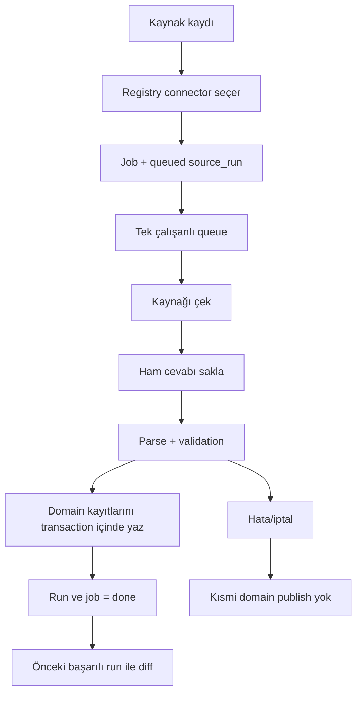

# 30A Studio — Master Devir / Çalışma Mantığı

> **Bu dosya projenin ana devir-teslim belgesidir.**
>
> Yeni bir geliştirici veya yapay zekâ projeye devam etmeden önce önce bu dosyayı, sonra `docs/DEVIR/` altındaki belgeleri okumalıdır. Domain belgeleri (`M2`, `M3`, `M4`, `M5`, `M6`) ayrıntılı teknik kayıt niteliğindedir. Kod ile belge çelişirse gerçek kod ve güncel veritabanı davranışı incelenmeli, ardından bu belge aynı geliştirme turunda güncellenmelidir.
>
> Bu paket 3 Ekim 2026 itibarıyla `bemonths/tatilya` reposunun durumu esas alınarak hazırlanmıştır.

## 1. Bir bakışta mevcut durum

| Alan | Güncel durum |
|---|---|
| Repo | `bemonths/tatilya` |
| Yerel çalışma klasörü | `C:\Users\1\Documents\Codex\2026-09-29\referenced-chatgpt-conversation-this-is-an\outputs\30a-studio` |
| Başlatma | `baslat.bat` |
| Stable branch | `main` |
| Stable commit | `a938367a280ef799597d5d90dc39ef34a26a6fcb` |
| Stable tag | `v0.6.0` |
| Stable uygulama sürümü | `0.6.0` |
| Stable SQLite şeması | `6` |
| Aktif araştırma branch'i | `v0.7-lodging-inventory` |
| Aktif branch HEAD | `23905962126ba9f00f7f8b6223c67c9633e70c2c` |
| Aktif branch durumu | Yalnız dokümantasyon/kanıt; uygulama ve DB hâlâ v0.6.0 / şema 6 |
| Son CI | Başarılı |
| Test tabanı | 289 Python testi + 19 frontend testi |
| Mevcut gerçek connector'lar | Plaj erişimleri, NWS hava, restoran dizini |
| Mevcut production destinasyonu | 30A / South Walton, Florida |
| Konaklama durumu | Book>Direct date-filtered search doğrulandı; tarihten bağımsız tam unit/provider inventory bulunamadı |

## 2. Projenin amacı

30A Studio yalnız bir scraper veya veri tabanı değildir. Uzun vadeli amaç, **30A / South Walton gibi mikro-destinasyonlar için güvenilir veri toplayan ve bu veriyi YouTube içerik üretim zincirine kanıt katmanı olarak veren yerel bir içerik stüdyosu** oluşturmaktır.

İlk gerçek kullanım alanı İngilizce, yüz göstermeyen, yaklaşık 15–17 dakikalık YouTube videolarıdır. İçerik yaklaşımı “mekânı tanıt” değil, **gerçek bir tatil kararını çöz** yaklaşımıdır.

Örnek karar soruları:

- Hangi 30A mahallesi hangi tatil tipi için daha uygun?
- Hangi bölgede plaj erişimi daha rahat?
- Hangi tarihler hava açısından daha mantıklı?
- Hangi bölgede restoran/konaklama seçeneği daha güçlü?
- Maliyet, ulaşım, sezon, kalabalık, deniz koşulları ve hizmet çeşitliliği nasıl değişiyor?

Programdaki veri, videoda istatistik yağdırmak için değil; AI'ın ve editörün **kanıta dayalı araştırma, karşılaştırma ve senaryo üretmesi** için kullanılır.

## 3. Uzun vadeli ürün modeli

30A yalnızca ilk destinasyondur. Sistem baştan şu modelle tasarlanmıştır:

```text
Destinasyon
├─ Kaynaklar
├─ Canonical alt bölgeler
├─ Plajlar
├─ Hava
├─ Restoranlar
├─ Konaklama
├─ Etkinlikler
├─ Ulaşım
├─ Fiyat / müsaitlik snapshot'ları
├─ Araştırma / evidence pack
└─ İçerik üretimi
```

Bugün production'da yalnız `30a` vardır. Gelecekte Napa Valley, Lake Tahoe, Cape Cod vb. destinasyonlar aynı motoru kullanabilmelidir.

Bu yüzden yeni geliştirmelerde şu ayrım korunur:

> Bu davranış generic core'da mı olmalı, yoksa yalnız bu destinasyona özel connector/profile içinde mi kalmalı?

## 4. Temel veri ilkeleri

1. **Kaynağın kimliği ve otoritesi doğrulanmadan veri ana kaynak kabul edilmez.**
2. **Verinin ne anlama geldiği doğrulanmadan tabloya yanlış semantik ile yazılmaz.**
3. Eksik alan tahmin edilmez; mümkünse `NULL` bırakılır.
4. `fetched_at`, kaynağın kendi `source_updated` zamanı değildir.
5. Adres/koordinattan mahalle tahmini yalnız açıkça tasarlanmış ayrı bir eşleme katmanında yapılabilir; connector bunu sessizce yapmaz.
6. Kaynağın yayınladığı bir alan “listelenmedi” ise “yok” anlamına gelmez.
7. Stable external ID tercih edilir; isimden kimlik üretmekten kaçınılır.
8. Kısmi crawl sonucu başarılı snapshot olarak yayımlanmaz.
9. Ham cevaplar ve SHA-256 izi korunur.
10. Başarısız/iptal run önceki başarılı snapshot'ı bozmaz.
11. Dynamic search sonucu “tam inventory” diye adlandırılmaz.
12. Kaynak keşfinde öncelik: API → structured JSON → HTML → public network endpoint → gerekiyorsa browser automation.
13. Playwright varsayılan değildir; HTTP/JSON ile çözülüyorsa kullanılmaz.
14. Düzenli çalışan veri toplayıcılar robots.txt kurallarına uyar. Belirli bir resmî belgenin (rapor, yönetmelik PDF'i gibi) kaynak göstermek için tek seferlik elle alınması toplayıcı sayılmaz; URL, erişim tarihi ve SHA-256 ile kaydedilir. Programatik kullanım için yayımlanmış API'ler kendi kullanım koşullarıyla kullanılır. (7 Ekim 2026 yönetici kararı)

Ayrıntı: `docs/DEVIR/03_VERI_KAYNAKLARI_VE_DOGRULAMA.md`.

## 5. Çalışan teknik yığın

- Python 3.12+
- FastAPI
- Uvicorn
- SQLite
- HTTPX
- HTML/CSS/Vanilla JavaScript
- Server-Sent Events
- `ThreadPoolExecutor`
- pytest
- frontend testleri için Node built-in test runner

PySide6/Qt kullanılmaz. Node tabanlı frontend build sistemi yoktur.

Yerel uygulama varsayılan olarak `http://127.0.0.1:8830` adresinde çalışır.

`baslat.bat`:
- proje klasörüne geçer,
- gerekirse `.venv` oluşturur,
- bağımlılıkları kurar,
- `python -m studio` başlatır.

Varsayılan DB: `data/studio.sqlite3`  
Ham cevaplar: `data/raw/`  
Yedekler: `data/backups/`

## 6. Multi-destination omurgası

v0.6 ile 30A sistemin kendisi olmaktan çıkarıldı ve ilk `destination` haline getirildi.

Production kaydı:

```text
id       = 30a
name     = 30A
subtitle = South Walton, Florida
```

Destination-scoped temel yapılar:
- `destinations`
- `regions`
- `sources`
- `jobs`
- `source_runs`
- `entities`
- `destination_weather_anchors`

Önemli kurallar:
- Aynı URL farklı destinasyonlarda kullanılabilir.
- Aynı bölge adı farklı destinasyonlarda kullanılabilir.
- Source başka destination'a normal edit ile taşınamaz.
- Job/run hangi destinasyon için üretildiyse provenance bunu korur.
- Diff başka destinasyondaki run ile karşılaştırmaz.
- NWS connector generic'tir.
- South Walton Beaches ve Restaurants connector'ları 30A'ya özeldir.

Frontend seçimi server-global değildir. Seçim `localStorage["studio.destination_id"]` ile tutulur. Destination değişince eski async cevapların yeni ekrana yazılması engellenir.

## 7. Connector modeli

Genel connector sözleşmesi `studio/sources/base.py` içindedir.

Connector şu sorumlulukları taşır:
- `name`
- `version`
- `raw_filename`
- `method`
- `diff_enabled`
- `supports(source)`
- `collect(..., context=ConnectorContext)`
- `store_records(...)`
- `read_records(...)`
- `comparison_value(...)`

`ConnectorContext` runtime'da destination'a ait:
- destination kaydı,
- canonical regions,
- weather anchors

gibi yapılandırmayı taşır.

Yeni domain connector'ı mümkün olduğunca generic `source_collection → job → run → raw → atomic publish` akışını kullanmalıdır.

## 8. Job / source_run / raw artifact akışı



Önemli:
- `run.id` bugün job kimliğiyle aynıdır.
- Ham artifact SHA'sı DB katmanında gerçek dosya baytlarından hesaplanır.
- İptal edilmiş iş geç gelen sonucu publish edemez.
- Domain yazımı hata verirse transaction geri alınır.
- Başarısız/iptal run tarihsel olarak kalır.

## 9. Bugün çalışan domain'ler

### 9.1 Plaj erişimleri

Kaynak: `https://www.visitsouthwalton.com/beach-bay-access-locations/`  
Connector: `south-walton-beaches`  
Yöntem: HTML içindeki JSON  
Scope: 30A-specific

Toplanan başlıca alanlar:
- external ID
- ad
- kaynak yerleşim adı
- adres
- koordinatlar
- erişim tipi
- kaynakta listelenen olanaklar

Örnek live snapshot'larda 53 kıyı erişim kaydı görülmüştür; bu sayı sabit kabul kriteri değildir.

### 9.2 NWS hava

Source record URL: `https://www.weather.gov/`  
API: `https://api.weather.gov`  
Connector: `nws-weather`  
Scope: generic

Destination'ın `destination_weather_anchors` kayıtlarını kullanır.

30A için üç örnek nokta:
- Batı 30A
- Orta 30A
- Doğu 30A

Bunlar canonical mahalle merkezi değildir; hava örnek noktalarıdır.

Toplanır:
- NWS point/grid bilgisi
- 12 saatlik forecast dönemleri
- saatlik forecast
- aktif alerts

Rolling forecast olduğu için generic record diff kapalıdır.

### 9.3 Restoranlar

Kaynak: `https://www.visitsouthwalton.com/listings/culinary-experiences/`  
Connector: `south-walton-restaurants`  
Yöntem: HTML dizin + detay  
Scope: 30A-specific

Kapsam: 13 canonical mahalle; Miramar Beach, Seascape ve Sandestin hariç.

Alanlar:
- stable listing path identity
- ad
- açıklama nullable
- adres
- telefon
- e-posta
- website
- cuisines
- meals served
- amenities
- source neighborhood provenance

Gerçek kullanıcı snapshot'ında 138 restoran ve 141 restoran-bölge ilişkisi korunmuştur. Bunlar kaynak değişebileceği için sabit test sayısı değildir.

## 10. Konaklama — şu an nerede kaldık?

Branch: `v0.7-lodging-inventory`  
HEAD: `23905962126ba9f00f7f8b6223c67c9633e70c2c`

Bu branch'te **kod, şema veya production DB değişmedi**. Yalnız kaynak keşfi ve kanıt belgelendi.

Doğrulanan Book>Direct giriş: `https://visitsouthwalton.bookdirect.net/`

Doğrulanan public clone API host: `admin.bookdirect.net`

Önemli public yol sınıfları:
- clone config: `/show.json`
- list/search: `/lodgings.json`, `/lodgings/search.json`
- detail: `/lodgings/:id.json`

Ancak:
- tarihsiz liste 400,
- tarihsiz search 400,
- tarihsiz bilinen-ID detail 400,
- `checkin` zorunlu,
- farklı tarihlerde farklı ID kümeleri dönüyor.

Dune Allen örneği:
- 2–3 Ekim 2026: 112 benzersiz ID
- 2–3 Kasım 2026: 113 benzersiz ID

Bir tarihin listesinde görünmeyen ID, tarihli detail isteğinde yine 200 dönebildi. Dışlama sebebinin availability, minimum stay veya başka backend scope olup olmadığı **unknown** bırakıldı.

Visit South Walton sitemap'i ve 11 public listing directory incelendi. Statik provider/otel sayfaları bulundu ancak bütün provider veya bütün unit kayıtlarını deterministik veren tarihsiz public inventory yolu bulunamadı.

**Karar:** Book>Direct date-filtered search, statik “tam konaklama envanteri” olarak kullanılmayacak.

Bu kaynak ileride tarih/misafir/rate/availability/minimum stay gibi snapshot tabanlı fiyat-müsaitlik katmanında değerlendirilebilir.

Tam envanter için yeni, deterministik bir public/read/export sözleşmesi bulunmadan schema 7 lodging connector geliştirilmemelidir.

Ayrıntı: `docs/M6-KONAKLAMA-KAYNAK-KEŞFİ.md`

> **7 Ekim 2026 yönetici kararı:** Tarihten bağımsız tam konaklama envanteri şartı kaldırıldı; içerik için gerekli değildir. Konaklama, belirli tarihler için yapılan Book>Direct aramalarının etiketli anlık görüntüleri olarak modellenecek: arama tarihi, giriş/çıkış tarihi, misafir sayısı, mahalle filtresi, dönen kayıtlar ve kaynağın verdiği fiyat alanları. Bu veri hiçbir yerde tam envanter diye adlandırılmayacak.

## 11. Stable release ve test durumu

Stable: `main @ a938367a280ef799597d5d90dc39ef34a26a6fcb`  
Tag: `v0.6.0`

Tag doğrudan bu commit'e işaret eder.

Son v0.7 docs commit CI:
- 289 Python testi geçti
- 19 frontend testi geçti
- GitHub Actions başarılı

Bilinen non-blocking uyarılar:
- Starlette TestClient / httpx deprecation warning
- GitHub Actions Node 20 action'larının Node 24 üzerinde zorlanması uyarısı

## 12. Kullanıcı verisini koruma politikası

`data/` gerçek kullanıcı verisidir.

Yapılmaması gerekenler:
- DB'yi sıfırlamak,
- `data/` klasörünü silmek,
- test için production DB'yi rastgele değiştirmek,
- migration testini doğrudan tek kopya DB üzerinde denemek.

Şema migration'larında:
1. gerçek DB'nin yedeği alınır,
2. mümkünse ayrı copy üzerinde migration denenir,
3. count/FK kontrolleri yapılır,
4. sonra gerçek DB açılır.

v0.6 migration doğrulamasında raporlanan örnek sayılar:
- 8 sources
- 4 source_history
- 9 jobs
- 6 source_runs
- 159 beach_records
- 6 weather_locations
- 1020 forecast rows
- 138 restaurant_records
- 141 restaurant_regions

Bunlar yalnız o doğrulama anının snapshot'ıdır.

## 13. Geliştirme çalışma biçimi

1. Proje yöneticisi (ayrı bir Claude sohbeti) görevi `GÖREV-NN` numarasıyla yazar.
2. Kullanıcı görevi Claude Code'a taşır.
3. Claude Code görevi kullanıcının gerçek yerel repo ortamında, görevin kendi dalında uygular.
4. Claude Code testleri çalıştırır, gerekiyorsa geçici veri klasöründe canlı smoke yapar, commit eder ve kendi dalına push eder.
5. Claude Code Türkçe raporunu yazar; görev metni, rapor ve istenen çıktılar `docs/gorevler/GOREV-NN/` altında aynı dala push edilir.
6. Yönetici commit'i, CI sonucunu ve raporu GitHub üzerinden inceler; gerekirse düzeltme görevi verir.
7. Gerçek ortamda yapılması gereken arayüz ve canlı kontrolleri Claude Code kendisi yapar (gerekirse ekran görüntüsüyle); kullanıcıdan onay veya manuel test istenmez.
8. Dal, proje yöneticisinin kararıyla main'e alınır; Claude Code main'e yalnız görev metni bunu açıkça istediğinde alır.
9. Stable release tag'lenir.
10. Sonraki görev dalı açılır.

Görev dalı; yönetici incelemesi ve gereken gerçek ortam kontrolleri tamamlanmadan ve yönetici main'e alma kararını görev metninde vermeden main'e alınmamalıdır. Teknik kararlar yöneticiye aittir; kullanıcı makale (video metni) aşamasına kadar karar mekanizması değildir.

Ayrıntı: `docs/DEVIR/04_GELISTIRME_TEST_RELEASE_AKISI.md`

## 14. Şu anda uygulanmamış başlıca alanlar

- Tam lodging inventory connector
- Lodging rates / availability history
- Historical climate (NOAA/NCEI)
- Deniz suyu sıcaklığı / koşullar
- Yakıt fiyatı
- Overture/POI enrichment
- Etkinlik connector
- Ulaşım connector
- Grocery / günlük ihtiyaç fiyatları
- Restoran menü/fiyat enrichment
- Scheduler
- Otomatik entity matching
- Region polygon mapping
- AI evidence-pack / konu seçimi
- Makale/senaryo
- Görsel plan
- Video render
- Yayın paketi

## 15. Sonraki geliştirici / AI için ilk kurallar

1. Önce bu belgeyi oku.
2. Sonra `docs/DEVIR/05_SURUM_GECMISI_VE_GUNCEL_DURUM.md` oku.
3. Aktif görev veri kaynağıyla ilgiliyse `03_VERI_KAYNAKLARI_VE_DOGRULAMA.md` oku.
4. Kod değişmeden önce gerçek branch/head'i doğrula.
5. `data/` klasörüne zarar verme.
6. Kaynak semantiğini doğrulamadan schema/domain yazma.
7. 30A-specific davranışı generic core'a gömme.
8. Yeni destination uyumluluğunu test et.
9. Test fixture'ları canlı web'e bağımlı yapma.
10. Canlı smoke sonuçlarını sabit production/test sayısı haline getirme.
11. Görev metni (yönetici kararı) açıkça istemedikçe görev dalını main'e merge etme.
12. v0.7 lodging konusunda date-filtered sonucu “tam inventory” diye modelleme.

## 16. Devir dokümanı indeksi

- `CALISMA_MANTIGI.md` — ana devir ve çalışma mantığı
- `docs/KONSEPT.md` — kanal konsepti ve içerik stratejisi; içerik yönünde bağlayıcı belge
- `docs/TEKNIK-CALISMA-MANTIGI-v0.6.md` — v0.6 uygulamasının ayrıntılı teknik çalışma mantığı (eski kök belge)
- `docs/gorevler/` — görev metinleri, raporlar ve görev çıktıları (`GOREV-NN/`)
- `docs/DEVIR/01_URUN_VIZYONU_VE_KARARLAR.md`
- `docs/DEVIR/02_TEKNIK_MIMARI_VE_VERI_MODELI.md`
- `docs/DEVIR/03_VERI_KAYNAKLARI_VE_DOGRULAMA.md`
- `docs/DEVIR/04_GELISTIRME_TEST_RELEASE_AKISI.md`
- `docs/DEVIR/05_SURUM_GECMISI_VE_GUNCEL_DURUM.md`
- `docs/DEVIR/06_ROADMAP_VE_ACIK_KONULAR.md`
- `docs/DEVIR/07_YENI_AI_BASLANGIC_TALIMATI.md`

Mevcut ayrıntılı domain belgeleri de korunmalıdır:
- `docs/M2-VERI-TOPLAMA.md`
- `docs/M3-HAVA-VERISI.md`
- `docs/M4-RESTORAN-VERISI.md`
- `docs/M5-DESTINASYON-KATMANI.md`
- `docs/M6-KONAKLAMA-KAYNAK-KEŞFİ.md`

---

**Son güncelleme:** 3 Ekim 2026  
**Stable:** v0.6.0  
**Aktif araştırma:** v0.7 lodging inventory discovery / sonuç C
