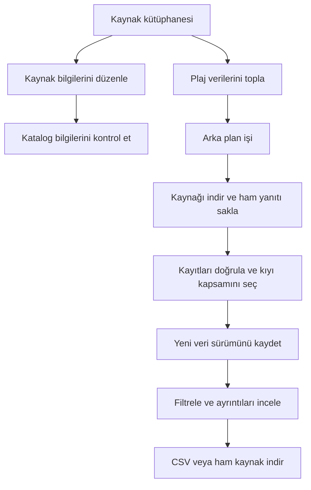

# 30A Studio — Çalışma mantığı

Bu belge v0.2.0'ın çalışan davranışını ve sonraki geliştirme adımlarını açıklar. Proje, Florida'nın Scenic Highway 30A bölgesi için kaynak verilerini toplayıp ileride kaynaklı içerik üretimine dönüştürmek amacıyla geliştiriliyor.

## Mevcut kapsam

Kaynak ekleme, düzenleme, arşivleme, katalog kontrolü, South Walton plaj erişimlerini toplama, filtreleme, veri sürümlerini görüntüleme ve CSV indirme çalışır. Claude, Playwright, makale, görsel, video ve yayın bağlantıları henüz uygulanmadı. Sol menüde bu aşamaların bulunması çalıştıkları anlamına gelmez; plan ekranlarında durumları belirtilir.

Housing Atlas ayrı bir projedir. 30A Studio onun kodunu, verisini, ayarlarını veya tarayıcı profilini kullanmaz.

## Uygulama nasıl açılır?

`baslat.bat`, proje klasörüne geçer ve gerekirse Python 3.12 sanal ortamını oluşturur. Paketleri `requirements-lock.txt` üzerinden kurar ve `python -m studio` komutunu çalıştırır. Kurulum tamamlandığında `.venv/studio-ready` işareti yazılır.

`studio/__main__.py`, FastAPI uygulamasını Uvicorn ile yalnızca `127.0.0.1:8830` adresinde sunar ve tarayıcıyı açar. Aynı adreste çalışan bir 30A Studio bulunursa mevcut uygulamayı açar. Başka bir program bu portu kullanıyorsa hata gösterir; `--port` ile farklı port seçilebilir.

Başlangıçta veritabanı şeması hazırlanır, ilk kurulumda yedi kaynak adayı eklenir ve önceki oturumdan kalan etkin işler `interrupted` olarak işaretlenir. Bu işler otomatik yeniden başlatılmaz. Standart başlatma penceresindeki Ctrl+C sunucuyu kapatır; tarayıcı sekmesini kapatmak sunucuyu durdurmaz.

## Bileşenler

| Dosya / klasör | Görevi |
|---|---|
| `studio/app.py` | Yerel HTTP API, uygulama yaşam döngüsü, indirmeler ve canlı iş bildirimleri |
| `studio/models.py` | Kaynak ve iş girdilerinin doğrulanması |
| `studio/catalog.py` | Başlangıç kaynakları, kategori/bölge seçenekleri ve üretim aşamaları |
| `studio/database.py` | SQLite işlemleri, kaynak geçmişi, işler ve toplanan veri sürümleri |
| `studio/jobs.py` | Tek çalışanlı arka plan kuyruğu, ilerleme, iptal ve hata yönetimi |
| `studio/sources/beaches.py` | İlk gerçek kaynak bağlayıcısı ve plaj kayıtlarının doğrulanması |
| `studio/web/app.js` | Ekran geçişleri, kaynak formu, iş paneli ve ortak ön yüz durumu |
| `studio/web/collection.js` | Toplanan kayıtlar, arama, filtreler, sürüm seçimi ve ayrıntılar |
| `studio/web/roadmap.js` | Henüz uygulanmayan içerik aşamalarının plan metinleri |
| `tests/` | Ağdan bağımsız veri, API, kuyruk, iptal, sürüm ve dışa aktarma testleri |

Ön yüz bağımsız HTML, CSS ve JavaScript modülleridir. Node derlemesi gerekmez. Ekranlar `#sources`, `#collect` gibi adres parçalarıyla değiştirilir. Sunucu Python/FastAPI, yerel veritabanı SQLite'tır.

## Kullanıcının temel akışı



Kaynak eklemek otomatik veri çekmez. Formdaki toplama yöntemi ve sıklık alanları plan bilgisidir. Mevcut sürümde zamanlayıcı yoktur; toplama kullanıcı tarafından başlatılır. Bir URL eklemek o site için bağlayıcı oluşturmaz.

## Kaynak kayıtları ve katalog kontrolü

Kaynak kaydı; ad, URL, kategori, bölge, planlanan yöntem, sıklık, açıklama ve etkinlik durumunu içerir. URL'deki `#` parçası kaldırılır; aynı normalize edilmiş adres tekrar eklenemez. HTTP/HTTPS dışındaki adresler, URL içine yazılmış kullanıcı adı/parola ve bilinmeyen seçim değerleri reddedilir.

Her düzenlemede sürüm numarası artırılır ve kaydedilen durum geçmiş tablosuna yazılır. İstek, düzenlemeye başlanırken görülen sürüm numarasını taşır. Başka bir pencere daha önce kaydı değiştirmişse eski düzenleme yeni veriyi ezmez; çakışma yanıtı döner. Arşivleme yalnızca kaynağı pasif yapar ve geri alınabilir.

“Kayıtları kontrol et” işi etkin kaynakların yöntem ve açıklama alanlarını inceler. Bağlı plaj kaynağının yöntemi tanınır. Bu kontrol internete bağlanmaz, kaynak içeriğinin doğruluğunu veya güncelliğini kanıtlamaz. Kaynaklar rapordan sonra değişirse ön yüz raporu eskimiş olarak gösterir.

## Gerçek plaj verisi nasıl toplanır?

Bağlayıcının tek kaynak adresi [Visit South Walton plaj erişim sayfasıdır](https://www.visitsouthwalton.com/beach-bay-access-locations/).

1. Kullanıcı toplama düğmesine basar. API, seçili kaynağın etkin olduğunu ve adresinin desteklenen adresle eşleştiğini kontrol eder.
2. Kuyruğa `beach_collection` işi eklenir. Aynı türde bekleyen veya çalışan bir iş varsa ikinci istek reddedilir.
3. HTTPX ile kaynak HTML indirilir. TLS doğrulaması açıktır; yönlendirmeler takip edilmez. Bağlantı için 10 saniye, diğer HTTP işlemleri için 20 saniye zaman aşımı; yanıt için 5 MB sınır kullanılır.
4. Ağ hatası veya sunucunun 5xx yanıtında en fazla bir kez yeniden denenir. 429 yanıtı ve kalıcı HTTP hataları kullanıcıya bildirilir.
5. Ham yanıt, iş kimliğine ait `data/raw/<iş-kimliği>/source.html` dosyasına yazılır.
6. Sayfadaki `initMarkers` fonksiyonunun `data` dizisi bulunur. JSON nesneleri ayrıştırılır; kaynağın JavaScript kodu çalıştırılmaz. Dizinin sonundaki virgül desteklenir.
7. Kimlik, ad, adres, yerleşim, erişim türü, olanak listesi ve koordinatlar denetlenir. Yinelenen kimlik, beklenmeyen tür, boş sonuç, eksik alan veya bölge dışında koordinat bütün çekimi başarısız yapar.
8. Kapsama uyan kayıtlar yeni sürüm olarak saklanır. Kayıtların eklenmesi ve işin başarılı bitişi tek veritabanı işlemidir.

### Kapsam kuralı

Erişim türü `regional` veya `neighborhood`, kaynak yerleşimi ise `Santa Rosa Beach`, `Grayton Beach`, `Seacrest` veya `Inlet Beach` olmalıdır. Miramar ve koy/göl noktaları dışarıda bırakılır. Kaynağın yerleşim adından daha ayrıntılı mahalle tahmini yapılmaz.

İlk canlı çekimde 70 harita noktasının 53'ü bu kurala uydu; 17'si kapsam dışında kaldı. Bunlar sabit hedef sayıları değildir. Kaynak değiştiğinde sayılar da değişebilir. Seçim, bölgedeki tüm plajların veya özel erişimlerin eksiksiz listesi olarak sunulmaz.

Olanak listesi boşsa “bilgi listelenmemiş” gösterilir. Bir olanağın listelenmemesi, bulunmadığının kanıtı sayılmaz. Deniz durumu bayrağı etiketi, bu noktada bayrak olanağının listelendiğini gösterir; güncel bayrak rengi veya denizin güvenli olduğu anlamına gelmez.

## Veriler nerede ve nasıl saklanır?

Varsayılan veri alanı proje içindeki `data/` klasörüdür. `--data-dir` ile ayrı bir alan seçilebilir.

| Tablo | İçerik |
|---|---|
| `sources` | Kaynağın güncel bilgileri ve sürüm numarası |
| `source_history` | Kaynak kaydının kaydedilen sürümleri |
| `jobs` | İş türü, durum, ilerleme, günlük ve sonuç |
| `collections` | Başarılı çekim, kaynak URL'si, zaman, kapsam, ham dosya yolu ve özeti |
| `beach_records` | Her çekime ait plaj kayıtları |
| `metadata` | Başlangıç kaynaklarının eklenme işareti |

SQLite WAL ve yabancı anahtar denetimi kullanılır. Şema sürümü `PRAGMA user_version` ile izlenir; v0.2.0 şema sürümü 2'dir. Önceki kaynak ve iş kayıtları yükseltmede korunur.

Her başarılı çekim ayrı kalır. Aynı kayıt sonraki çekimde değişse bile önceki sürüm değiştirilmez. Ham dosyanın SHA-256 özeti, ayrıştırıcı sürümü ve çekim zamanı saklanır. Kaynağın kendi güncelleme yazısı metin olarak korunur; belirtilmeyen zaman dilimi tahmin edilmez. Henüz sürümler arasında otomatik fark raporu yoktur.

Yedek almak için uygulama kapalıyken `data/` klasörünün tamamı kopyalanmalıdır. GitHub deposu kod ve belgeleri içerir; yerel veritabanı, ham çekimler, sanal ortam ve önbellekler `.gitignore` ile dışarıda tutulur. Depoyu başka bilgisayarda açan kullanıcı veriyi yeniden toplar veya kendi yedeğini taşır.

## Kuyruk, iptal ve canlı ilerleme

İş yürütücüsü `ThreadPoolExecutor(max_workers=1)` kullanır; aynı anda bir iş çalışır. İş ve sonuç bilgisi veritabanında kalıcıdır, yürütücü kuyruğu bellektedir. İş durumları `queued`, `running`, `done`, `failed`, `canceled` ve `interrupted` değerleridir.

İptal talebi veritabanına hemen yazılır. Çalışan bağlayıcı uygun kontrol noktalarında iptali görüp durur; devam eden ağ işleminin kesilmesi zaman aşımını bekleyebilir. Tamamlama sırasında işin hâlâ etkin olup olmadığı tekrar denetlenir. Böylece iptal edilmiş bir iş sonradan başarılı sonuç yayımlayamaz.

Kaynak değişmiş, erişilememiş veya doğrulamadan geçememişse önceki başarılı veri sürümleri korunur. Ayrıştırması başarısız olan yanıtın ham dosyası teşhis için diskte kalabilir.

Ön yüz `/api/events` üzerinden Server-Sent Events bağlantısı açar. Sunucu iş listesini saniyede bir kontrol eder; değiştiğinde yeni listeyi yollar. Tamamlanan çekim ön yüzde sürüm listesini yeniler. Bağlantı kesilirse tarayıcı yeniden bağlanmayı dener.

## API özeti

| İstek | İşlev |
|---|---|
| `GET /api/health` | Uygulama kimliği ve sürümü |
| `GET /api/bootstrap` | İlk ekran için seçenekler, kaynaklar, işler ve çekimler |
| `GET /api/sources` | Kaynak listesi |
| `POST /api/sources` | Kaynak oluşturma |
| `PUT /api/sources/{id}` | Sürüm denetimli düzenleme / arşivleme |
| `GET /api/jobs` | Son 100 iş |
| `POST /api/jobs` | Katalog kontrolü veya plaj toplama başlatma |
| `POST /api/jobs/{id}/cancel` | İptal talebi |
| `GET /api/events` | Canlı iş listesi |
| `GET /api/collections` | Başarılı çekimlerin listesi |
| `GET /api/collections/{id}` | Çekim bilgisi ve kayıtları |
| `GET /api/collections/{id}/export.csv` | Seçili sürümün CSV dosyası |
| `GET /api/collections/{id}/raw` | Ham kaynak dosyası |

Değişiklik yapan istekler `X-Studio-Request: 1` başlığını taşımalıdır. Origin varsa istek adresiyle eşleşmesi denetlenir. Bunlar yerel kullanım kontrolleridir; kullanıcı hesabı veya uzaktan erişim yetkilendirmesi yoktur. Uygulama internet sunucusu olarak tasarlanmamıştır.

CSV, UTF-8 BOM ve noktalı virgül ayırıcı kullanır. Kaynaktan gelen metinlerde formül başlatabilecek karakterler etkisizleştirilir. Ham HTML, tarayıcıda çalıştırılmak yerine metin eki olarak indirilir.

## Geliştirme ve doğrulama

```powershell
py -3.12 -m venv .venv
.\.venv\Scripts\python.exe -m pip install -r requirements-lock.txt
.\.venv\Scripts\python.exe -m pytest -q
.\.venv\Scripts\python.exe -m studio
```

40 test; kaynak kalıcılığı, düzenleme çakışması, arşivleme, URL doğrulama, katalog kontrolü, kaynak ayrıştırma, kapsam, HTTP hataları, yeniden deneme, iptal, sürüm saklama, CSV ve şema yükseltmeyi kapsar. Testler sentetik yanıtlar kullanır; canlı ağa veya Claude'a bağlanmaz. Gerçek kaynak değişiklikleri için ayrıca sınırlı canlı çekimle doğrulama gerekir.

## Sonraki aşamalar

Önce veri sürümleri arasında eklenen, değişen ve kaldırılan kayıtları gösterme; ardından diğer kaynaklar ve ortak veri kalite kontrolleri geliştirilir. İçerik akışı kontrol edilmiş veri paketinden konu araştırması, rakip analizi, brief, makale, görsel plan, video ve yayın hazırlığına ilerler.

Claude bağımsız bir sağlayıcı modülü olarak; Playwright ise yalnızca kaynak gerektirdiğinde, bu projeye ait profil üzerinden eklenecek. İçerikler kullandıkları veri sürümüne bağlanacak ve girdi değişince yenilenmesi gereken aşamalar işaretlenecek. Bu davranışlar v0.2.0'da henüz uygulanmamıştır.

İlgili belgeler: [mimari](docs/MIMARI.md), [aşama planı](docs/ASAMALAR.md), [ilk kaynağın kapsamı](docs/M2-VERI-TOPLAMA.md).
