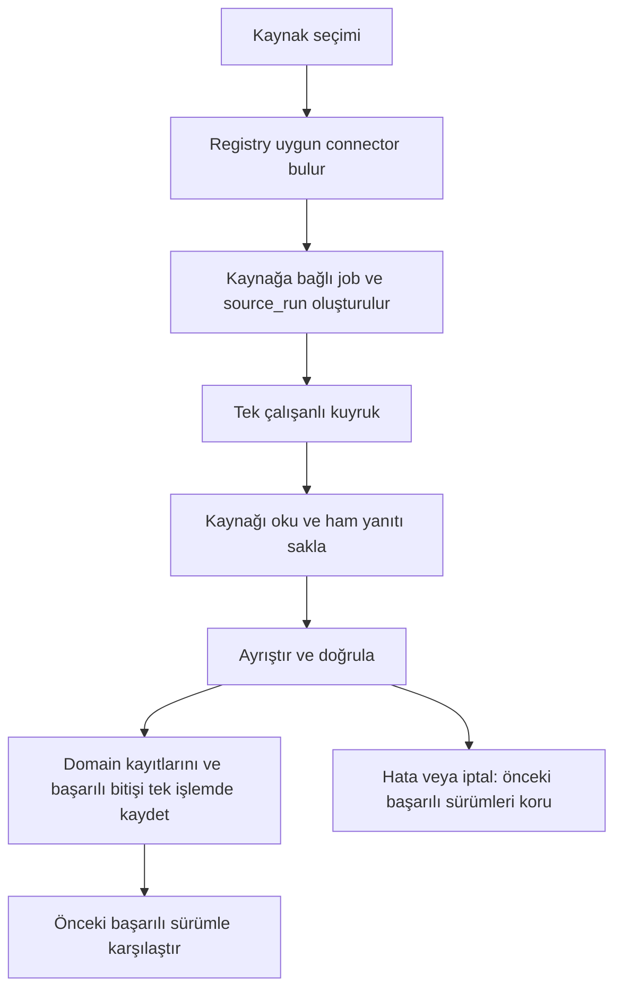

# 30A Studio — Çalışma mantığı

Bu belge **v0.4.0** davranışını açıklar. Uygulama, 30A kaynak verilerini yerel olarak toplar ve sürümlerini saklar. Housing Atlas bağımsız bir projedir; kodu, verisi, ayarları veya tarayıcı profili kullanılmaz.

## Çalışan kapsam

Kaynak kütüphanesi, katalog kontrolü, genel connector seçimi ve toplama kuyruğu, çekim geçmişi, plaj verisi ekranı, filtreler, sürüm farkı ve CSV indirme çalışır. Gerçek ağa bağlanan iki connector vardır: **BeachesConnector / south-walton-beaches** (HTML içindeki JSON) ve **WeatherConnector / nws-weather** (resmî API).

Canonical bölge ve entity tabloları yalnızca veri modelinin temelidir. Otomatik entity matching, region polygon mapping, mahalle tahmini, haftalık scheduler, Claude/OpenAI, Playwright, konu araştırması, makale, görsel, video ve yayın üretimi uygulanmadı. İleri içerik ekranları plan gösterir.

## Açılış ve kayıt alanı

`baslat.bat`, gerekirse Python 3.12 sanal ortamını oluşturur, `requirements-lock.txt` paketlerini kurar ve `python -m studio` çalıştırır. Kurulum işareti `.venv/studio-ready` dosyasıdır. Uygulama yalnızca `127.0.0.1:8830` üzerinde açılır. Bu adreste zaten 30A Studio çalışıyorsa mevcut uygulama açılır. Başka bir program portu kullanıyorsa `--port` seçilebilir.

Varsayılan veri alanı `data/`, veritabanı `data/studio.sqlite3` dosyasıdır. `--data-dir` ayrı alan seçer. Tarayıcı sekmesini kapatmak sunucuyu durdurmaz; standart başlatma penceresinde Ctrl+C kullanılır.

Şema sürümü 4'tür. v0.1/v0.2/v0.3 açılırken SQLite backup API ile `data/backups/` altında yükseltme öncesi kopya alınır. Şema değişiklikleri ve veri aktarımı tek transaction içindedir; hata olursa geri alınır. Daha yeni bir şema bu uygulama sürümüyle açılmaz.

## Ana akış

Kaynak eklemek toplama başlatmaz. Formdaki sıklık bir plan alanıdır, zamanlayıcı değildir. Desteklenmeyen kaynak için “Bu kaynak için henüz veri toplayıcı bağlanmadı.” yanıtı döner. Böyle bir istek henüz kabul edilmiş bir çekim olmadığı için job/run oluşturmaz.

## Kaynak kütüphanesi

Kaynak; ad, URL, kategori, bölge etiketi, yöntem, sıklık, notlar ve etkinlik durumunu taşır. URL'nin `#` kısmı kaldırılır ve tekrar eklenmesi engellenir. Geçersiz adres şeması, adres içindeki kullanıcı adı/parola ve bilinmeyen seçim değerleri reddedilir.

Düzenleme `expected_version` taşır. Başka pencere kaydı değiştirmişse eski düzenleme yeni kaydı ezmez. Kaydedilen sürümler `source_history` tablosuna yazılır. Arşivleme silme değildir ve geri alınabilir.

`catalog_audit`, etkin kaynakların yöntem ve açıklama alanlarını kontrol eder. Bağlı connector'ı registry üzerinden tanır. İnternete bağlanmaz, içerik doğruluğunu veya güncelliğini kanıtlamaz. Birden fazla kaynağı kapsadığı için `jobs.source_id` NULL'dır. Kaynak değişirse önceki kontrol raporu ön yüzde eskimiş gösterilir.

## Connector sözleşmesi

`studio/sources/base.py`, sonuç sözleşmesini ve küçük bir Python Protocol tanımlar. CollectionResult; normalize edilmiş kayıtları, toplam/kapsam dışı sayısını, kaynak güncelleme metnini ve ek metadata'yı taşır. Ayrıca `related` sözlüğü, kayıt sayısına dahil olmayan domain ilişkilerini (hava noktaları ve uyarıları) aynı transaction içinde yazılmak üzere taşır.

| Sorumluluk | Metot / alan |
|---|---|
| Kimlik, sürüm, ham dosya adı | `name`, `version`, `method`, `raw_filename`, `diff_enabled` |
| Kaynak desteği | `supports(source)` |
| Çekme, ham yanıtı yazma, parse/validate | `collect(source, raw_path, progress, canceled)` |
| Domain kayıtlarını transaction içinde yazma | `store_records(connection, run_id, records, related)` |
| Kaydedilen kayıtları okuma | `read_records(connection, run_id)` |
| Fark raporu için alan seçimi | `comparison_value(record)` |

`registry.py` BeachesConnector ve WeatherConnector'ı kaydeder. `jobs.py` plaj modülünü import etmez. Yeni kaynak için connector, gerekiyorsa domain migration'ı ve testleri yazılıp registry'ye eklenir; jobs.py/app.py yönlendirmesine kaynağa özel if blokları gerekmez. Plaj ekranı ve CSV uçları korunmuştur; yeni domain'lerin özel ekran/dışa aktarma ihtiyacı ayrıca uygulanmalıdır.

## Job ve source_run

Yeni toplama türü `source_collection`'dır. Kaynak etkin ve destekleniyor olmalıdır. Job ve queued run aynı transaction içinde oluşturulur. Bu sürümde run kimliği job kimliğiyle aynıdır; `job_id` ilişkisi ayrıca saklanır.

Her kabul edilmiş çekim queued/running/done/failed/canceled/interrupted durumuyla source_runs içinde izlenir. Alanları: id, source_id, job_id, status, started_at, fetched_at, finished_at, source_url, connector_name, connector_version, raw_path, raw_sha256, source_updated, record_count, excluded_count, error_message, metadata JSON.

Başlangıç metadata'sı kaynak adı ve sürüm numarasını içerir. started_at iş çalışınca yazılır. İndirme oluşmadıysa raw/fetched_at alanları NULL'dır. Ham dosya oluşursa SHA-256 yalnızca Database.record_raw_artifact() tarafından diskteki gerçek baytlardan hesaplanır; CollectionResult hash taşımaz; fetched_at dosyanın yazım zamanıdır. Başarısız ayrıştırmada da ham dosya bilgisi korunur. Doğrulanmamış kayıtlar yayımlanmaz; başarısız çekimin record_count değeri sıfırdır.

Tek çalışanlı ThreadPoolExecutor kullanılır. Aynı kaynakta ikinci aktif toplama engellenir, farklı kaynaklar sıraya girebilir. Yürütücü kuyruğu bellekte, iş ve run bilgileri SQLite'tadır. Yeniden açılışta etkin kalan işler/run'lar interrupted yapılır; otomatik yeniden çalıştırılmaz.

İptal isteği durumu hemen değiştirir. Connector iptali kontrol noktalarında görür; süren ağ çağrısı zaman aşımını bekleyebilir. Domain kayıtları yazılmadan önce job ve run'ın hâlâ aktif olduğu transaction içinde denetlenir. İptal edilmiş iş geç gelen sonuç yayımlayamaz. Domain yazımı hata verirse kısmi kayıtlar ve başarılı bitiş birlikte geri alınır.

## Plaj connector'ı

Kaynak: [Visit South Walton plaj erişimleri](https://www.visitsouthwalton.com/beach-bay-access-locations/). HTTPX ile HTML alınır; initMarkers veri dizisinin JSON nesneleri ayrıştırılır. Kaynak JavaScript çalıştırılmaz.

TLS kontrolü açıktır. En fazla üç yönlendirme izlenir; yalnızca açık izin listesindeki `visitsouthwalton.com` ve `www.visitsouthwalton.com`, HTTPS ve varsayılan/443 port kabul edilir. www/apex geçişleri iki yönde desteklenir; diğer alt alanlar ve yanıltıcı alan adı son ekleri reddedilir. Kullanıcı bilgisi içeren adresler izlenmez. Ağ/5xx hatasında bir kez yeniden deneme vardır; 429 ve kalıcı hatalar kullanıcıya bildirilir. Yanıt sınırı 5 MB, bağlantı zaman aşımı 10 saniye, diğer HTTP işlemleri için 20 saniyedir.

Kimlik, ad, adres, city, tür, koordinatlar ve olanak listesi doğrulanır. Bozuk/boş veri, yinelenen kimlik veya beklenmeyen tür bütün çekimi başarısız yapar. Kayıtlar beach_records içinde kalır ve run_id artık source_runs'a bağlıdır.

Kapsam değişmedi: tür regional/neighborhood; kaynak yerleşimi Santa Rosa Beach, Grayton Beach, Seacrest veya Inlet Beach olmalı. Miramar ve koy/göl noktaları dışarıda kalır. İlk canlı örnekte 70 noktanın 53'ü seçilmişti; bunlar sabit hedef sayıları değildir.

city ve source_region_text kaynaktaki yerleşim adını korur. canonical_region_id NULL bırakılır. Metin veya koordinattan mahalle tahmini yapılmaz. Listelenmeyen olanak “yok” değildir. Deniz durumu bayrağı etiketi güncel bayrak rengini göstermez. Kaynak güncelleme metninin bilinmeyen zaman dilimi tahmin edilmez.

## Canonical bölge ve entity temeli

`studio/regions.py` ve regions tablosunda aynı 13 sabit kimlik vardır: dune-allen, gulf-place, santa-rosa-beach, blue-mountain-beach, grayton-beach, watercolor, seaside, seagrove, watersound, seacrest, alys-beach, rosemary-beach, inlet-beach. Kaynak formundaki “Tüm 30A” kapsam seçeneği mahalle kaydı değildir.

entities: id, entity_type, canonical_name, nullable canonical_region_id/latitude/longitude, created_at, updated_at. entity_sources: entity_id, source_id, external_id, nullable source_url/record_url. Bir kaynak/external_id çifti yalnızca bir entity'ye bağlanabilir; bir entity çok sayıda kaynağa bağlanabilir. Foreign key denetimi açıktır.

Tablolar boş oluşturulur. Entity düzenleme arayüzü/API'si, otomatik eşleştirme ve polygon eşleştirme yoktur. Plajlar zorla entity sistemine aktarılmaz; koordinat veya mahalle sınırı üretilmez.

## Sürüm farkı

Diff etkinse seçili başarılı run; aynı source_id ve connector_name için önceki başarılı run ile karşılaştırılır. Başarısız/iptal edilmiş çekimler atlanır. Önceki sürüm yoksa bu açıkça yazılır. Diff çıktısında previous_connector_version, connector_version ve connector_version_changed bulunur. Toplayıcı sürümleri farklıysa karşılaştırma korunur; ekranda ayrıştırma değişikliğinin farkları etkileyebileceği uyarısı gösterilir. Bu kural migration sonrası eski v0.2 ile ilk yeni çekim için de geçerlidir. Sıralama run kayıt sırasıdır; tek çalışan ve kaynak başına tek aktif iş bu düzeni korur.

External_id kümelerinden added/removed; ortak kimliklerden changed/unchanged hesaplanır. Plajlarda ad, adres, city/source_region_text, koordinatlar, erişim türü ve olanaklar karşılaştırılır. Olanak sırası/tekrarı değişiklik sayılmaz. İş kimliği ve zaman karşılaştırılmaz. Rapor okunurken hesaplanır ve eski kayıtları değiştirmez.

## Migration ve uyumluluk

Eski başarılı sürüm kimlikleri, plajlar, kaynaklar, arşiv durumu, düzenleme geçmişi, iş sonuç/günlükleri ve ham dosya yolları korunur. Eski beach_collection işleri source_collection olarak adlandırılır. Başarılı eski çekimlerden jobs.source_id doldurulur. Eski başarısız işte kaynak bilgisi saklanmamışsa tahmin edilmez; NULL ve source_identity_unknown metadata'sı kullanılır. Bilinmeyen başlangıç zamanı NULL kalır.

collections fiziksel tablosu, başarılı plaj sürümlerini sunan salt okunur uyumluluk görünümüne dönüşür. `/api/collections`, CSV ve ham indirme uçları çalışır. Eski beach_collection POST değeri alias olarak kabul edilir; yeni job türü source_collection olur. Verisi eksik tarihsel işler genel run geçmişinde kalır, gerçek başarılı plaj sürümü gibi gösterilmez.

## Teşhis ve canlı ilerleme

Beklenmeyen hata türü ve traceback konumları jobs.diagnostic JSON alanında tutulur. Teknik mesaj str(exc) üzerinden alınır; password/token/api_key, Authorization/Bearer, ghp_/sk- ve URL kimlik bilgileri gibi yaygın kalıplar [REDACTED] ile gizlendikten sonra en fazla 500 karakter saklanır. Traceback yalnızca dosya adı, satır ve fonksiyon içerir; kaynak satırı ve locals saklanmaz. Kullanıcıya anlaşılır sabit mesaj gösterilir. Diagnostic normal job API/SSE yanıtına dahil edilmez. Yerel veritabanından geliştirici tarafından incelenebilir.

Ön yüz `/api/events` SSE bağlantısıyla iş listesini alır. Sunucu saniyede bir değişikliği kontrol eder. İşler paneli kaynak adını, ilerlemeyi ve günlüğü gösterir; başarılı plaj çekimi sürüm listesini yeniler.

## API ve dışa aktarma

Mevcut kaynak CRUD, job, bootstrap, health, SSE ve collections uçları korunur. Yeni uçlar:

| İstek | Sonuç |
|---|---|
| POST /api/jobs | kind: source_collection ve source_id ile genel toplama |
| GET /api/source-runs?source_id=... | Başarısız/iptal dahil run listesi; filtre isteğe bağlı |
| GET /api/source-runs/{id} | Run, connector'ın kayıtları ve fark raporu |
| GET /api/source-runs/{id}/diff | Önceki başarılı sürümle fark sayıları |

Bootstrap canonical bölge listesini de döndürür. Kaynak listesindeki connector alanı desteği gösterir. CSV, UTF-8 BOM/noktalı virgül kullanır, metinsel formül başlangıçlarını etkisizleştirir. Ham HTML metin eki olarak indirilir. Değişiklik istekleri X-Studio-Request: 1 taşır ve varsa Origin kontrol edilir. Uzaktan kullanıcı hesabı/yetkilendirme sistemi yoktur; uygulama yerel kullanım içindir.

## Geliştirme ve sonraki aşamalar

Kurulum: `python -m pip install -e ".[test]"`. Test: `python -m pytest -q`. GitHub Actions Python 3.12 üzerinde aynı komutları push/pull_request olaylarında çalıştırır. Testler sentetik yanıt ve MockTransport kullanır; gerçek HTTP transport kullanımını engelleyen fixture vardır. Test connector'ı yalnızca test kodundadır, uygulamaya demo kayıt eklenmez.

Yedek için uygulama kapalıyken data klasörünün tamamı kopyalanır. GitHub'a kod, testler ve belgeler gönderilir; data, yedekler, ham çekimler, .venv, .env ve önbellekler gönderilmez. Yeni connector'lar ve veri kalite kontrolleri sonraki adımlardır. İçerik onayları, verisi değişen içeriği eskimiş işaretleme, AI ve medya akışı henüz uygulanmadı.

İlgili belgeler: [mimari](docs/MIMARI.md), [aşamalar](docs/ASAMALAR.md), [v0.2 plaj kaynağı çalışması](docs/M2-VERI-TOPLAMA.md).

Kaynak kütüphanesindeki hazır durumu ve bağlı yöntem, beach adına değil genel `source.connector` bilgisine dayanır. Ayrıntıda toplayıcı adı ve sürümü görünür. İşler panelindeki plaj ekranı bağlantısı yalnızca sonuçta plaj connector adını taşıyan işlere verilir; diğer genel toplama işleri bu ekrana yönlendirilmez.

## Hava domain'i · v0.4

WeatherConnector `nws-weather/1`, `method=API`, `diff_enabled=False` metadata'sı taşır; BeachesConnector `method=JSON`, `diff_enabled=True` kullanır. Source API metadata'sı name/version/method döndürür. Yöntem alanı kaynak formundaki plan yerine bağlı connector yöntemini gösterir; kaynak satırı değiştirilmez.

Her çekim `/points/{lat},{lon}` → yanıttaki forecast ve forecastHourly adresleri → `/alerts/active?point={lat},{lon}` sırasını üç sabit örnek noktada yürütür. Adresler yalnızca HTTPS api.weather.gov, credentials olmadan ve varsayılan/443 port ile izlenir. Noktalar ve provenance `weather_anchors.py` içindedir. Canonical mahalle merkezleri değildir.

`weather_locations`, `weather_forecast_periods`, `weather_alerts`, `weather_alert_anchors` tabloları v3→v4 migration'ında yalnızca eklenir. Eski tabloların satırları değiştirilmez. Fresh DB ve v1/v2 yükseltme zinciri de v4 ile biter. Kaynak/run/iş, hava lokasyonu ve alert ilişkileri foreign key ile korunur.

CollectionResult.records tüm normal ve saatlik forecast dönemlerini içerir; record_count bunların toplamıdır. İlişkili noktalar/uyarılar related içindedir. Metadata anchors/forecast_period_count/hourly_period_count/alert_count ve nokta başına generatedAt/updateTime içerir. source_updated her normal forecast'in updateTime (yoksa generatedAt) değerlerinin en yenisidir; bizim çekim zamanımız değildir. API'nin dönem sayıları sabit kabul edilmez. Null, sıfır ve kaynak ISO offset'i korunur; dewpoint birimi ayrıca saklanır.

Her yanıtın endpoint'i, anchor'ı, türü, çekim sırası, durumu, çekim zamanı ve ham body metni `data/raw/<run-id>/source.json` paketine yazılır. Ana dosyanın SHA-256'sı sadece Database.record_raw_artifact() tarafından hesaplanır. Yanıt tamamlandıkça paket atomik değiştirilir. Başarısız/kesilmiş istekte önceki tamamlanmış yanıtlar korunur; boyut sınırını aşan veya ortasında iptal edilen yanıtın tamamı saklanmaz. Başarısız/iptal çekimde domain kaydı yayımlanmaz.

Hava sekmesi üç nokta arasında geçiş, başarılı sürüm seçimi, bütün normal dönemler, ilk 24 saatlik kayıt ve seçili noktanın uyarılarını gösterir. Zamanlar points.timeZone ile biçimlenir; çekim listesi UTC etiketi taşır. Hava için generic run_diff, connector.diff_enabled üzerinden açıklamalı available=false döndürür. Job sonuç hedefleri domain helper ile #collect veya #collect/weather seçer.

Ek uçlar: GET /api/weather-runs, GET /api/weather-runs/{id}, GET /api/weather-runs/{id}/raw. Ayrıntı run/locations/forecast_periods/hourly_periods/alerts/diff döndürür. Sadece başarılı hava run'ları sunulur. Ham indirme raw dizini dışına çıkamaz. Genel /api/source-runs korunur.

NWS HTTP: TLS açık, bağlantı 10 s/diğer işlemler 20 s timeout, yanıt başına 5 MB, en çok 3 yönlendirme. Ağ/timeout/5xx için bir kez ve 0.5 s iptal edilebilir beklemeyle retry; 429 doğrudan anlaşılır hata. Uyarı sayfalaması en fazla 5 sayfa; eksik veri başarı sayılmaz. İstekler sırayla yapılır. NWS alanları ve schema açıklaması: [M3-HAVA-VERISI](docs/M3-HAVA-VERISI.md).

Tarihsel NOAA iklimi, observation station/current conditions, scheduler, Claude/OpenAI bu sürümde yoktur. Nokta yanıtındaki istasyon URL'si yalnızca provenance olarak saklanır, çağrılmaz.
