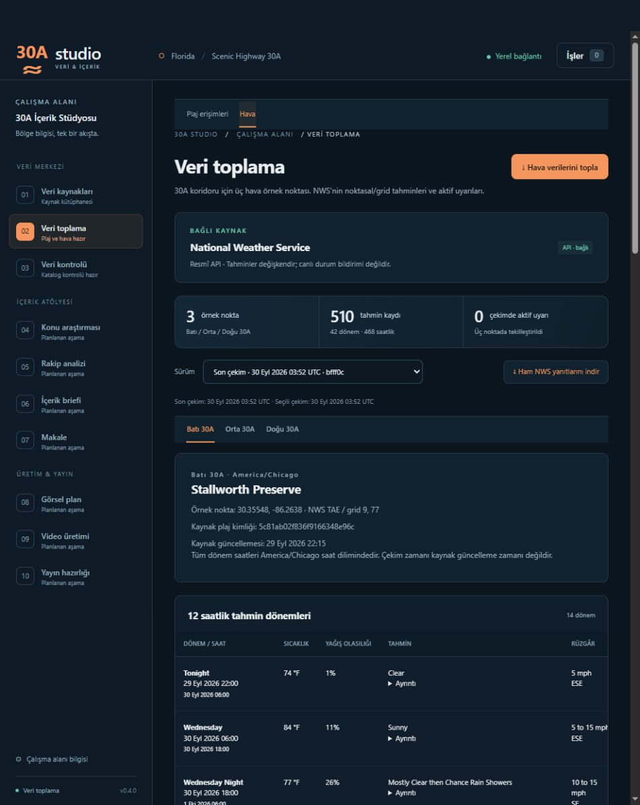

# 30A Studio

30A veri ve içerik üretim uygulaması · **v0.12.0 (geliştirme dalı `gorev-09-kapsama-restoran`) — konaklama fiyat kapsaması ve restoranların kendi sitelerinden bilgiler** · son stable etiket: v0.11.0 (kiralama şirketlerinin kendi sitelerinden konaklama fiyatları). Genel kaynak toplama altyapısı; plaj, NWS hava, restoran ve mahalle toplayıcıları, plaj erişimlerini mahallelere bağlayan yöntemi etiketli eşleme katmanı ve iklim toplayıcıları (NOAA normalleri, deniz suyu sıcaklığı, kasırga geçmişi) hazır. Housing Atlas'tan bağımsız bir projedir. (Eski `v0.7-lodging-inventory` dalı yalnız konaklama keşif belgesidir; bu sürümle ilgisi yoktur.)

## Açılış

Bu klasördeki **baslat.bat** dosyasına çift tıklayın. İlk açılışta gerekli paketler kurulabilir. Uygulama tarayıcıda `http://127.0.0.1:8830` adresinde açılır. Başlatma penceresi açık kalmalıdır. Durdurmak için bu pencerede **Ctrl+C** kullanın.

## İlk deneme

1. Soldaki **Veri toplama** ekranını açın ve **Plaj verilerini topla** düğmesine basın.
2. Sağdaki **İşler** panelinden ilerlemeyi izleyin. İş bitince paneli kapatarak kayıtları inceleyin.
3. Ad veya adrese göre arayın; yerleşim ve olanak filtrelerini kullanın. Kayıt adına basınca ayrıntılar açılır.
4. **CSV indir** ile seçili sürümü dışa aktarın. **Ham kaynağı indir** ile çekilen sayfanın metnini alın.
5. Daha sonraki çekimler ayrı sürümler olarak saklanır. **Sürüm** listesinden önceki çekimlere dönün; seçili sürümün önceki başarılı çekime göre eklenen/kaldırılan/değişen/aynı kayıt sayılarını görün.
6. **Veri kaynakları** ekranında yeni kaynak ekleyin, düzenleyin veya arşivleyin. **Kayıtları kontrol et** yalnızca kaynak kayıtlarının hazırlık eksiklerini denetler.

Plaj veri toplama [South Walton plaj erişim sayfasına](https://www.visitsouthwalton.com/beach-bay-access-locations/) bağlıdır. Kaynaktaki Santa Rosa Beach, Grayton Beach, Seacrest ve Inlet Beach kıyı erişimleri seçilir; Miramar ve koy/göl noktaları dışarıda kalır. Bu seçim tüm 30A plajlarının eksiksiz listesi değildir. Olanakların kaynakta listelenmemesi, bulunmadıkları anlamına gelmez. Yerleşim adları kaynaktan aynen alınır.

Başlangıçtaki diğer dört kaynak adayının toplayıcısı, Claude, makale, görsel ve video üretimi henüz bağlı değildir. İleri aşamaların ekranları geliştirme planını gösterir. Kaynak formundaki sıklık alanı bir plandır; zamanlanmış otomatik toplama başlatmaz. Bu sürümde toplama elle başlatılır.

Kayıtlar bu projenin `data/` klasöründeki SQLite veritabanında, ham kaynaklar `data/raw/` altında kalır. Başarısız ve iptal edilmiş çekimler önceki başarılı sürümleri değiştirmez. Yedeklemek için uygulama kapalıyken `data/` klasörünün tamamını kopyalayın. Programın klasörünü başka yere taşırken `.venv` yeniden oluşturulmalıdır; kod ve `data/` korunmalıdır.

## Veri temeli ve yükseltme

Toplama işleri artık source_id ile izlenir; başarılı, başarısız ve iptal edilmiş çekimler genel source_runs yapısında saklanır. İşler panelinde kaynak adı görünür. Eski plaj ekranı, indirmeler ve veri sürümleri çalışmaya devam eder. On gerçek connector **BeachesConnector**, **WeatherConnector**, **RestaurantsConnector**, **NeighborhoodsConnector**, **ClimateNormalsConnector**, **WaterTemperatureConnector**, **StormProximityConnector**, **BookDirectLodgingConnector**, **AgencyRatesConnector** ve **RestaurantSitesConnector** olarak kayıtlıdır; başka kaynak için yalnızca URL eklemek yeterli değildir.

v0.1–v0.11 veritabanı açılırken önce `data/backups/` içine SQLite yedeği alınır, ardından şema 12'ye tek transaction ile yükseltilir. Kullanıcı kaynakları, geçmiş plaj sürümleri ve ham dosyalar korunur. Eski başarısız işlerde kaynak bilgisi yoksa tahmin edilmez. Yükseltmeden sonra eski uygulama sürümünü aynı veritabanına karşı çalıştırmayın; geri dönüş gerekiyorsa kapalı uygulamada yükseltme öncesi yedeğin ayrı kopyasını kullanın.

13 canonical bölge kimliği ve entities/entity_sources tabloları yalnızca temel seviyede hazırdır. Otomatik entity matching ve region polygon mapping yoktur; toplayıcılar adres veya koordinattan mahalle tahmin etmez. Plaj erişimlerinin mahallesi yalnız ayrı ve gözden geçirilebilir eşleme dosyasından gelir ([M7](docs/M7-MAHALLE-VERISI.md)). Claude/OpenAI, scheduler ve içerik üretimi henüz uygulanmadı. Playwright yalnız isteğe bağlıdır: bir kiralama şirketi ya da restoran sitesi insan doğrulaması isterse, korumalı bir şirket sitesi okunurken ve menüsünü JavaScript ile çizen restoran siteleri için görünür tarayıcı penceresini açar (`pip install .[browser]`).

## Belgeler

- [Konaklama kaynağı keşfi — tam envanter kapsamı henüz doğrulanmadı](docs/M6-KONAKLAMA-KAYNAK-KEŞFİ.md)
- [Uygulamanın çalışma mantığı](CALISMA_MANTIGI.md)
- [Kanal konsepti ve içerik stratejisi](docs/KONSEPT.md)
- [Devir belgeleri (01–07)](docs/DEVIR/)
- [v0.6 teknik çalışma mantığı (eski kök belge)](docs/TEKNIK-CALISMA-MANTIGI-v0.6.md)
- [Housing Atlas incelemesi ve 30A mimarisi](docs/MIMARI.md)
- [Kademeli geliştirme planı](docs/ASAMALAR.md)
- [Plaj veri kaynağının kapsamı ve kontrolleri](docs/M2-VERI-TOPLAMA.md)
- [Hava verisi](docs/M3-HAVA-VERISI.md)
- [Restoran dizini ve kapsamı](docs/M4-RESTORAN-VERISI.md)
- [Mahalle verisi ve plaj–mahalle eşlemesi](docs/M7-MAHALLE-VERISI.md)
- [İklim verisi: normaller, deniz suyu sıcaklığı, kasırga geçmişi](docs/M8-IKLIM-VERISI.md)
- [Elle doğrulanmış referans tablosu](docs/M9-REFERANS-TABLOSU.md)
- [Konaklama profili: Book>Direct tarihli arama anlık görüntüleri](docs/M10-KONAKLAMA-PROFILI.md)
- [Konaklama fiyatları: kiralama şirketlerinin kendi siteleri](docs/M11-KONAKLAMA-FIYATLARI.md)
- [Restoran bilgileri: işletmelerin kendi siteleri](docs/M12-RESTORAN-BILGILERI.md)

## Geliştirme

Python 3.12 veya sonrası gerekir. Yeni sanal ortamda `python -m pip install -e ".[test]"` ile kurulur. Testler `python -m pytest -q` ile, uygulama `python -m studio` ile çalışır. Tarayıcı açmadan çalıştırmak için `python -m studio --no-browser`; ayrı deneme verileri için `--data-dir` kullanın. Testler canlı ağ veya Claude çağrısı yapmaz.

GitHub Actions, Python 3.12 üzerinde editable test kurulumu ve pytest çalıştırır: [iş akışları](https://github.com/bemonths/tatilya/actions). Testler gerçek HTTP bağlantısını engeller.

### Korunan veri davranışı

Kaynak kütüphanesi registry'den gelen her connector için **Toplayıcı hazır** durumunu, adını ve sürümünü gösterir. Arşivdeki kaynaklar arşiv durumunu korur. Genel toplama işlerinde plaj ekranına bağlantı yalnızca plaj connector sonucunda gösterilir.

Plaj sürüm karşılaştırması aynı kaynak ve connector için devam eder; connector sürümü değişmişse ayrıştırma değişikliğinin farkları etkileyebileceği uyarısı görünür. Eski v0.2 çekimleriyle karşılaştırma korunur.

Ham SHA-256 için tek kaynak, `Database.record_raw_artifact()` tarafından diskteki gerçek dosyadan hesaplanan değerdir; `CollectionResult` hash taşımaz. Visit South Walton yönlendirmeleri yalnızca `visitsouthwalton.com` ve `www.visitsouthwalton.com` arasında, HTTPS ve varsayılan/443 port ile izlenir; en fazla üç yönlendirme kabul edilir.

Beklenmeyen hataların teknik mesajları yaygın parola/token/API anahtarı ve URL kimlik bilgileri gizlendikten sonra 500 karakterle sınırlanarak yalnızca dahili veritabanı diagnostic alanında tutulur. Normal API/SSE yanıtlarında yayımlanmaz.

## NWS hava verisi · v0.4

**Veri toplama → Hava → Hava verilerini topla** ile üç örnek noktanın güncel NWS tahminlerini ve aktif uyarılarını ayrı bir çekim olarak saklayın. Kaynak kütüphanesinde National Weather Service **API · bağlı / Toplayıcı hazır** görünür. Veri toplama içindeki Plaj/Hava/Restoranlar/Mahalleler/Konaklama/İklim/Referanslar sekmeleri ve İşler panelindeki sonuç bağlantıları ilgili domain'i açar.

Batı / Orta / Doğu seçimi, Visit South Walton kaynağındaki 53 kıyı erişiminin boylam sıralamasına dayanır. Noktalar canonical mahalle merkezleri değildir. Tam koordinat/provenance ve NWS akışı: [Hava verisi sözleşmesi](docs/M3-HAVA-VERISI.md).

API'nin verdiği bütün dönem ve saatlik tahminler saklanır; ekranda saatlik kayıtların ilk 24'ü gösterilir. Tahmin saatleri `/points` yanıtındaki saat dilimine göre, çekim zamanları açıkça UTC ile gösterilir. Sürüm seçiciden eski çekimler incelenebilir. NWS'nin null alanları sıfıra çevrilmez. Aynı uyarı birden çok noktayı etkiliyorsa tek uyarı ve nokta ilişkileri saklanır. “Aktif uyarı yok” seçili çekimin durumudur; canlı güvenlik bildirimi değildir.

Hava kayan/geçici bir tahmin penceresidir; eklenen/silinen kayıt farkı gösterilmez. Ham yanıt paketi indirilebilir. Tarihsel iklim normalleri ayrı İklim sekmesindedir (v0.8.0); observation station/current conditions, scheduler, Claude/OpenAI yoktur. API key gerekmez; veriler NWS'nin kendi tahminleridir.

Ön yüz yardımcı testleri: Node 22+ ile `node --test tests/frontend.test.mjs`. Node yalnızca test aracıdır; uygulamanın çalışması/kurulumu için gerekmez.

Varsayılan kaynak düzeltmesi: temiz kurulumda NWS yöntemi API, South Walton plaj yöntemi JSON olarak seed tanımından alınır. v3→v4 migration yalnızca tam kaynak URL'si eşleşen ve yöntemi hâlâ `Belirlenecek` olan bu iki kaydı günceller. NWS notu yalnızca eski varsayılan açıklamayla birebir aynıysa yeni tahmin/uyarı açıklamasına çevrilir. Not ve yöntem koşulları bağımsızdır; kullanıcı notu veya seçtiği yöntem korunur. Diğer kaynak alanları ve source_history değiştirilmez. Yükseltme öncesi yedek eski değerleri içerir. Zaten şema v4 olan veritabanlarında bu migration yeniden çalıştırılmaz.

## Restoran dizini · v0.5

**Veri toplama → Restoranlar → Restoran verilerini topla** ile Visit South Walton HTML dizini ve detay sayfaları okunur. 13 canonical mahalle, yalnızca **Restaurants** işletme türüyle taranır; Miramar Beach, Seascape ve Sandestin kapsam dışıdır. Filtre seçenekleri ana sayfadan keşfedilir. Her mahallenin bütün sayfaları taranır, detay URL'leri tekilleştirilir ve birden fazla mahallede bulunan kayıtların bütün ilişkileri korunur.

Ad, açıklama, adres, iletişim, işletme sitesi bağlantısı, cuisine, meals served ve diğer amenities saklanır. Metin, mahalle, mutfak türü ve öğün filtreleri; ayrıntı paneli, eski sürüm seçimi ve önceki başarılı sürüme göre fark sayıları kullanılabilir. Ham indirme, response dosyalarının yollarını ve hash'lerini içeren manifesttir. Kaynak güncelleme zamanı bulunmadığından `source_updated` null kalır.

Ratings/reviews, scheduler ve AI yoktur; menü, fiyat ve saat gibi bilgiler v0.12.0'dan itibaren ayrı bir toplayıcıyla restoranın kendi sitesinden alınır (aşağıda). Üç bağlantının yöntemleri: Beaches = HTML içi JSON, Weather = NWS API, Restaurants = HTML dizin/detay. v4→v5 yalnızca yeni restoran tablolarını ekler; restoran kaynağının güvenli URL kimliği eşleştiğinde, yöntem hâlâ Belirlenecek ise HTML yapılır ve yalnızca eski varsayılan not güncellenir. Kullanıcı düzenlemeleri korunur. Ayrıntılar: [M4 restoran veri sözleşmesi](docs/M4-RESTORAN-VERISI.md).
Kaynakta description bulunmayan veya boş açıklamalı geçerli restoranlar NULL açıklamayla kaydedilir ve ekranda “Belirtilmemiş” görünür. Metin uydurulmaz; generic meta description fallback yapılmaz. `description_missing_count` yalnızca çekimin gözlem sayısıdır. Güncel canlı sonuç ve mahalle sayıları [M4 canlı inceleme notunda](docs/M4-RESTORAN-VERISI.md).

Mevcut şema 5 kaynak onarımı: uygulama açılışında restoran URL’sinin www/no-www ve son slash varyantları aynı kaynak olarak tanınır. Yalnız eski varsayılan yöntem/not güncellenir; kullanıcı seçimleri, kaynak sürümü ve geçmiş korunur. Tekrar açılışta gereksiz UPDATE yapılmaz. HTTPS dışı, query/fragment, credentials ve farklı host/port eşleşmez. Bu davranış kod güncellendikten sonra uygulama tamamen kapatılıp yeniden açıldığında devreye girer.

## Destinasyon katmanı · v0.6

30A ilk production destinasyonudur. Global seçici kaynakları, bölgeleri, işleri ve veri geçmişini destinasyona göre yükler. NWS yapılandırılmış hava noktalarını kullanır; South Walton connector’ları yalnız 30A’ya bağlanır. Aynı URL veya bölge adı farklı destinasyonlarda bulunabilir. Kaynak kimlikleri ve geçmiş snapshot’lar korunur. İkinci production destinasyonu eklenmedi. Tasarım, migration ve yeni destinasyon ekleme akışı: [M5 destinasyon katmanı](docs/M5-DESTINASYON-KATMANI.md).

## Mahalle verisi ve plaj–mahalle eşlemesi · v0.7.0

**Veri toplama → Mahalleler → Mahalle verilerini topla** ile [Visit South Walton mahalle dizini](https://www.visitsouthwalton.com/neighborhoods/) ve her mahallenin sayfası okunur. 13 canonical mahalle kaynak adıyla birebir (veya açık yazım tablosuyla) bağlanır; Miramar Beach, Seascape ve Sandestin kapsam dışıdır; hedef mahallelerden biri yoksa çekim başarısız olur. Kaynak kimliği, permalink, kısa tanıtım, temsilî nokta (mahalle merkezi değildir), kaynak etiketleri, kayıt değişiklik zamanı ve sayfa tanıtım metni (yoksa boş) saklanır. Sürüm seçimi, fark özeti, batıdan doğuya liste ve ayrıntı paneli vardır. Kaynak metinleri iç araştırma kanıtıdır; videoda aynen kullanılmaz.

Plaj ekranında her erişimin yanında mahalle ve yöntem etiketi görünür (eşleme v3): **resmî rehber** (Visit South Walton park ve ulaşım rehberi, 2023-05-04), **ilçe alt bölüm verisi** (erişim noktası Walton County alt bölüm poligonunun içinde ve alt bölüm adı mahalleyi açıkça belirtiyor), **ilçe alt bölüm verisi (bitişik)** (nokta böyle bir poligona 30 m veya daha yakın) — bu üçü kaynak gösterilerek söylenebilir —, **komşu erişimlerle tutarlı** (batıdaki ve doğudaki en yakın kaynaklı erişim aynı mahallede) veya **program türetimi** (mahalle temsilî noktalarına boylam farkıyla en yakın mahalle); son ikisi yalnız yaklaşık konumdur. Yakın iki aday için “belirsiz”, dosyada olmayan yeni kimlikler için “eşlenmemiş” yazar; mahalleye göre filtrelenebilir. Eşleme `studio/destinations/thirty_a_beach_neighborhoods.csv` dosyasındadır, `tools/plaj_mahalle_esleme.py` ile üretilir ve uygulama çalışırken yeniden hesaplanmaz. Ayrıntılar ve doğrulama: [M7](docs/M7-MAHALLE-VERISI.md).

## İklim verisi · v0.8.0

**Veri toplama → İklim** sekmesinde üç toplayıcı vardır: **İklim normallerini topla** (NOAA NCEI 1991–2020 aylık normalleri; 30A için kıyı referansı Destin–Fort Walton Beach Havalimanı ve iç kesim karşılaştırması DeFuniak Springs), **Deniz suyu sıcaklığını topla** (NOAA NDBC'nin PCBF1 Panama City Beach istasyonunun yıllık ölçüm dosyalarından aylık ortalama) ve **Kasırga izlerini topla** (NOAA NHC HURDAT2 kayıtlarından 30A kıyı koridoruna 50 ve 100 deniz mili içinden geçen fırtınalar). Toplayıcılar genel çekirdektedir; istasyonlar, kıyı koridoru ve yarıçaplar destinasyon yapılandırmasından gelir. Aylık tabloda değerler kaynağın birimiyle (°F, inç) ve altında °C/mm ile, bayrakları ve yıl sayılarıyla görünür; deniz suyu ortalamasının yanında kullanılan yıl sayısı yazar. Kasırga bölümünde yarıçap ve dönem seçilir; aylara ve sınıflara göre sayılar ile koridora en yakın geçen fırtınalar listelenir. v0.9.0'dan itibaren yalnız fırtınanın tropikal veya subtropikal olduğu evreler sayılır; daireye yalnız ekstratropikal, alçak basınç, dalga veya bozukluk evresinde giren fırtınalar ayrı bir "sayılmayan" satırında gösterilir. Her tablonun altında kaynak ve "bizim hesabımız" etiketi vardır; değerler istasyonlara göredir, "30A'nın iklimi" diye sunulmaz. Ayrıntılar, yöntem ve sınırlar: [M8](docs/M8-IKLIM-VERISI.md).

## Referans tablosu · v0.9.0

**Veri toplama → Referanslar** sekmesi, toplayıcıyla alınamayan ama videoda söylenecek bilgileri salt okunur gösterir: Walton County plaj kuralları (Ordinance 2025-22), South Walton Fire District bayrak ve ateş kuralları, plaj erişimi ve Beach Park and Ride, havalimanlarına kuş uçuşu uzaklıklar, golf arabası ve düşük hızlı araç kanunları, park ve orman ücretleri, kasırga sezonu, ziyaretçi ve konaklama göstergeleri. Her satırda kaynak bağlantısı, belgedeki yeri, kısa alıntı, erişim tarihi, durum ("doğrulandı", "çelişkili", "doğrulanamadı") ve yeniden kontrol tarihi vardır; tarihi geçen satırlar işaretlenir. Tablo `studio/destinations/thirty_a_references.csv` dosyasındadır ve elle güncellenir; uygulama yalnız okur ve doğrular. South Walton'ın aylık turist vergisi tahsilatları `studio/destinations/thirty_a_tdt_collections.csv` dosyasındadır. Ayrıntılar ve video dili: [M9](docs/M9-REFERANS-TABLOSU.md).

## Konaklama profili · v0.10.0

**Veri toplama → Konaklama → Konaklama aramalarını topla**, Visit South Walton'ın resmî "Stay" sayfasının kullandığı Book>Direct aramalarını yapılandırılmış tarih pencerelerinde (30A için 2026 sonbaharı, 2027 kışı, bahar tatili ve yazı; Cumartesi–Cumartesi 7 gece) her mahalle filtresi için çalıştırır: görünen ilanlar, türleri, yatak odası, banyo ve kapasite, kaynağın verdiği liste ve canlı fiyatlar, her ilanın fiyat takviminin aylık özeti. Sekmede mahalle × pencere özeti (ilan sayısı, tür ve oda dağılımı, fiyatlı ilan payı, gecelik fiyat ortancası ve çeyrekleri), mahalle başına aylık takvim ortancaları ve ilan ayrıntıları görünür. Bu veri belirli tarihlerdeki aramaların anlık görüntüsüdür, tam envanter değildir; fiyatlar kaynağa göre en düşük müsait günlük fiyata dayanır ve vergi/ücretlerin dahil olup olmadığı kaynakta belirtilmiyor. Çekim sıralı ve aralıklı isteklerle uzun sürebilir (takvimi gizli ilanlarda takvim istenmez; ~35 dk). Her ilanın kiralama şirketinin kendi ilan sayfasına bağlantısı ayrıntıda görünür. Ayrıntılar: [M10](docs/M10-KONAKLAMA-PROFILI.md).

## Konaklama fiyatları · v0.11.0

**Veri toplama → Konaklama → Kiralama şirketi fiyatlarını topla**, son konaklama çekimindeki ilanların kiralama şirketi bağlantılarını açar ve yapılandırılmış şirketlerin kendi sitelerinde (30A için 9 şirket: ResCMS, Track, Streamline ve "vacation-rentals/router" altyapıları) her tarih penceresi için sitenin herkese açık fiyat ve müsaitlik gösterimini sorar: kira, temizlik ve diğer ücretler (adlarıyla), vergiler, genel toplam, en az gece ve giriş günü kuralı (site gösteriyorsa). İlan şirket sitesindeki ilana yalnız bağlantıyla eşlenir; ad benzerliğiyle eşleme yapılmaz. Sekmenin altındaki fiyat bölümünde mahalle × pencere için sorgulanan ve fiyatı alınan ilan sayısı, müsait payı, 7 gecelik toplamın ortancası ve çeyrekleri, oda sayısına göre ortancalar, şirket bazında sonuç ve ilan ilan fiyat dökümü görünür. Aynı siteye istekler sıralı ve aralıklıdır; bir site insan doğrulaması isterse görünür tarayıcı açılır, İşler panelinde hangi sitenin beklediği yazar ve doğrulamayı kullanıcı yapar. Ayrıntılar: [M11](docs/M11-KONAKLAMA-FIYATLARI.md).

## Kapsama ve restoran bilgileri · v0.12.0

**Konaklama fiyatları (`agency-lodging-rates/2`):** yapılandırılmış kiralama şirketi 9'dan 24'e çıktı (yeni altyapılar: VRPConnect, Southern Resorts'un fiyat servisi, Exceptional Stay, ASP.NET GetQuote, Wander, Q4VR). Book>Direct bağlantısı çalışmayan ilanlar, şirketin kendi ilan listesiyle **adres** (sokak numarası, sokak adı, daire ve oda sayısı birebir; tek aday) ya da adres yoksa **konum** (15 m içinde, oda ve banyo aynı, 50 m içinde tek aday; çok daireli binalarda kullanılmaz) kuralıyla eşlenir; ad tek başına eşleme ölçütü değildir ve her eşleşmenin yöntemi görünür. Tek bir topluluğun resmî kiralama programında (30A için Alys Beach) Book>Direct'te olmayan evler "şirketin kendi envanteri" olarak ayrı sayılır. Fiyat formu çalışmayan ama sezon kirası yayımlayan sitelerde bu kira "yayımlanmış kira (vergi ve ücret hariç)" olarak ayrı tutulur, toplam fiyat ortancalarına karışmaz. Her fiyatta kaç misafirle sorulduğu saklanır. Cloudflare arkasındaki şirketler yalnız görünür tarayıcıdan, en az 6 sn arayla ve tek tek okunur; ilk ret ya da engel sayfasında o şirket durur. Yeni pencere: Sonbahar 2027.

**Restoran bilgileri (`restaurant-sites/1`):** **Veri toplama → Restoranlar → İşletme sitelerinden bilgi topla**, son restoran dizinindeki her restoranın kendi sitesini (ve yayımladığı menü/sipariş platformu sayfalarını) okur: site durumu (çalışıyor, kapandı, sezon için kapalı, başka işletme vb.), menüler ve menü kalemleri (fiyat metniyle), çalışma saatleri, rezervasyon (platform ve bağlantı), çocuk menüsü, açık hava, su kenarı/manzara, köpek dostu. Her değerin kaynak adresi, erişim zamanı, ham kopyasının SHA-256'sı ve yöntemi (yapısal veri, sayfa metni, PDF metni, platform verisi, görüntüden okundu) saklanır; site söylemiyorsa "bilinmiyor" kalır. Ana yemek fiyatlarının ortancası en kapsamlı ana öğün menüsünden hesaplanır; **fiyat seviyesi** ($ / $$ / $$$ / $$$$) bizim sınıflamamızdır ve en az 5 ana yemek fiyatı ister. Restoranlar sekmesinde seviye, ortanca, rezervasyon ve çocuk menüsü sütunları ve filtreleri, ayrıntıda kaynaklarıyla bütün alanlar, mahalle özeti vardır. Görüntü menüler bir kişi tarafından okunup gözden geçirme dosyasına yazılır. Ayrıntılar: [M12](docs/M12-RESTORAN-BILGILERI.md).
