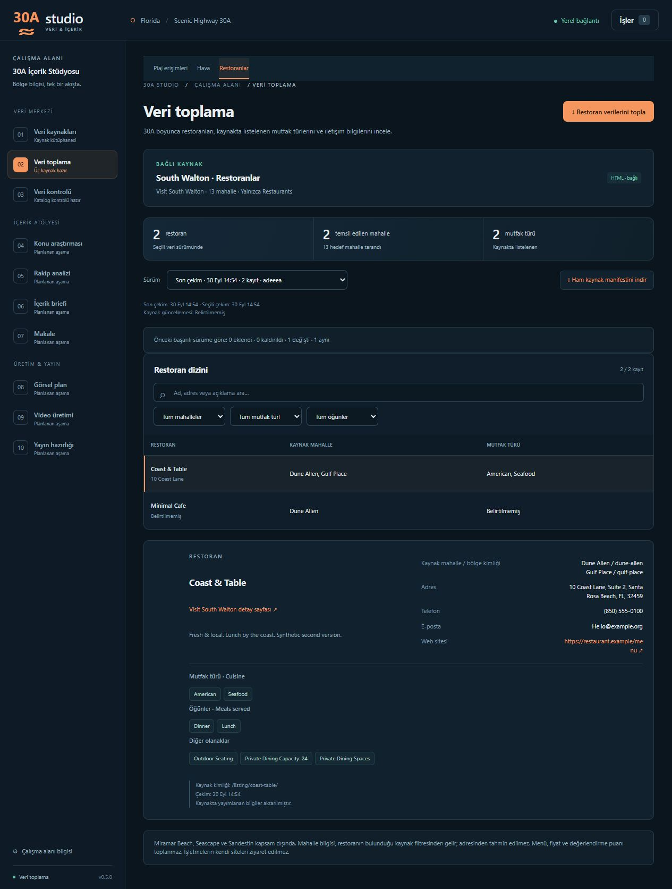

# M4 · Visit South Walton restoran dizini

Uygulama 0.5.0 · SQLite şema 5 · `south-walton-restaurants/1` · HTML · diff etkin.

## Kaynak ve kapsam

Üç çalışan bağlantı sözleşmesi vardır: Beaches, Visit South Walton HTML içindeki JSON'u; Weather, NWS API'sini; Restaurants, [Culinary Experiences dizini](https://www.visitsouthwalton.com/listings/culinary-experiences/) ve `/listing/.../` detay HTML'lerini kullanır. Restoran bağlantısı yalnızca **Restaurants** business type seçeneğini kabul eder. Catering, Craft Beer & Spirits ve Grocery/Meal Delivery toplanmaz.

Hedef mahalleler: Dune Allen, Gulf Place, Santa Rosa Beach, Blue Mountain Beach, Grayton Beach, WaterColor, Seaside, Seagrove, WaterSound, Seacrest, Alys Beach, Rosemary Beach, Inlet Beach. **Miramar Beach, Seascape ve Sandestin kapsam dışında.** Mevcut `regions.py` ID'leri değiştirilmez; kaynak etiketleri aynı isimle açıkça eşlenir. Adresten mahalle tahmini yapılmaz.

Opaque mahalle/business ID'leri kodda sabit değildir. Ana sayfanın formundan option label/value ve gerçek query parametre adları keşfedilir. 13 hedef + 3 dışlanan mahalle ve Restaurants seçeneği bulunamazsa işlem anlaşılır hata verir. Her sonuç sayfasında istenen iki seçeneğin gerçekten selected olduğu kontrol edilir. Query adları/değerleri çekim ortasında değişirse işlem başarısız olur.

## Toplama ve kimlik

1. Filtre HTML'ini al ve doğrula.
2. 13 hedef mahallenin Restaurants sonuçlarını sırayla oku; bütün pager linklerini izle. Link filtreleri taşımıyorsa keşfedilmiş filtreler korunur; başka filtre değeri döndüren link reddedilir.
3. Detay URL'lerini query/fragment olmadan `/listing/slug/` biçiminde tekilleştir. Aynı ID farklı adlara çıkarsa doğrulama hatası ver.
4. Her benzersiz detay sayfasını bir kez oku. Yönlendirme kimliği değiştiremez; kart ve detay adları eşleşmelidir. Bulunduğu bütün mahalleleri koru.
5. Tüm detaylar doğrulanınca kayıtları, mahalle ilişkilerini ve job/run başarı durumunu mevcut generic transaction içinde birlikte kaydet.

Alanlar: external_id, name, listing_url, description; nullable address_line_1/address_line_2/city/state/postal_code/phone/email/website_url; cuisines, meals_served, amenities dizileri. Whitespace ve HTML entity'ler normalize edilir. Telefonun kaynak metni korunur. Cuisine ve Meals Served ayrı listeler; kalan amenity satırları ayrı liste olur. Güvenilir kaynak güncelleme alanı bulunmadığından **source_updated NULL** kalır; fetched_at bunun yerine geçmez.

Menü, fiyat, rezervasyon uygunluğu, ratings/reviews, başka sitelerdeki saatler, sosyal medya, restoranın kendi sitesini tarama, scheduler ve AI yoktur. İşletme sitesi yalnızca bağlantı alanıdır; bağlantıdaki domaine HTTP isteği yapılmaz. Description için açıklama üretme veya başka kaynakla tamamlama yapılmaz.

## HTTP ve ham kayıtlar

HTTPS, yalnızca visitsouthwalton.com/www.visitsouthwalton.com, credentials olmadan, varsayılan/443 port kabul edilir. TLS doğrulaması açıktır. Bağlantı 10 saniye, diğer HTTP aşamaları 20 saniye timeout kullanır. Yanıt başına açılmış body sınırı 5 MB; tüm mahalleler toplamında en çok 100 listing sayfası, en çok 500 benzersiz detay kabul edilir. Her istekte en çok 3 redirect; bağlantı/timeout/5xx hatasında bir retry ve 0.5 saniye iptal edilebilir bekleme vardır. 429 doğrudan anlaşılır hata döner. İstekler sıralı, aralarında 0.1 saniye beklemelidir; indirme sırasında iptal kontrol edilir.

`data/raw/<run-id>/manifest.json`, `listing/NNNN.html`, `detail/NNNN.html` kullanılır. Dosya adlarında kaynak adı/URL metni yoktur. Manifestte connector, source URL, fetched_at; her response için sequence, request_kind, neighborhood, requested_url, final_url, status, content_type, raw_file ve raw_sha256 yer alır. Yönlendirme/retry yanıtları da ayrı sıradadır. Alt dosya hash'leri connector'da; **ana manifestin source_runs.raw_sha256 değeri yalnızca Database.record_raw_artifact tarafından gerçek disk baytlarından** hesaplanır. Manifest her tamamlanan yanıtta atomik değiştirilir. Yarım/boyut sınırını aşan response başarıyla saklanmış gibi gösterilmez; önceki tamamlanmış yanıtlar kalır.

## Şema ve migration

`restaurant_records`: PK(run_id, external_id), run_id → source_runs. Cuisine/meal/amenity alanlarında json_valid ve array tür kontrolü vardır. `restaurant_regions`: PK(run_id, external_id, source_neighborhood), composite FK → restaurant_records; nullable canonical_region_id → regions. Run/name ve canonical region/run index'leri eklenir.

Fresh DB şema 5'tir. v1/v2/v3/v4 zinciri mevcut backup API ile başlangıç şemasının yedeğini alıp tek transaction içinde 5'e ulaşır. Source/history/jobs/runs, plaj/hava verileri, regions/entities/entity_sources ve raw dosyalar korunur. Migration hatasında şema ve tablo değişiklikleri geri alınır.

Restoran seed URL'si tam eşleştiğinde method yalnızca hâlâ `Belirlenecek` ise `HTML` olur. Notes yalnızca eski varsayılan “Restoran dizini. Menü ve fiyatlar için işletmelerin kendi sayfaları ayrıca incelenecek.” metniyle birebir eşleşirse yeni dizin/kapsam açıklamasına çevrilir. İki koşul bağımsızdır; kullanıcı yöntemi/notu ve diğer alanları korunur. Yeni veritabanının seed tanımı doğrudan HTML ve güncel açıklama kullanır.

## API, diff ve ekran

- `GET /api/restaurant-runs`: yalnızca başarılı restoran sürümleri.
- `GET /api/restaurant-runs/{id}`: run, records (mahalle ilişkileri dahil), diff.
- `GET /api/restaurant-runs/{id}/raw`: yalnızca ilgili run'ın raw dizinindeki manifest.json indirmesi. Çözümlenmiş dosya yolu dizin dışına veya başka run'a çıkamaz.

Genel source-runs uçları korunur. Hata veya iptal halinde kısmi domain kaydı yayımlanmaz ve önceki başarılı sürüm değişmez. Diff aynı kaynak+connector için önceki başarılı run ile kimlik bazında added/removed/changed/unchanged hesaplar. Ad, açıklama, tüm adres/iletişim/site alanları ve normalize edilmiş listeler/mahalle ilişkileri karşılaştırılır. Liste ve ilişki sırası fark sayılmaz. Connector sürümü farklıysa UI mevcut uyarıyı gösterir.

**Veri toplama → Restoranlar**: son çekim, toplam restoran, temsil edilen mahalle ve cuisine sayısı; toplama düğmesi, başarılı sürüm seçimi, diff; ad/adres/açıklama araması ve mahalle/cuisine/meals filtreleri. Detay paneli bütün alanları gösterir; eksik alanlar Belirtilmemiş olarak görünür. Harici bağlantılar target=_blank, rel=noopener noreferrer taşır. İşler panelinde kaynak adı ve `#collect/restaurants` hedefi, ortak domainTarget helper üzerinden gösterilir.

## Doğrulama

Sentetik, küçük HTML fixture'ları `tests/fixtures/restaurants/` içindedir. Canlı tam sayfa kopyaları depoya alınmaz. Testlerde yalnızca MockTransport kullanılır ve no_real_http fixture'ı açık kalır. Migration zinciri/backup/veri koruma, koşullu seed, form keşfi, pagination/dedupe/çoklu mahalle, tüm alanlar, HTTP sınırları/retry/iptal, manifest/hash, atomik rollback, önceki başarılı sürüm, diff ve API path koruması test edilir. Ön yüz testleri domain hedefi, arama/filtre birleşimi ve güvenli bağlantı oluşturmayı kapsar.

Canlı smoke yalnızca ayrı geçici veri dizininde yapılır. Kullanıcının mevcut gerçek veritabanı bu denemede kullanılmaz. Canlı sayılar test beklentisi veya uygulama sabiti değildir.
## Canlı kaynak incelemesi · 30 Eylül 2026

Kullanıcı DB'sinden ayrı geçici dizinde gerçek generic job çalıştırıldı. 13 mahalle filtresi ve bütün pagination sayfaları okundu: **22 listing sayfası, 138 benzersiz restoran, 3 tekrar**. İlk job, 31. detay olan Beignets & Brew sayfasındaki zorunlu açıklama eksikliği nedeniyle failed oldu; sıfır restaurant_records/restaurant_regions yayımlandı. Ham manifest korundu.

Bağımsız teşhis taraması mevcut yanıtları tekrar kullanıp kalan detayları da okudu: **138 detayın 136'sı doğrulandı**. Beignets & Brew ile Cajun Corner Sports Bar and Grill sayfalarında açıklama bloğu yoktur. Sayfa meta açıklaması genel turizm metnidir; restoran açıklaması diye kullanılmadı. Bu sürüm, talimattaki zorunlu description kuralını korur; kaynak bu eksikleri gidermedikçe veya nullable açıklama için veri sözleşmesi değiştirilmedikçe tam canlı run başarıya geçmez. Eksik kayıtları atlama, metin uydurma veya kısmi snapshot yayımlama yapılmaz.

| Mahalle | Benzersiz kayıt |
|---|---:|
| Dune Allen | 2 |
| Gulf Place | 6 |
| Santa Rosa Beach | 28 |
| Blue Mountain Beach | 8 |
| Grayton Beach | 15 |
| WaterColor | 5 |
| Seaside | 19 |
| Seagrove | 17 |
| WaterSound | 3 |
| Seacrest | 8 |
| Alys Beach | 7 |
| Rosemary Beach | 12 |
| Inlet Beach | 11 |

Mahalle sayılarının toplamı, bir restoran birden fazla filtrede bulunduğu için benzersiz restoran toplamından büyük olabilir. Bunlar gözlem tarihinin sayılarıdır; koda veya test beklentilerine sabitlenmemiştir.

Tarayıcıda **ayrı sentetik veri dizini** ile arama, mahalle/cuisine/meals filtrelerinin birleşimi, nullable iletişim alanları, iki sürüm arasında geçiş, diff ve iş sonucundan restoran sekmesine dönüş doğrulandı. Aşağıdaki önizleme yalnızca sentetik fixture kayıtlarını gösterir; canlı toplama başarısı anlamına gelmez.

