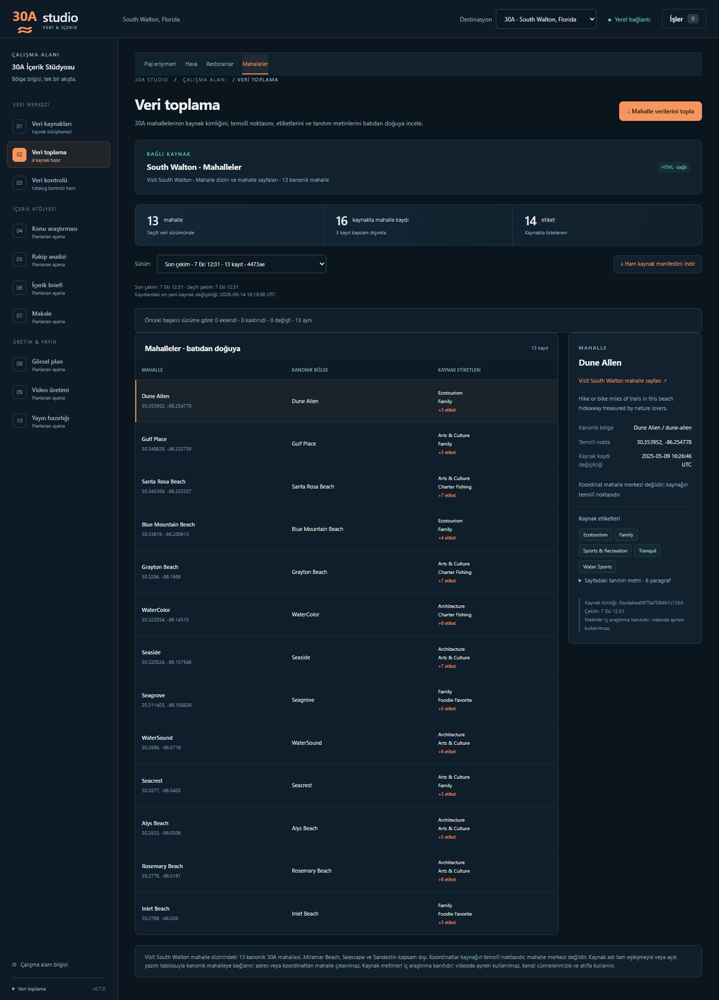
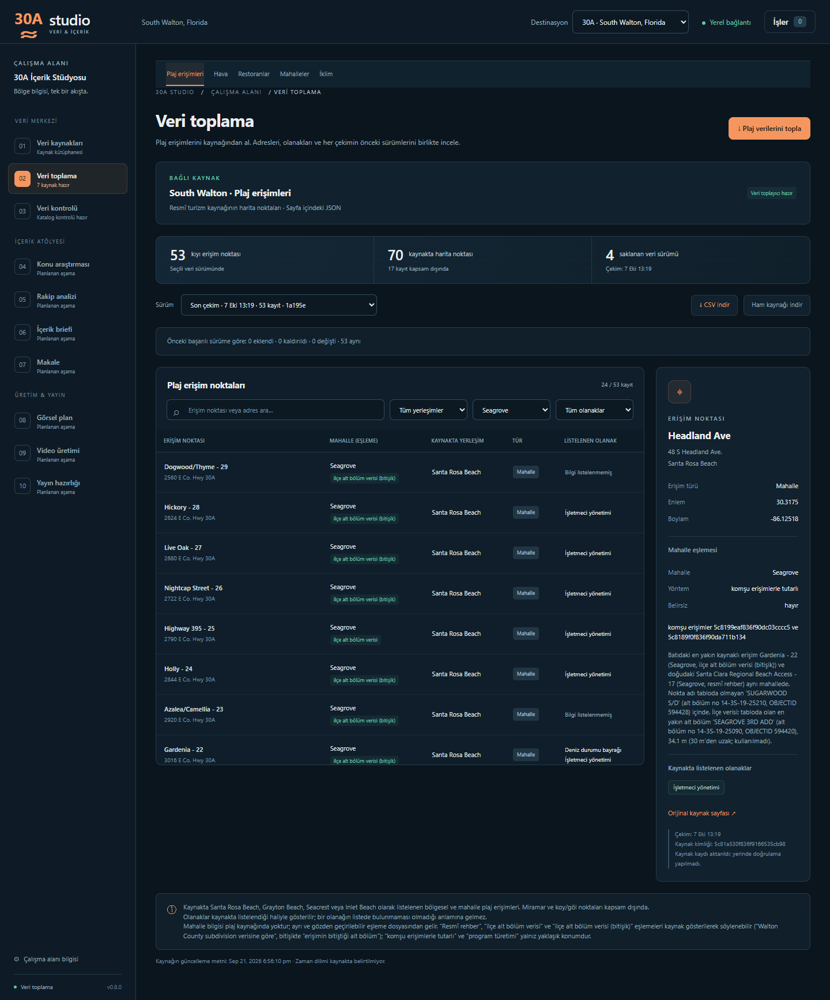

# M7 · Mahalle verisi ve plaj–mahalle eşlemesi

**v0.7.0 — mahalle verisi ve plaj–mahalle eşlemesi.** Uygulama 0.7.0 · SQLite şema 7 · `south-walton-neighborhoods/1` · HTML · diff etkin. GÖREV-03 ile geliştirildi; 7 Ekim 2026'da main'e alınıp `v0.7.0` olarak etiketlendi. Plaj–mahalle eşlemesi GÖREV-04'te ilçe alt bölüm poligonlarıyla yeniden kuruldu (v2) ve GÖREV-05'te yönetici kararıyla bitişik alt bölüm ve komşu tutarlılığı kurallarıyla genişletilip kilitlendi (v3, `gorev-05-iklim` dalı). Eski `v0.7-lodging-inventory` dalı yalnız konaklama keşif belgesidir; bu sürümle ilgisi yoktur.

## 1. Mahalle toplayıcısı

### Kaynak ve kapsam

Kaynak [Visit South Walton mahalle dizinidir](https://www.visitsouthwalton.com/neighborhoods/): dizin sayfasındaki gömülü JSON (`var locations = [...]`, 16 kayıt) ve her mahallenin kendi sayfası (`/neighborhoods/<permalink>/`). robots.txt (7 Ekim 2026) yalnız `/userfiles/` ve `/search/` yollarını kapatıyor; dizin ve mahalle sayfaları açık.

Kapsam programın 13 kanonik mahallesidir. Kaynaktaki ad kanonik bölge adıyla birebir eşleşerek bağlanır; yazım farkları yalnız 30A profilindeki açık tabloyla kabul edilir (`NEIGHBORHOOD_ALIASES`: Blue Mountain → Blue Mountain Beach, Watercolor → WaterColor, Watersound → WaterSound). Miramar Beach, Seascape ve Sandestin kapsam dışıdır ve `excluded_count`'a girer. Kaynağa yeni ve tanınmayan bir mahalle eklenirse o da kapsam dışı sayılır ve run metadata'sında `unknown_neighborhoods` olarak raporlanır. Hedef 13 mahalleden biri dizinde yoksa çekim başarısız olur. Adres, koordinat veya permalink'ten mahalle çıkarılmaz.

Toplayıcı 30A'ya özeldir: kaynak kaydı `destination_id=30a` değilse bağlanmaz.

### Saklanan alanlar (`neighborhood_records`)

| Alan | Anlamı |
|---|---|
| `external_id` | Kaynağın 24 haneli kayıt kimliği |
| `name` | Kaynaktaki ad |
| `permalink`, `page_url` | Kaynaktaki sayfa yolu ve tam adresi |
| `canonical_region_id` | Kanonik bölge kimliği (`regions`) |
| `summary` | Dizindeki kısa tanıtım cümlesi; yoksa NULL |
| `latitude`, `longitude` | **Kaynağın temsilî noktası; mahalle merkezi değildir.** Sınır veya alan bilgisi taşımaz. |
| `tags` | Kaynak etiketleri (Walkable, Tranquil, Family vb.), tekil ve sıralı JSON dizi |
| `source_modified` | Kaynak kaydının kendi `modified` değeri (UTC, `+0000`); `fetched_at` değildir |
| `page_intro` | Mahalle sayfasındaki tanıtım metni (`section#neighborhood-hero .copious` paragrafları); blok yoksa veya boşsa NULL |

Run düzeyindeki `source_updated`, seçilen kayıtların en yeni `modified` değeridir. Kaynakta listelenmeyen bir etiket, o özelliğin mahallede olmadığı anlamına gelmez.

**Metin kullanım notu:** Kaynak metinleri (kısa tanıtım, sayfa tanıtım metni, etiketler) yalnız iç araştırma kanıtıdır; **videoda aynen kullanılmaz, kendi cümlelerimizle ve atıfla kullanılır.**

### Doğrulama, güvenlik ve ham kayıt

- Dizin: tam bir `var locations` bloğu; JSON dizi; en çok 100 kayıt; 24 haneli tekil kimlik; tekil ad; slug biçiminde permalink; enlem 29,5–31,5 ve boylam −87,5…−85,0 aralığında sayı; geçerli etiket metni. Yinelenen kimlik, bozuk JSON veya beklenmeyen yapı çekimi durdurur.
- Sayfa: tek `section#neighborhood-hero`; `.hero-title h1 > span` içindeki ad dizindeki adla aynı olmalıdır (kimlik kontrolü). Birden fazla tanıtım bloğu belirsiz yapı sayılır. Yönlendirme dizin veya mahalle yolunu değiştiremez.
- HTTP: restoran toplayıcısıyla aynı sınırlar. Yalnız HTTPS, `visitsouthwalton.com`/`www.visitsouthwalton.com`, kimlik bilgisiz, varsayılan/443 port; bağlantı 10 sn, diğer aşamalar 20 sn zaman aşımı; yanıt başına 5 MB; en çok 3 yönlendirme; bağlantı/zaman aşımı/5xx için bir yeniden deneme; 429 doğrudan hata; istekler sıralı ve aralarında 0,1 sn; indirme sırasında iptal kontrolü.
- Ham kayıt: `data/raw/<run>/manifest.json`, `index/NNNN.html`, `pages/NNNN.html`. Manifest her yanıtın sırasını, istenen/son adresini, durumunu, içerik türünü, dosyasını ve SHA-256'sını tutar; manifestin kendi SHA-256'sı veritabanı katmanında diskteki baytlardan hesaplanır.
- Yayın: bütün sayfalar doğrulanınca kayıtlar ve run/job başarısı tek transaction'da yazılır. Hata veya iptal halinde kısmi kayıt yayımlanmaz; önceki başarılı sürüm değişmez.

### Diff

Kimlik kaynak kimliğidir. Ad, permalink, sayfa adresi, kanonik bölge, kısa tanıtım, temsilî nokta, etiketler (sıra farkı sayılmaz) ve sayfa tanıtım metni karşılaştırılır. Yalnız `source_modified` değişmişse kayıt "aynı" sayılır; bu alan CMS damgasıdır.

### Şema 7 ve migration

`neighborhood_records`: PK(`run_id`, `external_id`), UNIQUE(`run_id`, `canonical_region_id`); `run_id` → `source_runs`, `canonical_region_id` → `regions`; koordinat CHECK'leri; `tags` için JSON dizi kontrolü.

v6 → v7 mevcut kurallarla çalışır: açılışta `data/backups/` içine SQLite yedeği, tek transaction, `foreign_key_check`, hata halinde geri alma. Mevcut tablolar ve satırlar değişmez; 30A'da uyumlu bir mahalle kaynağı yoksa yalnız "South Walton · Mahalleler" kaynağı eklenir (kullanıcının eklediği veya arşivlediği uyumlu kaynak varsa ikinci kaynak eklenmez). Yeni kurulumda kaynak seed'den gelir.

### API ve ekran

- `GET /api/neighborhood-runs`: yalnız başarılı mahalle sürümleri (destinasyona göre).
- `GET /api/neighborhood-runs/{id}`: run, kayıtlar (batıdan doğuya), diff.
- `GET /api/neighborhood-runs/{id}/raw`: yalnız o run'ın ham dizinindeki `manifest.json`.

**Veri toplama → Mahalleler**: toplama düğmesi, sürüm seçimi, fark özeti, batıdan doğuya liste (temsilî nokta ve kaynak etiketleri) ve ayrıntı paneli (kanonik bölge, temsilî nokta notu, kaynak kaydı değişikliği, etiketler, açılır kapanır sayfa tanıtım metni).



## 2. Plaj erişimi–mahalle eşleme katmanı (v3)

Sürümler: v1 (GÖREV-03) resmî rehber dışındaki erişimleri mahalle temsilî noktalarına boylam yakınlığıyla bağladı. v2 (GÖREV-04) Walton County alt bölüm poligonlarını ekledi, ama yalnız noktanın poligonun içinde olduğu durumda; plaj erişimleri çoğunlukla kamuya ait yol uçlarında, alt bölüm sınırının birkaç metre dışında durduğu için bu yalnız 6 erişimde işe yaradı. v3 (GÖREV-05, yönetici kararı) bitişik alt bölümleri (≤ 30 m) ve komşu erişimlerle tutarlılığı ekledi ve kilitlendi.

### Yer ve ilke

Plaj kaynağında mahalle alanı yoktur. Eşleme, plaj toplayıcısından ve `beach_records` tablosundan ayrı, 30A'ya özel, gözden geçirilebilir bir katmandır (`beach_records.canonical_region_id` NULL kalır). Dosyalar 30A profilinin yanında, `studio/destinations/` altındadır:

| Dosya | İçerik |
|---|---|
| `thirty_a_beach_neighborhoods.csv` | Eşleme: `external_id, plaj_adi, bolge_id, yontem, kaynak, not, belirsiz`. Uygulama yalnız bunu okur. |
| `thirty_a_beach_subdivisions.csv` | İlçe sorgusunun erişim başına sonucu: `external_id, alt_bolum_adi, alt_bolum_numarasi, poligon_kimligi, iliski, mesafe_m, katman_url, sorgu_zamani`. Her erişim için noktayı içeren bütün poligonlar (`iceride`, 0 m) ve 75 m içindeki öteki bütün poligonlar (`yakin`, mesafesiyle) ayrı satırdır; 75 m içinde hiç poligon yoksa tek bir `sonucsuz` satırı. `alt_bolum_numarasi` ilçenin `SUBDIVISION_NUMBER` değeridir (haftalık yayında değişebilen `OBJECTID`'den daha kalıcı). |
| `thirty_a_subdivision_neighborhoods.csv` | Alt bölüm adı → mahalle tablosu: `alt_bolum_adi, bolge_id, gerekce`. Adlar kaynağın verdiği gibi, birebir. |

Üretici `tools/plaj_mahalle_esleme.py` geliştirme aracıdır; veritabanını salt okunur açar, ilçe sonuçlarını repodaki CSV'den okur ve ağa yalnız `--ilce-sorgula` ile çıkar. Uygulama eşlemeyi çalışırken yeniden hesaplamaz. API: `GET /api/beach-neighborhoods` (bootstrap içinde de gelir).

### İlçe alt bölüm kaynağı

| | |
|---|---|
| Katman | [Subdivision Boundaries](https://services1.arcgis.com/TaXHPwWfIMuzJ7Ov/ArcGIS/rest/services/EnerGov_Additional/FeatureServer/13) — `EnerGov_Additional/FeatureServer/13`, poligon, 7 Ekim 2026'da 2.254 kayıt |
| Sahibi | Walton County GIS (ArcGIS Online kuruluşu `TaXHPwWfIMuzJ7Ov`). Servis açıklaması: "Additional GIS Data made for EnerGov application also general use - Updated Weekly". |
| Alanlar | `OBJECTID` (kayıt kimliği), `SUBDIVISION_NUMBER` (ilçenin alt bölüm numarası, ör. `15-3S-19-25070`), `PRCL_PARCEL_NUMBER`, `OWNER_NAME` (katmanın görüntüleme alanı), `LEGAL_1–3` (yasal tanım), `USE_DESC` (HEADER RECORD / NOTE RECORD …), `CreationDate`, `EditDate` |
| Alt bölüm adı | Ayrı bir "ad" alanı yok. Alt bölüm başlık kayıtlarında ad `OWNER_NAME` alanında duruyor (ör. `SEAGROVE 1ST ADD`); bazı kayıtlarda bu alan geliştirici/sahip adı (`SEAGROVE ENDEAVORS`), bilgi kaydı (`INFORMATION ONLY`) veya yasal tanım (`S/D OF LOT 2`) taşıyor. Ad olarak `OWNER_NAME` kullanılır; ad tablosu yalnız adı açıkça bir mahalleyi belirten kayıtları kabul eder. |
| Son düzenleme | `dataLastEditDate` 2026-10-04T03:19:58Z. Servis haftalık yeniden yayımlandığı için bu tarih verinin kendi değişiklik tarihi olmayabilir. |
| Kayıt kimliği | `OBJECTID` (GlobalID yok) ve `SUBDIVISION_NUMBER`; ikisi de sonuç dosyasında saklanır. |
| Kullanım / lisans | Katmanın açıklama ve telif alanı boş, servisin telif alanı doldurulmamış ("My Credits"); ayrı bir kullanım koşulu bulunamadı. ArcGIS REST yayımlanmış bir API'dir; 53 nokta için tek seferlik sorgu yapıldı (istekler arası 0,25 sn). `services1.arcgis.com` robots.txt yayımlamıyor. Atıf: "Walton County GIS, Subdivision Boundaries (erişim 7 Ekim 2026)". |
| Değerlendirilen alternatif | Aynı servisteki 31 numaralı "Covenants Restrictions" katmanı açık bir `Sub_Name` alanı veriyor; ancak yalnız kayıtlı sözleşme/kısıtlama belgesi olan mülkleri kapsıyor ve açıklaması 2013 güncellemesini belirtiyor. Kullanılmadı. |

### Sorgu

Her erişim noktası için iki ArcGIS REST `query` isteği: nokta-poligon (`geometryType=esriGeometryPoint`, `spatialRel=esriSpatialRelIntersects`, `inSR=4326`, geometri içinde `{"spatialReference":{"wkid":4326}}`) ve 100 m aday araması. Aday geometrilerinden noktaya uzaklık yerel olarak (metre) hesaplanır; noktayı içermeyen ve 75 m içinde kalan bütün poligonlar kaydedilir. Mesafeler 0,1 m'ye yuvarlanmış olarak yazılır ve kurallar bu kayıtlı değere uygulanır. Ham yanıtlar `work/` altında saklanır, repoya girmez.

7 Ekim 2026 sonucu (53 erişim, 106 istek): 50 "içeride" satırı (21 erişim en az bir poligonun içinde) ve 246 "yakın" satırı; her erişimin 75 m içinde en az bir poligon var.

### Alt bölüm adı → mahalle tablosu

Kural değişmedi: adda kanonik mahalle adı tam olarak geçiyorsa (yalnız `BCH` = `BEACH` kısaltması kabul) ve ad bir alt bölüm/plat başlığıysa tabloya alınır. Genişleyen sorgu 144 farklı ad döndürdü; tabloda 37 ad var (Dune Allen 4, Gulf Place 1, Blue Mountain Beach 1, Grayton Beach 5, Seagrove 16, Seacrest 2, Rosemary Beach 4, Inlet Beach 4). Alınmayanlar: şirket/sahip/dernek adları (`SEAGROVE ENDEAVORS`, `SEASIDE LAND AND DEVELOPMENT`, `DALTON COTTAGES AT SEAGROVE HO ASSOC INC`, `WALKOVER PROPERTIES`), bilgi kayıtları, yasal tanımlar, tam mahalle adı taşımayanlar (`BUTLER'S ADD TOWN OF GRAYTON`) ve başka yer/site adları. `VILLAS AT SANTA ROSA BEACH THE` de alınmadı: "Santa Rosa Beach" aynı zamanda 30A'nın büyük bölümünü kapsayan posta/şemsiye adıdır; ad mahalleyi açıkça belirtmiyor (bu kompleks, resmî rehberin Gulf Place saydığı Ed Walline erişiminin 24,7 m yanında). Kararlı tam liste: [alt-bolum-adlari-v3.csv](gorevler/GOREV-05/alt-bolum-adlari-v3.csv).

### Yöntem sırası (v3)

1. **`resmi_rehber`** — GÖREV-02 önizlemesindeki 9 eşleme olduğu gibi; kaynak = [Guide to Beach Parking and Transportation](https://www.visitsouthwalton.com/blog/guide-beach-parking-transportation/) (yayın 2023-05-04).
2. **`ilce_alt_bolum`** — nokta, ad tablosunda bir mahalleye bağlanan bir alt bölüm poligonunun **içinde** (içindeki tablolu adlar tek bir mahalle gösteriyor). Etiket: "ilçe alt bölüm verisi".
3. **`ilce_alt_bolum_yakin`** — nokta böyle bir poligonun içinde değil; ad tablosunda bir mahalleye bağlanan ve **30 m veya daha yakın** olan poligonlar tek bir mahalle gösteriyor. Noktanın tabloda olmayan bir poligonun (INFORMATION ONLY, yasal tanım, site adı vb.) içinde olması bu kuralı engellemez. 30 m içinde farklı mahallelere bağlanan poligonlar varsa sonuç vermez ve notta yazılır; 30–75 m arasındaki poligonlar kullanılmaz. Etiket: "ilçe alt bölüm verisi (bitişik)".
4. **`komsu_tutarliligi`** — ilk üç yöntemle atanamayan erişim için, boylam sırasına göre batısındaki en yakın ve doğusundaki en yakın kaynağa dayalı erişim (yöntemi 1, 2 veya 3) aynı mahalledeyse erişim o mahalleye atanır; kıyı boyunca mahallelerin kesintisiz olduğu varsayımına dayanır. Komşu sonuçları zincirleme kullanılmaz. Kaynak sütununda iki komşunun kimliği, notta adları yazılır. Etiket: "komşu erişimlerle tutarlı".
5. **`turetim_en_yakin_mahalle_noktasi`** — ilk dördü sonuç vermezse mahalle temsilî noktalarına boylam farkıyla en yakın mahalle; kaynak = mahalle çekiminin run kimliği; atanabilir en yakın iki aday arasındaki fark 0,003°'den küçükse `belirsiz=evet`. Etiket: "program türetimi".

**Kısıt:** Resmî rehber Alys Beach ve Rosemary Beach için "No Public Beach Access" diyor; hiçbir yöntem bu iki mahalleye erişim atamaz. İlçe verisi (içeride ya da 30 m içinde) bir erişimi bu mahallelere bağlarsa satır "Resmî rehberle çelişki" notuyla işaretlenir, raporlanır ve sonraki yöntemlere geçilir.

### Sonuç (7 Ekim 2026)

Girdiler gerçek veritabanının çekimleri: plaj `1a195e2b27604fbb9443f7376434df6d`, mahalle `3d1cbe8d5efc4e0fbae432786d57be23` (program türetimi satırlarının kaynağı). 53 erişim: **9 resmî rehber, 6 ilçe alt bölüm verisi, 16 ilçe alt bölüm verisi (bitişik), 13 komşu erişimlerle tutarlı, 9 program türetimi**; belirsiz yok. **Resmî rehberle çelişki: 1** — Winston Lane - 4, `ROSEMARY BEACH PH 1/2/3` poligonlarına 8,5 m (ve `PH 2 REPLAT`'e 17,4 m); Rosemary Beach'e atanmadı, komşuları farklı mahallede olduğu için program türetimi Inlet Beach dedi.

| Mahalle | Resmî rehber | İlçe | İlçe (bitişik) | Komşu | Türetme | Toplam | v2 |
|---|---:|---:|---:|---:|---:|---:|---:|
| Dune Allen | 2 | 1 | 2 | 1 | 3 | 9 | 7 |
| Gulf Place | 1 | 0 | 0 | 0 | 0 | 1 | 3 |
| Santa Rosa Beach | 1 | 0 | 0 | 0 | 2 | 3 | 3 |
| Blue Mountain Beach | 1 | 0 | 3 | 0 | 0 | 4 | 4 |
| Grayton Beach | 1 | 2 | 1 | 0 | 0 | 4 | 4 |
| WaterColor | 0 | 0 | 0 | 0 | 0 | 0 | 0 |
| Seaside | 0 | 0 | 0 | 0 | 0 | 0 | 9 |
| Seagrove | 2 | 2 | 9 | 11 | 0 | 24 | 15 |
| WaterSound | 0 | 0 | 0 | 0 | 0 | 0 | 0 |
| Seacrest | 0 | 0 | 1 | 0 | 2 | 3 | 3 |
| Alys Beach | 0 | 0 | 0 | 0 | 0 | 0 | 0 |
| Rosemary Beach | 0 | 0 | 0 | 0 | 0 | 0 | 0 |
| Inlet Beach | 1 | 1 | 0 | 1 | 2 | 5 | 5 |

v2 → v3: 29 satır değişti; 11'inde mahalle (Palms of Dune Allen West/East: Gulf Place → Dune Allen; Dogwood/Thyme - 29, Hickory - 28, Live Oak - 27, Nightcap Street - 26, Holly - 24, Azalea/Camellia - 23, Gardenia - 22: Seaside → Seagrove, bitişik; Headland Ave, Greenwood - 21: Seaside → Seagrove, komşu), 18'inde yalnız yöntem. Tablo: [esleme-v2-v3-fark.csv](gorevler/GOREV-05/esleme-v2-v3-fark.csv).

### Doğrulama

Yeni yöntemler 9 resmî eşlemeye de uygulandı (resmî eşlemenin kendisi değişmez):

| Yöntem | Aynı | Sonuçsuz | Farklı |
|---|---:|---:|---:|
| İlçe (içeride) | 1 | 8 | 0 |
| İlçe (bitişik, ≤ 30 m) | 2 | 7 | 0 |
| Komşu tutarlılığı | 3 | 6 | 0 |
| Program türetimi | 8 | 0 | 1 |
| Zincir (ilk sonuç veren yöntem) | 8 | 0 | 1 |

Yeni yöntemler hiçbir resmî eşlemede farklı sonuç vermedi. Zincirdeki tek fark Walton Dunes - 8'dir: ilk üç yöntem sonuç vermiyor, program türetimi WaterSound diyor, resmî rehber Seagrove. Tablo: [esleme-dogrulama-v3.csv](gorevler/GOREV-05/esleme-dogrulama-v3.csv).

### Sınırlar

- Seaside, WaterColor ve WaterSound'a hiç erişim atanmadı. Bu, bu yöntemlerin ve verinin sonucudur; "orada halka açık plaj erişimi yok" anlamına gelmez.
- Komşu tutarlılığı mahallelerin kıyı boyunca kesintisiz olduğunu varsayar. Örneğin Eastern Lake çevresindeki erişimler (Ramsgate - 11 … Sugar Dunes - 9), batıdaki One Seagrove - 13 (ilçe, bitişik, Seagrove) ile doğudaki Walton Dunes - 8 (resmî rehber, Seagrove) arasında kaldığı için Seagrove sayıldı.
- İlçe alt bölüm adı mahallenin sınırını değil, alt bölümün adını verir; ad tablosu yalnız adı açıkça mahalle belirten kayıtlarla sınırlıdır.

### Videoda kullanım dili

- "Resmî rehber" eşlemeleri kaynak gösterilerek söylenebilir (Visit South Walton park ve ulaşım rehberi, 2023-05-04).
- "İlçe alt bölüm verisi" eşlemeleri kaynak gösterilerek söylenebilir: "Walton County subdivision verisine göre …".
- "İlçe alt bölüm verisi (bitişik)" eşlemeleri kaynak gösterilerek söylenebilir: "Walton County subdivision verisine göre, erişimin bitiştiği alt bölüm …".
- "Komşu erişimlerle tutarlı" ve "program türetimi" eşlemeleri yalnız yaklaşık konum bilgisidir ("Seagrove civarında" gibi); kesin mahalle veya mahalle başına erişim sayısı iddiası yapılmaz.

### Yeniden üretim

Depo kökünden (veritabanı salt okunur açılır; gerçek veritabanı için önce `work/` altına backup API ile kopya alınır):

```text
.venv\Scripts\python.exe -X utf8 -m tools.plaj_mahalle_esleme --data-dir <veri-klasörü> --plaj-run <plaj-run> --mahalle-run <mahalle-run> --dogrulama <dogrulama.csv> --onceki <eski-esleme.csv> --fark <fark.csv>
```

İlçe sorgusunu yenilemek için `--ilce-sorgula --ham <work-altında-klasör>` (yalnız sorgu için `--yalniz-sorgu`) eklenir; bu, `thirty_a_beach_subdivisions.csv` dosyasını yeniden yazar. Yeni bir üretim gözden geçirildikten sonra ayrı commit olarak alınır.

## 3. Testler ve canlı kontroller

Testler sentetik fixture ve `MockTransport` kullanır; canlı ağ yoktur (`tests/fixtures/neighborhoods/`, `tests/test_neighborhoods.py`, `tests/test_beach_neighborhoods.py`, `tests/frontend.test.mjs`). Kapsananlar: 16 kayıtlık dizinden 13 seçim ve 3 dışlama, eksik hedef mahalle, bozuk/belirsiz JSON, yinelenen kimlik, tanıtım metni olmayan sayfa (NULL), yazım tablosu, bilinmeyen mahalle, sayfa kimliği ve yönlendirme kontrolleri, HTTP sınırları, yeniden deneme, iptal, atomik geri alma, diff, v6 → v7 migration ve geri alma, kaynağın yinelenmemesi, destinasyon yalıtımı; eşleme dosyasının okunması ve doğrulanması, API, üretici yöntemi (kısıt, belirsizlik, resmî satırlar), ilçe alt bölüm yöntemi (içeride / sonuçsuz / tabloda olmayan ad / farklı mahalle gösteren adlar), bitişik kural (30 m sınırı 29,9 / 30,0 / 30,1 m, tabloda olmayan poligonun içindeyken uygulanması, iki farklı mahalle yakınlığı), komşu tutarlılığı (iki komşu aynı / farklı / bir taraf yok, zincirleme yok), Rosemary–Alys kısıtı (içeride ve bitişik), ilçe sorgusunun parametreleri ve mesafe hesabı, sürüm farkı ve ekrandaki gösterim/filtre.

7 Ekim 2026 canlı denemesi (`work/gorev-03/temp-data`, gerçek `data/` kullanılmadı): mahalle çekimi 16 kayıt okudu, 13 mahalle kaydetti, 3 kaydı kapsam dışı saydı; 14 ham yanıtın hepsi HTTP 200, alt SHA-256'lar ve manifest özeti doğrulandı; 13 mahallenin hepsinde sayfa tanıtım metni vardı; ikinci çekimin farkı 0 eklendi · 0 kaldırıldı · 0 değişti · 13 aynı. Gerçek veritabanı kopyasında v6 → v7 denemesi yedek aldı, `foreign_key_check` boş döndü, mevcut satırlar korundu ve yalnız mahalle kaynağı eklendi. Ayrıntılar: [GÖREV-03 raporu](gorevler/GOREV-03/RAPOR.md).

7 Ekim 2026'da (GÖREV-04) gerçek veritabanı, `data/` klasörünün tam yedeği alındıktan sonra uygulamanın normal kullanımıyla v7'ye yükseltildi ve dört toplayıcı çalıştırıldı; mahalle verisinin ilk gerçek sürümü `3d1cbe8d5efc4e0fbae432786d57be23`. Ayrıntılar: [GÖREV-04 raporu](gorevler/GOREV-04/RAPOR.md).

7 Ekim 2026'da (GÖREV-05) gerçek veritabanı şema 8'e yükseltildi ve yalnız iklim toplayıcıları çalıştı; plaj ve mahalle verisi değişmedi. Aşağıdaki görüntü v3 eşlemesini gerçek veritabanının `work/` altındaki kopyasıyla gösterir: Seagrove filtresi, listede “ilçe alt bölüm verisi (bitişik)”, ayrıntıda “komşu erişimlerle tutarlı” (Headland Ave). v2 görüntüsü: [GÖREV-04](gorevler/GOREV-04/plaj-ekrani-esleme-v2.png).


