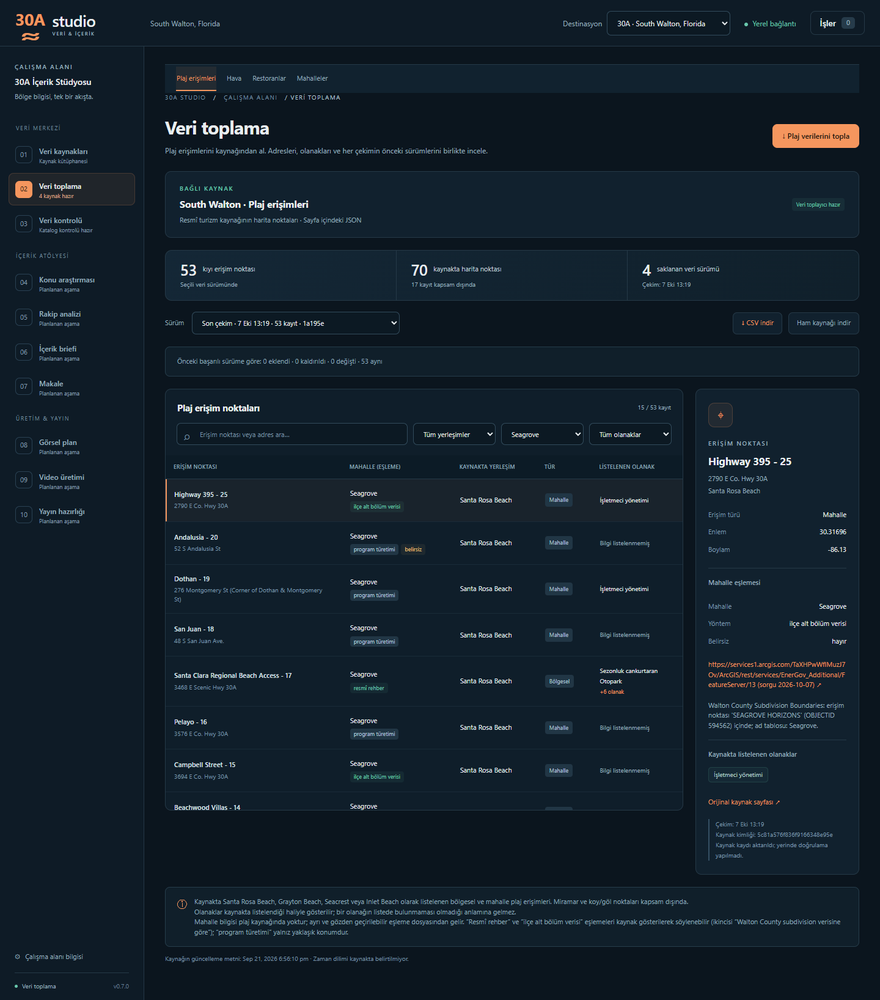

# M7 · Mahalle verisi ve plaj–mahalle eşlemesi

**v0.7.0 — mahalle verisi ve plaj–mahalle eşlemesi.** Uygulama 0.7.0 · SQLite şema 7 · `south-walton-neighborhoods/1` · HTML · diff etkin. GÖREV-03 ile geliştirildi; 7 Ekim 2026'da main'e alınıp `v0.7.0` olarak etiketlendi. Plaj–mahalle eşlemesi GÖREV-04'te (`gorev-04-esleme-v2` dalı) ilçe alt bölüm poligonlarıyla yeniden kuruldu (v2). Eski `v0.7-lodging-inventory` dalı yalnız konaklama keşif belgesidir; bu sürümle ilgisi yoktur.

## 1. Mahalle toplayıcısı

### Kaynak ve kapsam

Kaynak [Visit South Walton mahalle dizinidir](https://www.visitsouthwalton.com/neighborhoods/): dizin sayfasındaki gömülü JSON (`var locations = [...]`, 16 kayıt) ve her mahallenin kendi sayfası (`/neighborhoods/<permalink>/`). robots.txt (7 Ekim 2026) yalnız `/userfiles/` ve `/search/` yollarını kapatıyor; dizin ve mahalle sayfaları açık.

Kapsam programın 13 kanonik mahallesidir. Kaynaktaki ad kanonik bölge adıyla birebir eşleşerek bağlanır; yazım farkları yalnız 30A profilindeki açık tabloyla kabul edilir (`NEIGHBORHOOD_ALIASES`: Blue Mountain → Blue Mountain Beach, Watercolor → WaterColor, Watersound → WaterSound). Miramar Beach, Seascape ve Sandestin kapsam dışıdır ve `excluded_count`'a girer. Kaynağa yeni ve tanınmayan bir mahalle eklenirse o da kapsam dışı sayılır ve run metadata'sında `unknown_neighborhoods` olarak raporlanır. Hedef 13 mahalleden biri dizinde yoksa çekim başarısız olur. Adres, koordinat veya permalink'ten mahalle çıkarılmaz.

Toplayıcı 30A'ya özeldir: kaynak kaydı `destination_id=30a` değilse bağlanmaz.

### Saklanan alanlar (`neighborhood_records`)

| Alan | Anlamı |
|---|---|
| `external_id` | Kaynağın 24 haneli kayıt kimliği |
| `name` | Kaynaktaki ad |
| `permalink`, `page_url` | Kaynaktaki sayfa yolu ve tam adresi |
| `canonical_region_id` | Kanonik bölge kimliği (`regions`) |
| `summary` | Dizindeki kısa tanıtım cümlesi; yoksa NULL |
| `latitude`, `longitude` | **Kaynağın temsilî noktası; mahalle merkezi değildir.** Sınır veya alan bilgisi taşımaz. |
| `tags` | Kaynak etiketleri (Walkable, Tranquil, Family vb.), tekil ve sıralı JSON dizi |
| `source_modified` | Kaynak kaydının kendi `modified` değeri (UTC, `+0000`); `fetched_at` değildir |
| `page_intro` | Mahalle sayfasındaki tanıtım metni (`section#neighborhood-hero .copious` paragrafları); blok yoksa veya boşsa NULL |

Run düzeyindeki `source_updated`, seçilen kayıtların en yeni `modified` değeridir. Kaynakta listelenmeyen bir etiket, o özelliğin mahallede olmadığı anlamına gelmez.

**Metin kullanım notu:** Kaynak metinleri (kısa tanıtım, sayfa tanıtım metni, etiketler) yalnız iç araştırma kanıtıdır; **videoda aynen kullanılmaz, kendi cümlelerimizle ve atıfla kullanılır.**

### Doğrulama, güvenlik ve ham kayıt

- Dizin: tam bir `var locations` bloğu; JSON dizi; en çok 100 kayıt; 24 haneli tekil kimlik; tekil ad; slug biçiminde permalink; enlem 29,5–31,5 ve boylam −87,5…−85,0 aralığında sayı; geçerli etiket metni. Yinelenen kimlik, bozuk JSON veya beklenmeyen yapı çekimi durdurur.
- Sayfa: tek `section#neighborhood-hero`; `.hero-title h1 > span` içindeki ad dizindeki adla aynı olmalıdır (kimlik kontrolü). Birden fazla tanıtım bloğu belirsiz yapı sayılır. Yönlendirme dizin veya mahalle yolunu değiştiremez.
- HTTP: restoran toplayıcısıyla aynı sınırlar. Yalnız HTTPS, `visitsouthwalton.com`/`www.visitsouthwalton.com`, kimlik bilgisiz, varsayılan/443 port; bağlantı 10 sn, diğer aşamalar 20 sn zaman aşımı; yanıt başına 5 MB; en çok 3 yönlendirme; bağlantı/zaman aşımı/5xx için bir yeniden deneme; 429 doğrudan hata; istekler sıralı ve aralarında 0,1 sn; indirme sırasında iptal kontrolü.
- Ham kayıt: `data/raw/<run>/manifest.json`, `index/NNNN.html`, `pages/NNNN.html`. Manifest her yanıtın sırasını, istenen/son adresini, durumunu, içerik türünü, dosyasını ve SHA-256'sını tutar; manifestin kendi SHA-256'sı veritabanı katmanında diskteki baytlardan hesaplanır.
- Yayın: bütün sayfalar doğrulanınca kayıtlar ve run/job başarısı tek transaction'da yazılır. Hata veya iptal halinde kısmi kayıt yayımlanmaz; önceki başarılı sürüm değişmez.

### Diff

Kimlik kaynak kimliğidir. Ad, permalink, sayfa adresi, kanonik bölge, kısa tanıtım, temsilî nokta, etiketler (sıra farkı sayılmaz) ve sayfa tanıtım metni karşılaştırılır. Yalnız `source_modified` değişmişse kayıt "aynı" sayılır; bu alan CMS damgasıdır.

### Şema 7 ve migration

`neighborhood_records`: PK(`run_id`, `external_id`), UNIQUE(`run_id`, `canonical_region_id`); `run_id` → `source_runs`, `canonical_region_id` → `regions`; koordinat CHECK'leri; `tags` için JSON dizi kontrolü.

v6 → v7 mevcut kurallarla çalışır: açılışta `data/backups/` içine SQLite yedeği, tek transaction, `foreign_key_check`, hata halinde geri alma. Mevcut tablolar ve satırlar değişmez; 30A'da uyumlu bir mahalle kaynağı yoksa yalnız "South Walton · Mahalleler" kaynağı eklenir (kullanıcının eklediği veya arşivlediği uyumlu kaynak varsa ikinci kaynak eklenmez). Yeni kurulumda kaynak seed'den gelir.

### API ve ekran

- `GET /api/neighborhood-runs`: yalnız başarılı mahalle sürümleri (destinasyona göre).
- `GET /api/neighborhood-runs/{id}`: run, kayıtlar (batıdan doğuya), diff.
- `GET /api/neighborhood-runs/{id}/raw`: yalnız o run'ın ham dizinindeki `manifest.json`.

**Veri toplama → Mahalleler**: toplama düğmesi, sürüm seçimi, fark özeti, batıdan doğuya liste (temsilî nokta ve kaynak etiketleri) ve ayrıntı paneli (kanonik bölge, temsilî nokta notu, kaynak kaydı değişikliği, etiketler, açılır kapanır sayfa tanıtım metni).


## 2. Plaj erişimi–mahalle eşleme katmanı (v2)

GÖREV-03'teki v1 eşlemesi, resmî rehber dışındaki erişimleri yalnız mahalle temsilî noktalarına boylam yakınlığıyla bağlıyordu. Seaside, WaterColor gibi planlı toplulukların temsilî noktası küçük bir merkezdir; bu yöntem komşu ve dağınık yerleşimlerin (ör. Seagrove) erişimlerini kolayca bu topluluklara yazar. GÖREV-04'te eşleme, Walton County'nin alt bölüm (subdivision/plat) poligonlarıyla yeniden kuruldu.

### Yer ve ilke

Plaj kaynağında mahalle alanı yoktur. Eşleme, plaj toplayıcısından ve `beach_records` tablosundan ayrı, 30A'ya özel, gözden geçirilebilir bir katmandır (`beach_records.canonical_region_id` NULL kalır). Dosyalar 30A profilinin yanında, `studio/destinations/` altındadır:

| Dosya | İçerik |
|---|---|
| `thirty_a_beach_neighborhoods.csv` | Eşleme: `external_id, plaj_adi, bolge_id, yontem, kaynak, not, belirsiz`. Uygulama yalnız bunu okur. |
| `thirty_a_beach_subdivisions.csv` | İlçe sorgusunun erişim başına sonucu: `external_id, alt_bolum_adi, poligon_kimligi, iliski, mesafe_m, katman_url, sorgu_zamani`. Bir nokta birden fazla poligonun içindeyse (veya eşit uzaklıkta birden fazla yakın poligon varsa) her poligon ayrı satırdır. `iliski`: `iceride`, `yakin` veya `sonucsuz`. |
| `thirty_a_subdivision_neighborhoods.csv` | Alt bölüm adı → mahalle tablosu: `alt_bolum_adi, bolge_id, gerekce`. Adlar kaynağın verdiği gibi, birebir. |

Üretici `tools/plaj_mahalle_esleme.py` geliştirme aracıdır; veritabanını salt okunur açar, ilçe sonuçlarını repodaki CSV'den okur ve ağa yalnız `--ilce-sorgula` ile çıkar. Uygulama eşlemeyi çalışırken yeniden hesaplamaz. API: `GET /api/beach-neighborhoods` (bootstrap içinde de gelir).

### İlçe alt bölüm kaynağı

| | |
|---|---|
| Katman | [Subdivision Boundaries](https://services1.arcgis.com/TaXHPwWfIMuzJ7Ov/ArcGIS/rest/services/EnerGov_Additional/FeatureServer/13) — `EnerGov_Additional/FeatureServer/13`, poligon, 7 Ekim 2026'da 2.254 kayıt |
| Sahibi | Walton County GIS (ArcGIS Online kuruluşu `TaXHPwWfIMuzJ7Ov`). Servis açıklaması: "Additional GIS Data made for EnerGov application also general use - Updated Weekly". |
| Alanlar | `OBJECTID` (kayıt kimliği), `SUBDIVISION_NUMBER` (ilçenin alt bölüm numarası, ör. `15-3S-19-25070`), `PRCL_PARCEL_NUMBER`, `OWNER_NAME` (katmanın görüntüleme alanı), `LEGAL_1–3` (yasal tanım), `USE_DESC` (HEADER RECORD / NOTE RECORD …), `CreationDate`, `EditDate` |
| Alt bölüm adı | Ayrı bir "ad" alanı yok. Alt bölüm başlık kayıtlarında ad `OWNER_NAME` alanında duruyor (ör. `SEAGROVE 1ST ADD`); bazı kayıtlarda bu alan geliştirici/sahip adı (`SEAGROVE ENDEAVORS`), bilgi kaydı (`INFORMATION ONLY`) veya yasal tanım (`S/D OF LOT 2`) taşıyor. Ad olarak `OWNER_NAME` kullanıldı; ad tablosu yalnız adı açıkça bir mahalleyi belirten kayıtları kabul ediyor. |
| Son düzenleme | `dataLastEditDate` 2026-10-04T03:19:58Z. Servis haftalık yeniden yayımlandığı için bu tarih verinin kendi değişiklik tarihi olmayabilir. |
| Kayıt kimliği | `OBJECTID`; GlobalID yok. Haftalık yayında `OBJECTID`'nin korunup korunmadığı doğrulanmadı; daha kalıcı başvuru `SUBDIVISION_NUMBER`'dır (ham yanıtlarda var). |
| Kullanım / lisans | Katmanın açıklama ve telif alanı boş, servisin telif alanı doldurulmamış ("My Credits"); ayrı bir kullanım koşulu bulunamadı. ArcGIS REST yayımlanmış bir API'dir; 53 nokta için tek seferlik sorgu yapıldı (istekler arası 0,25 sn). `services1.arcgis.com` robots.txt yayımlamıyor. Atıf: "Walton County GIS, Subdivision Boundaries (erişim 7 Ekim 2026)". |
| Değerlendirilen alternatif | Aynı servisteki 31 numaralı "Covenants Restrictions" katmanı açık bir `Sub_Name` alanı veriyor; ancak yalnız kayıtlı sözleşme/kısıtlama belgesi olan mülkleri kapsıyor ve açıklaması 2013 güncellemesini belirtiyor. Kullanılmadı. |

### Sorgu

Her erişim noktası için ArcGIS REST `query`: `geometryType=esriGeometryPoint`, `spatialRel=esriSpatialRelIntersects`, `inSR=4326` ve geometri içinde `{"spatialReference":{"wkid":4326}}`. Nokta hiçbir poligonun içinde değilse 100 m aday araması yapılır; dönen geometrilerden noktaya uzaklık yerel olarak (metre) hesaplanır ve 75 m içindeki en yakın poligon(lar) `yakin` olarak, mesafesiyle kaydedilir. 75 m içinde poligon yoksa `sonucsuz` yazılır. Ham yanıtlar `work/` altında saklanır, repoya girmez.

7 Ekim 2026 sonucu (53 erişim): **21 erişim bir alt bölüm poligonunun içinde, 32 erişim yalnız yakınında** (en uzak 70,2 m); sonuçsuz yok. Plaj erişim noktalarının çoğu kamuya ait yol uçlarında, alt bölüm poligonlarının birkaç metre dışında kalıyor.

### Alt bölüm adı → mahalle tablosu

Sorgu 49 farklı ad döndürdü. Kural: adda kanonik mahalle adı tam olarak geçiyorsa (yalnız `BCH` = `BEACH` kısaltması kabul) ve ad bir alt bölüm/plat başlığıysa tabloya alınır. Şirket/sahip adları (`SEAGROVE ENDEAVORS`, `WALKOVER PROPERTIES`), bilgi kayıtları (`INFORMATION ONLY …`), yasal tanımlar (`S/D OF …`), tam mahalle adı taşımayanlar (`BUTLER'S ADD TOWN OF GRAYTON`) ve başka yer/site adları (ör. `SEA HIGHLANDS S/D`, `SUGARWOOD S/D`) alınmadı. Tabloda 13 ad var (Dune Allen 2, Blue Mountain Beach 1, Grayton Beach 3, Seagrove 5, Seacrest 1, Inlet Beach 1). Kararlı tam liste: [alt-bolum-adlari.csv](gorevler/GOREV-04/alt-bolum-adlari.csv).

### Yöntem sırası

1. **`resmi_rehber`** — GÖREV-02 önizlemesindeki 9 eşleme olduğu gibi; kaynak = [Guide to Beach Parking and Transportation](https://www.visitsouthwalton.com/blog/guide-beach-parking-transportation/) (yayın 2023-05-04).
2. **`ilce_alt_bolum`** — erişim noktası bir alt bölüm poligonunun **içindeyse** ve içinde olduğu poligonların adları tablodan **tek bir** mahalleye bağlanıyorsa. Tabloda olmayan adlar sonucu etkilemez; adlar farklı mahalleler gösterirse atama yapılmaz. Kaynak = katman adresi ve sorgu tarihi; not = alt bölüm adı ve `OBJECTID`. **Yakın poligonlar bu yöntemde kullanılmaz**; yalnız kayıtlı ve notta yazılı.
3. **`turetim_en_yakin_mahalle_noktasi`** — ilk iki yöntem sonuç vermezse mahalle temsilî noktalarına boylam farkıyla en yakın mahalle; kaynak = mahalle çekiminin run kimliği; atanabilir en yakın iki aday arasındaki fark 0,003°'den küçükse `belirsiz=evet`. Not, ilçe sorgusunun sonucunu da yazar (ör. "nokta alt bölüm poligonu içinde değil; en yakın: 'SEAGROVE 1ST ADD', 18,6 m").

**Kısıt:** Resmî rehber Alys Beach ve Rosemary Beach için "No Public Beach Access" diyor; bu iki mahalleye hiçbir erişim atanmaz. İlçe verisi bir erişimi bu iki mahallenin alt bölümünün içine düşürürse erişim o mahalleye atanmaz, satır "Resmî rehberle çelişki" notuyla işaretlenir ve raporlanır. 7 Ekim 2026 verisinde böyle bir erişim yok (Winston Lane - 4 Rosemary Beach alt bölümlerine 8,5 m yakın ama içinde değil; en yakın poligon BARBERY COAST S/D, 2,3 m).

### Sonuç (7 Ekim 2026)

Girdiler gerçek veritabanının güncel çekimleri: plaj `1a195e2b27604fbb9443f7376434df6d`, mahalle `3d1cbe8d5efc4e0fbae432786d57be23` (program türetimi satırlarının kaynağı). 53 erişim: **9 resmî rehber, 6 ilçe alt bölüm verisi, 38 program türetimi**; 2 belirsiz; resmî rehberle çelişki 0.

| Mahalle | Resmî rehber | İlçe alt bölüm | Program türetimi | Toplam (v1) |
|---|---:|---:|---:|---:|
| Dune Allen | 2 | 1 | 4 | 7 (6) |
| Gulf Place | 1 | 0 | 2 | 3 (4) |
| Santa Rosa Beach | 1 | 0 | 2 | 3 (3) |
| Blue Mountain Beach | 1 | 0 | 3 | 4 (4) |
| Grayton Beach | 1 | 2 | 1 | 4 (4) |
| WaterColor | 0 | 0 | 0 | 0 (0) |
| Seaside | 0 | 0 | 9 | 9 (10) |
| Seagrove | 2 | 2 | 11 | 15 (14) |
| WaterSound | 0 | 0 | 0 | 0 (0) |
| Seacrest | 0 | 0 | 3 | 3 (3) |
| Alys Beach | 0 | 0 | 0 | 0 (kısıt) |
| Rosemary Beach | 0 | 0 | 0 | 0 (kısıt) |
| Inlet Beach | 1 | 1 | 3 | 5 (5) |

v1 → v2: 6 satır değişti — 2'sinde mahalle (Lake Causeway - 41: Gulf Place → Dune Allen, `VIZCAYA AT DUNE ALLEN S/D` içinde; Highway 395 - 25: Seaside → Seagrove, `SEAGROVE HORIZONS` içinde), 4'ünde yalnız yöntem (Grayton Dunes - 17, Grayton Dunes (West), Campbell Street - 15, Lupine - 1). Tablo: [esleme-v1-v2-fark.csv](gorevler/GOREV-04/esleme-v1-v2-fark.csv).

**Sınır:** Seaside'a yazılan 9 erişimin hepsi program türetimidir. Bunlardan 7'si (Dogwood/Thyme - 29, Hickory - 28, Live Oak - 27, Nightcap Street - 26, Holly - 24, Azalea/Camellia - 23, Gardenia - 22) Seagrove alt bölümlerinin (`SEAGROVE 1ST ADD`, `SEAGROVE REVISED`, `SEAGROVE 3RD ADD`) 4,5–21,3 m yakınında ama içinde değil. Görev tanımı gereği yakın poligonlar atamada kullanılmadı. Yakın poligonlar da kullanılsaydı bu 7 erişim Seagrove'a, Palms of Dune Allen West/East (`PALMS AT DUNE ALLEN UNRECD`, 7,2–7,6 m) Dune Allen'a geçerdi; Seaside 9 → 2, Seagrove 15 → 22, Dune Allen 7 → 9, Gulf Place 3 → 1 olurdu. Bu seçenek uygulanmadı; karar yöneticinindir.

### Doğrulama

`ilce_alt_bolum` yöntemi 9 resmî eşlemeye de uygulandı: **1'inde aynı sonuç** (Bets "Beachmama" Haynes → Grayton Beach, `GRAYTON BEACH S/D` içinde), **8'inde sonuç yok** (5 erişim yalnız yakın poligonda, 3 erişim içinde olduğu poligonun adı bir mahalle belirtmiyor: `S/D OF LOT 2`, yasal tanım/bilgi kayıtları, `SEA WALK S/D`), **farklı çıkan yok**. Program türetimi aynı 9 eşlemenin 8'inde aynı (fark: Walton Dunes - 8, v1'deki gibi). Tablo: [esleme-dogrulama-v2.csv](gorevler/GOREV-04/esleme-dogrulama-v2.csv). Doğrulama ilçe yönteminin yanlış sonuç vermediğini gösteriyor; az sayıda erişime uygulanabildiğini de gösteriyor.

### Videoda kullanım dili

- "Resmî rehber" eşlemeleri kaynak gösterilerek söylenebilir (Visit South Walton park ve ulaşım rehberi, 2023-05-04).
- "İlçe alt bölüm verisi" eşlemeleri kaynak gösterilerek söylenebilir: "Walton County subdivision verisine göre …".
- "Program türetimi" eşlemeleri yalnız yaklaşık konum bilgisidir ("Seagrove civarında" gibi); kesin mahalle veya mahalle başına erişim sayısı iddiası yapılmaz. Belirsiz satırlarda iki komşu mahalle birlikte anılır.

### Yeniden üretim

Depo kökünden (veritabanı salt okunur açılır; gerçek veritabanı için önce `work/` altına backup API ile kopya alınır):

```text
.venv\Scripts\python.exe -X utf8 -m tools.plaj_mahalle_esleme --data-dir <veri-klasörü> --dogrulama <dogrulama.csv> --onceki <eski-esleme.csv> --fark <fark.csv>
```

İlçe sorgusunu yenilemek için `--ilce-sorgula --ham <work-altında-klasör>` (yalnız sorgu için `--yalniz-sorgu`) eklenir; bu, `thirty_a_beach_subdivisions.csv` dosyasını yeniden yazar. `--plaj-run` / `--mahalle-run` belirli çekimleri seçer. Yeni bir üretim gözden geçirildikten sonra ayrı commit olarak alınır.

## 3. Testler ve canlı kontroller

Testler sentetik fixture ve `MockTransport` kullanır; canlı ağ yoktur (`tests/fixtures/neighborhoods/`, `tests/test_neighborhoods.py`, `tests/test_beach_neighborhoods.py`, `tests/frontend.test.mjs`). Kapsananlar: 16 kayıtlık dizinden 13 seçim ve 3 dışlama, eksik hedef mahalle, bozuk/belirsiz JSON, yinelenen kimlik, tanıtım metni olmayan sayfa (NULL), yazım tablosu, bilinmeyen mahalle, sayfa kimliği ve yönlendirme kontrolleri, HTTP sınırları, yeniden deneme, iptal, atomik geri alma, diff, v6 → v7 migration ve geri alma, kaynağın yinelenmemesi, destinasyon yalıtımı; eşleme dosyasının okunması ve doğrulanması, API, üretici yöntemi (kısıt, belirsizlik, resmî satırlar), ilçe alt bölüm yöntemi (içeride / yakın / sonuçsuz / tabloda olmayan ad / farklı mahalle gösteren adlar / Rosemary–Alys çelişkisi), ilçe sorgusunun parametreleri ve mesafe hesabı, v1–v2 farkı ve ekrandaki gösterim/filtre.

7 Ekim 2026 canlı denemesi (`work/gorev-03/temp-data`, gerçek `data/` kullanılmadı): mahalle çekimi 16 kayıt okudu, 13 mahalle kaydetti, 3 kaydı kapsam dışı saydı; 14 ham yanıtın hepsi HTTP 200, alt SHA-256'lar ve manifest özeti doğrulandı; 13 mahallenin hepsinde sayfa tanıtım metni vardı; ikinci çekimin farkı 0 eklendi · 0 kaldırıldı · 0 değişti · 13 aynı. Gerçek veritabanı kopyasında v6 → v7 denemesi yedek aldı, `foreign_key_check` boş döndü, mevcut satırlar korundu ve yalnız mahalle kaynağı eklendi. Ayrıntılar: [GÖREV-03 raporu](gorevler/GOREV-03/RAPOR.md).

7 Ekim 2026'da (GÖREV-04) gerçek veritabanı, `data/` klasörünün tam yedeği alındıktan sonra uygulamanın normal kullanımıyla v7'ye yükseltildi ve dört toplayıcı çalıştırıldı; mahalle verisinin ilk gerçek sürümü `3d1cbe8d5efc4e0fbae432786d57be23`. Ayrıntılar: [GÖREV-04 raporu](gorevler/GOREV-04/RAPOR.md).


