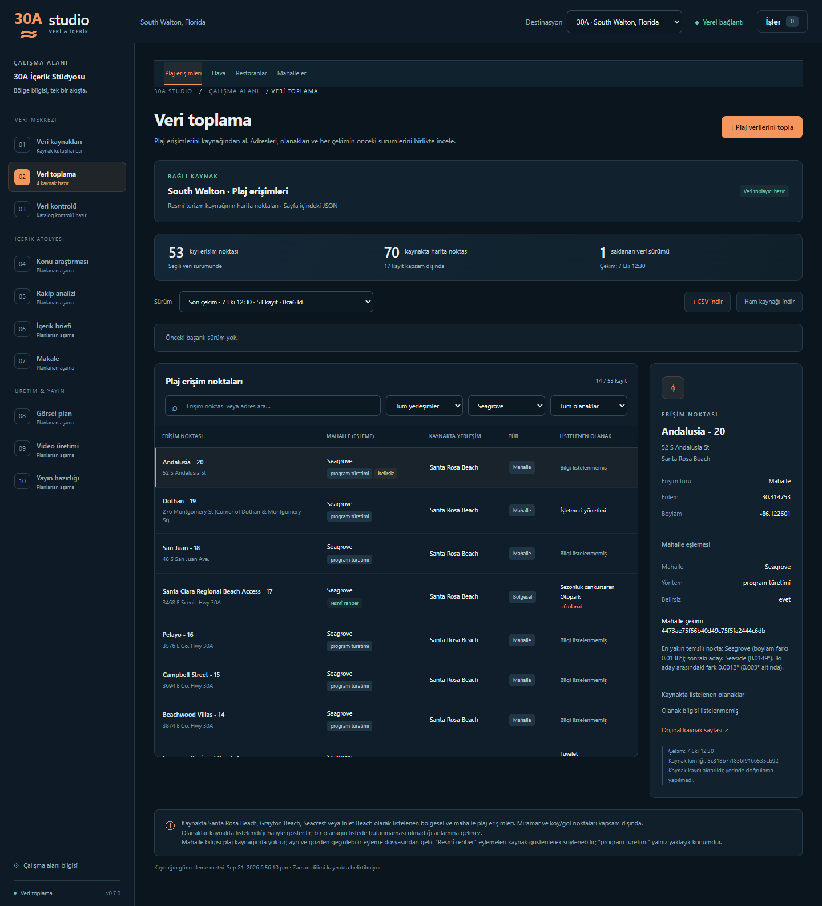

# M7 · Mahalle verisi ve plaj–mahalle eşlemesi

**v0.7.0 — mahalle verisi ve plaj–mahalle eşlemesi.** Uygulama 0.7.0 · SQLite şema 7 · `south-walton-neighborhoods/1` · HTML · diff etkin. GÖREV-03 ile `gorev-03-mahalleler` dalında geliştirildi; main'e alma ve etiket kararı yöneticinindir. Eski `v0.7-lodging-inventory` dalı yalnız konaklama keşif belgesidir; bu sürümle ilgisi yoktur.

## 1. Mahalle toplayıcısı

### Kaynak ve kapsam

Kaynak [Visit South Walton mahalle dizinidir](https://www.visitsouthwalton.com/neighborhoods/): dizin sayfasındaki gömülü JSON (`var locations = [...]`, 16 kayıt) ve her mahallenin kendi sayfası (`/neighborhoods/<permalink>/`). robots.txt (7 Ekim 2026) yalnız `/userfiles/` ve `/search/` yollarını kapatıyor; dizin ve mahalle sayfaları açık.

Kapsam programın 13 kanonik mahallesidir. Kaynaktaki ad kanonik bölge adıyla birebir eşleşerek bağlanır; yazım farkları yalnız 30A profilindeki açık tabloyla kabul edilir (`NEIGHBORHOOD_ALIASES`: Blue Mountain → Blue Mountain Beach, Watercolor → WaterColor, Watersound → WaterSound). Miramar Beach, Seascape ve Sandestin kapsam dışıdır ve `excluded_count`'a girer. Kaynağa yeni ve tanınmayan bir mahalle eklenirse o da kapsam dışı sayılır ve run metadata'sında `unknown_neighborhoods` olarak raporlanır. Hedef 13 mahalleden biri dizinde yoksa çekim başarısız olur. Adres, koordinat veya permalink'ten mahalle çıkarılmaz.

Toplayıcı 30A'ya özeldir: kaynak kaydı `destination_id=30a` değilse bağlanmaz.

### Saklanan alanlar (`neighborhood_records`)

| Alan | Anlamı |
|---|---|
| `external_id` | Kaynağın 24 haneli kayıt kimliği |
| `name` | Kaynaktaki ad |
| `permalink`, `page_url` | Kaynaktaki sayfa yolu ve tam adresi |
| `canonical_region_id` | Kanonik bölge kimliği (`regions`) |
| `summary` | Dizindeki kısa tanıtım cümlesi; yoksa NULL |
| `latitude`, `longitude` | **Kaynağın temsilî noktası; mahalle merkezi değildir.** Sınır veya alan bilgisi taşımaz. |
| `tags` | Kaynak etiketleri (Walkable, Tranquil, Family vb.), tekil ve sıralı JSON dizi |
| `source_modified` | Kaynak kaydının kendi `modified` değeri (UTC, `+0000`); `fetched_at` değildir |
| `page_intro` | Mahalle sayfasındaki tanıtım metni (`section#neighborhood-hero .copious` paragrafları); blok yoksa veya boşsa NULL |

Run düzeyindeki `source_updated`, seçilen kayıtların en yeni `modified` değeridir. Kaynakta listelenmeyen bir etiket, o özelliğin mahallede olmadığı anlamına gelmez.

**Metin kullanım notu:** Kaynak metinleri (kısa tanıtım, sayfa tanıtım metni, etiketler) yalnız iç araştırma kanıtıdır; **videoda aynen kullanılmaz, kendi cümlelerimizle ve atıfla kullanılır.**

### Doğrulama, güvenlik ve ham kayıt

- Dizin: tam bir `var locations` bloğu; JSON dizi; en çok 100 kayıt; 24 haneli tekil kimlik; tekil ad; slug biçiminde permalink; enlem 29,5–31,5 ve boylam −87,5…−85,0 aralığında sayı; geçerli etiket metni. Yinelenen kimlik, bozuk JSON veya beklenmeyen yapı çekimi durdurur.
- Sayfa: tek `section#neighborhood-hero`; `.hero-title h1 > span` içindeki ad dizindeki adla aynı olmalıdır (kimlik kontrolü). Birden fazla tanıtım bloğu belirsiz yapı sayılır. Yönlendirme dizin veya mahalle yolunu değiştiremez.
- HTTP: restoran toplayıcısıyla aynı sınırlar. Yalnız HTTPS, `visitsouthwalton.com`/`www.visitsouthwalton.com`, kimlik bilgisiz, varsayılan/443 port; bağlantı 10 sn, diğer aşamalar 20 sn zaman aşımı; yanıt başına 5 MB; en çok 3 yönlendirme; bağlantı/zaman aşımı/5xx için bir yeniden deneme; 429 doğrudan hata; istekler sıralı ve aralarında 0,1 sn; indirme sırasında iptal kontrolü.
- Ham kayıt: `data/raw/<run>/manifest.json`, `index/NNNN.html`, `pages/NNNN.html`. Manifest her yanıtın sırasını, istenen/son adresini, durumunu, içerik türünü, dosyasını ve SHA-256'sını tutar; manifestin kendi SHA-256'sı veritabanı katmanında diskteki baytlardan hesaplanır.
- Yayın: bütün sayfalar doğrulanınca kayıtlar ve run/job başarısı tek transaction'da yazılır. Hata veya iptal halinde kısmi kayıt yayımlanmaz; önceki başarılı sürüm değişmez.

### Diff

Kimlik kaynak kimliğidir. Ad, permalink, sayfa adresi, kanonik bölge, kısa tanıtım, temsilî nokta, etiketler (sıra farkı sayılmaz) ve sayfa tanıtım metni karşılaştırılır. Yalnız `source_modified` değişmişse kayıt "aynı" sayılır; bu alan CMS damgasıdır.

### Şema 7 ve migration

`neighborhood_records`: PK(`run_id`, `external_id`), UNIQUE(`run_id`, `canonical_region_id`); `run_id` → `source_runs`, `canonical_region_id` → `regions`; koordinat CHECK'leri; `tags` için JSON dizi kontrolü.

v6 → v7 mevcut kurallarla çalışır: açılışta `data/backups/` içine SQLite yedeği, tek transaction, `foreign_key_check`, hata halinde geri alma. Mevcut tablolar ve satırlar değişmez; 30A'da uyumlu bir mahalle kaynağı yoksa yalnız "South Walton · Mahalleler" kaynağı eklenir (kullanıcının eklediği veya arşivlediği uyumlu kaynak varsa ikinci kaynak eklenmez). Yeni kurulumda kaynak seed'den gelir.

### API ve ekran

- `GET /api/neighborhood-runs`: yalnız başarılı mahalle sürümleri (destinasyona göre).
- `GET /api/neighborhood-runs/{id}`: run, kayıtlar (batıdan doğuya), diff.
- `GET /api/neighborhood-runs/{id}/raw`: yalnız o run'ın ham dizinindeki `manifest.json`.

**Veri toplama → Mahalleler**: toplama düğmesi, sürüm seçimi, fark özeti, batıdan doğuya liste (temsilî nokta ve kaynak etiketleri) ve ayrıntı paneli (kanonik bölge, temsilî nokta notu, kaynak kaydı değişikliği, etiketler, açılır kapanır sayfa tanıtım metni).


## 2. Plaj erişimi–mahalle eşleme katmanı

### Yer ve ilke

Plaj kaynağında mahalle alanı yoktur. Eşleme, plaj toplayıcısından ve `beach_records` tablosundan ayrı, 30A'ya özel ve gözden geçirilebilir bir katmandır (`beach_records.canonical_region_id` NULL kalır).

- Dosya: `studio/destinations/thirty_a_beach_neighborhoods.csv`. 30A profilinin yanındadır; profil bunu `BEACH_NEIGHBORHOOD_MAPPING` ile gösterir ve dosya paket verisine dahildir. Sütunlar: `external_id, plaj_adi, bolge_id, yontem, kaynak, not, belirsiz` (`evet`/`hayır`).
- Üretici: `tools/plaj_mahalle_esleme.py`. Geliştirme aracıdır; veritabanını salt okunur açar. Dosya bir kez üretilip commit edilir; uygulama yalnız okur ve doğrular, çalışırken eşlemeyi yeniden hesaplamaz.
- API: `GET /api/beach-neighborhoods` (bootstrap içinde de gelir). Eşleme dosyası olan profil için doludur; diğer destinasyonlarda "dosya yok" döner. Dosya bozuksa ekran nedenini gösterir, uygulama çalışmaya devam eder.
- Ekran: **Veri toplama → Plaj erişimleri** tablosunda her erişimin yanında mahalle ve yöntem etiketi ("resmî rehber" / "program türetimi", gerekiyorsa "belirsiz"), mahalle filtresi ve ayrıntı panelinde eşleme kaynağı ile notu görünür. Dosyada olmayan bir plaj kimliği "eşlenmemiş" görünür ve filtrede ayrıca seçilebilir.

### Yöntem

1. **Resmî rehber.** GÖREV-02'deki `plaj-mahalle-onizleme.csv` dosyasının dolu 9 satırı olduğu gibi alınır. `yontem=resmi_rehber`; `kaynak` = [Guide to Beach Parking and Transportation](https://www.visitsouthwalton.com/blog/guide-beach-parking-transportation/) adresi ve yayın tarihi (2023-05-04); `not` = rehberdeki başlık, kayıt ve eşleşme türü.
2. **Program türetimi.** Kalan erişimler için mahalle çekimindeki 13 temsilî noktaya **boylam farkıyla** en yakın mahalle seçilir (kıyı doğu–batı uzandığı için boylam kullanılır). `yontem=turetim_en_yakin_mahalle_noktasi`; `kaynak` = kullanılan mahalle çekiminin run kimliği; `not` = seçilen ve sonraki adayın boylam farkları.
3. **Kısıt.** Resmî rehber Alys Beach ve Rosemary Beach başlıklarında "No Public Beach Access" diyor. Bu iki mahalleye hiçbir erişim atanmaz; daha yakın olsalar bile atlanır, sıradaki en yakın mahalle seçilir ve bu durum notta yazılır.
4. **Belirsizlik.** Atanabilir en yakın iki aday arasındaki boylam farkı 0,003 dereceden (yaklaşık 300 m) küçükse `belirsiz=evet` yazılır. Atlanan Alys/Rosemary noktaları bu ölçüme girmez; notta ayrıca belirtilir.

### Bu dosyanın girdileri

- Plaj çekimi `0ca63d2e5f0f4112a315441a88cfc5a7` (7 Ekim 2026, geçici deneme klasörü; 53 erişim). Kimlikler, adlar ve koordinatlar gerçek veritabanı kopyasındaki son plaj sürümüyle ve GÖREV-02 önizlemesiyle birebir aynı.
- Mahalle çekimi `4473ae75f66b40d49c75f5fa2444c6db` (7 Ekim 2026, geçici deneme klasörü; önceki çekim `b9ab4b58…` ile 13 kaydı aynı). Kullanılan noktalar: [mahalleler.csv](gorevler/GOREV-03/mahalleler.csv).

### Sonuç

53 erişim: **9 resmî rehber, 44 program türetimi; 2 satır belirsiz** (Greenwood - 21 → Seaside, Andalusia - 20 → Seagrove; Seaside ile Seagrove arasında).

| Mahalle | Erişim |
|---|---:|
| Dune Allen | 6 |
| Gulf Place | 4 |
| Santa Rosa Beach | 3 |
| Blue Mountain Beach | 4 |
| Grayton Beach | 4 |
| WaterColor | 0 |
| Seaside | 10 |
| Seagrove | 14 |
| WaterSound | 0 |
| Seacrest | 3 |
| Alys Beach | 0 (kısıt) |
| Rosemary Beach | 0 (kısıt) |
| Inlet Beach | 5 |

Kısıt bir erişimde devreye girdi: Winston Lane - 4 için en yakın nokta Rosemary Beach'ti (0,0039°); atlandı ve Inlet Beach (0,0042°) seçildi. WaterColor ve WaterSound'a hiç erişim atanmaması yalnız bu türetmenin sonucudur; "o mahallede plaj erişimi yok" anlamına gelmez (rehber bu iki başlıkta yalnız otopark bilgisi veriyor).

### Doğrulama

Aynı türetme 9 resmî eşlemeye de uygulandı: **9'un 8'inde aynı sonuç.** Fark: **Walton Dunes - 8** — resmî rehber Seagrove diyor, türetme WaterSound seçiyor (WaterSound noktasına 0,0157°, Seagrove'a 0,0215°). Tablo: [esleme-dogrulama.csv](gorevler/GOREV-03/esleme-dogrulama.csv).

Bu oran temkinli okunmalıdır: resmî 9 eşlemenin 8'i bölgesel erişimdir ve aynı sonucu veren 8 erişim mahalle noktasına çok yakındır (0,0000–0,0104°). Türetilen 44 erişimin 43'ü ise mahalle erişimidir ve iki mahalle arasında kalabilir; farklı çıkan tek örnek (Walton Dunes - 8) de resmî listedeki tek mahalle erişimidir. Rehberin Seacrest başlığı ad vermeden "3 neighborhood beach access" diyor; türetme de Seacrest'e 3 erişim atadı (Gulf Lakes Estates - 7, Seabreeze - 6, Seacrest Dr - 5). Adlar rehberde olmadığı için bu bir doğrulama sayılmaz.

### Videoda kullanım dili

- "Resmî rehber" eşlemeleri kaynak (Visit South Walton park ve ulaşım rehberi, 2023-05-04) gösterilerek söylenebilir.
- "Program türetimi" eşlemeleri yalnız yaklaşık konum bilgisi olarak kullanılır ("Seagrove civarında" gibi); kesin mahalle iddiası yapılmaz. Belirsiz satırlarda iki komşu mahalle birlikte anılır.

### Yeniden üretim

Depo kökünden (veritabanı salt okunur açılır; varsayılan girdiler 30A'daki son başarılı plaj ve mahalle çekimleridir):

```text
.venv\Scripts\python.exe -X utf8 -m tools.plaj_mahalle_esleme --data-dir <veri-klasörü> --dogrulama docs\gorevler\GOREV-03\esleme-dogrulama.csv
```

`--plaj-run` ve `--mahalle-run` belirli çekimleri seçer; `--resmi` resmî eşleme dosyasını, `--cikti` yazılacak dosyayı değiştirir. Yeni bir üretim, gözden geçirildikten sonra ayrı bir commit olarak alınmalıdır.

## 3. Testler ve canlı kontroller

Testler sentetik fixture ve `MockTransport` kullanır; canlı ağ yoktur (`tests/fixtures/neighborhoods/`, `tests/test_neighborhoods.py`, `tests/test_beach_neighborhoods.py`, `tests/frontend.test.mjs`). Kapsananlar: 16 kayıtlık dizinden 13 seçim ve 3 dışlama, eksik hedef mahalle, bozuk/belirsiz JSON, yinelenen kimlik, tanıtım metni olmayan sayfa (NULL), yazım tablosu, bilinmeyen mahalle, sayfa kimliği ve yönlendirme kontrolleri, HTTP sınırları, yeniden deneme, iptal, atomik geri alma, diff, v6 → v7 migration ve geri alma, kaynağın yinelenmemesi, destinasyon yalıtımı; eşleme dosyasının okunması ve doğrulanması, API, üretici yöntemi (kısıt, belirsizlik, resmî satırlar) ve ekrandaki gösterim/filtre.

7 Ekim 2026 canlı denemesi (`work/gorev-03/temp-data`, gerçek `data/` kullanılmadı): mahalle çekimi 16 kayıt okudu, 13 mahalle kaydetti, 3 kaydı kapsam dışı saydı; 14 ham yanıtın hepsi HTTP 200, alt SHA-256'lar ve manifest özeti doğrulandı; 13 mahallenin hepsinde sayfa tanıtım metni vardı; ikinci çekimin farkı 0 eklendi · 0 kaldırıldı · 0 değişti · 13 aynı. Gerçek veritabanı kopyasında v6 → v7 denemesi yedek aldı, `foreign_key_check` boş döndü, mevcut satırlar korundu ve yalnız mahalle kaynağı eklendi. Ayrıntılar: [GÖREV-03 raporu](gorevler/GOREV-03/RAPOR.md).


