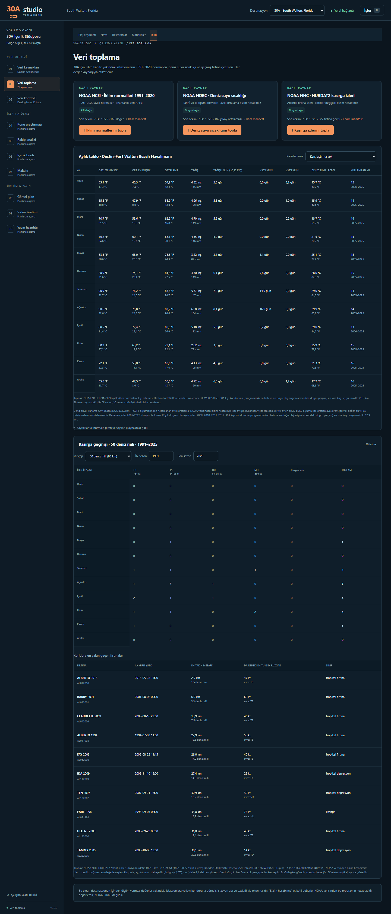

# M8 — İklim verisi: normaller, deniz suyu sıcaklığı, kasırga geçmişi

Tarih: 7 Ekim 2026 · Görevler: GÖREV-05 (paket), GÖREV-06 (kasırga evre kuralı) · Uygulama `0.9.0` · Şema `9`

Bu belge ilk videonun "ne zaman gitmeli" sorusu için kurulan iklim paketini anlatır: üç toplayıcı, yapılandırma, hesap yöntemleri, veri modeli, arayüz, migration, testler, 7 Ekim 2026 sonuçları ve sınırlar. Kaynak keşfi: `docs/gorevler/GOREV-02/KAYNAK-KESFI.md` Alan 4 ve 5.

## 1. Veri dili

- Bu paket destinasyonun içinden ölçüm vermez. Her değer kaynağıyla, istasyon adıyla ve uzaklığıyla etiketlenir. "30A'nın iklimi" denmez; "30A'ya en yakın kıyı istasyonu Destin'in 1991–2020 normali" denir.
- Hesapladığımız değerler (deniz suyu yıl-ay ve çok yıllı ortalamaları, °C/mm dönüşümleri, kasırga geçişleri, sayıları ve sınıfları) "NOAA verisinden bizim hesabımız" diye işaretlenir; NOAA ürünü değildir.
- "En yakın kıyı istasyonu" ifadesi 7 Ekim 2026'da doğrulandı: NCEI arama API'sinde (`/access/services/search/v1/data`, `dataset=normals-monthly-1991-2020`, 30,0–30,9° K ve 85,5–86,7° B kutusu, 19 istasyon) **sıcaklık normali olan** istasyonlar içinde 30A kıyı koridoruna en yakını Destin–Fort Walton Beach Havalimanı'dır (20,5 km); ikinci NW Florida Beaches Intl Havalimanı (USW00073805, 21,7 km). Yalnız **yağış** normali olan iki gönüllü gözlem istasyonu daha yakındır: Panama City Beach 5.9 WNW (US1FLBY0010, 6,0 km) ve Freeport 3.4 S (US1FLWT0002, 14,0 km). Bunlar kullanılmadı (bkz. §10).
- Dönemler farklıdır ve her yerde yazılır: normaller 1991–2020; deniz suyu 2005–2025 arasında dosyası bulunan yıllar; kasırga geçişleri bütün HURDAT2 sezonları (arayüz ve CSV'de dönem okuma anında seçilir).
- **Video dönemi (yönetici kararı, GÖREV-06):** videoda kasırga rakamları 1991–2025 dönemiyle verilir ve dönem açıkça söylenir.

## 2. Genel tasarım

Üç toplayıcı da generic çekirdektedir; başka destinasyonlarda da kullanılır. Destinasyona özel olan her şey SQLite'ta destinasyon kapsamlı yapılandırmadan gelir (hava örnek noktalarındaki gibi):

| Tablo | İçerik |
|---|---|
| `destination_climate_stations` | `destination_id, station_key, kind (normals / water_temperature), station_id, label, role, latitude, longitude, distance_km, distance_basis, first_year, sort_order, enabled` |
| `destination_storm_corridors` | `destination_id, label, west_latitude/longitude/reference, east_latitude/longitude/reference, radii_nmi (JSON dizi), enabled` |

`ConnectorContext` bu kayıtları `climate_stations` ve `storm_corridor` olarak taşır. 30A'nın ilk değerleri `studio/destinations/thirty_a.py` profilindedir (`CLIMATE_STATIONS`, `STORM_CORRIDOR`, `CLIMATE_DISTANCE_BASIS`) ve v8 migration'ı tarafından yalnız bir kez yazılır; sonradan düzenlenen yapılandırmanın üzerine yazılmaz. Yapılandırması olmayan bir destinasyonda toplayıcı ağa çıkmadan "yapılandırılmamış" hatasıyla durur.

**Uzaklık tanımı.** "30A kıyı koridoru", programdaki en batı ve en doğu plaj erişimi arasındaki büyük çember doğru parçasıdır: Stallworth Preserve (`5c81ab02f836f9166348e96c`, 30.35548, −86.2638) – Lupine - 1 (`5c81a6a2f836f9166348e961`, 30.2713, −85.99579). İstasyon uzaklığı bu doğru parçasına en kısa kuş uçuşu uzaklıktır (`studio/sources/geo.py`, küre yarıçapı 6371,0088 km, 0,1 km'ye yuvarlanmış): Destin 20,5 km (batı ucuna), DeFuniak Springs 44,1 km, PCBF1 12,9 km (doğu ucuna). Bir test, profildeki değerlerin bu hesapla aynı olduğunu denetler.

**Akış.** Generic `source_collection → job → source_run → ham dosya → atomik yazım` akışı kullanılır. Her HTTP yanıtı `raw/<run>/responses/NNNN.*` olarak, `manifest.json` içinde istenen/son URL, durum kodu, içerik türü, zaman, bayt sayısı ve SHA-256 ile saklanır; çekimin `raw_sha256` değeri manifestin özetidir. İptal her istekten önce ve sonra denetlenir; hata veya iptal hiçbir kayıt yayımlamaz, önceki başarılı sürüm korunur.

**HTTP kuralları** (`studio/sources/climate_http.py`): yalnız https ve toplayıcının izinli alan adı; en fazla 3 yönlendirme, yalnız izinli alan adı içinde; ağ hatası ve 5xx için bir kez yeniden deneme; 429 hata; içerik türü ve boyut sınırı denetimi; istekler arasında 0,2 sn; `User-Agent: 30AStudio/0.8 (+https://github.com/bemonths/tatilya)`.

**robots.txt** (7 Ekim 2026): NCEI `/data*` ve `/orders*` yollarını kapatıyor; toplayıcı yalnız `/access/services/data/v1` veri API'sini kullanır. NDBC yalnız adı belirtilmiş üç botu (008, SemrushBot, SemrushBot-SA) engelliyor; genel kural yok. NHC `User-agent: *` için hiçbir yolu kapatmıyor.

**Sürüm farkı.** Üç toplayıcıda kayıt farkı özeti kapalıdır ve gerekçesi API'de görünür (`diff_reason`): normaller on yılda bir üretilen durağan üründür; deniz suyu ortalamaları geçmiş yıllık dosyalardan yeniden hesaplanır; kasırga geçişleri her HURDAT2 sürümünden yeniden hesaplanır.

## 3. `ncei-climate-normals` — 1991–2020 aylık normaller

| | |
|---|---|
| Kaynak | [NOAA NCEI U.S. Climate Normals](https://www.ncei.noaa.gov/products/land-based-station/us-climate-normals), anahtarsız veri API'si |
| İstek | `https://www.ncei.noaa.gov/access/services/data/v1?dataset=normals-monthly-1991-2020&stations=<istasyonlar>&startDate=0001-01-01&endDate=9996-12-31&dataTypes=<7 değişken>&includeAttributes=true&includeStationName=true&includeStationLocation=1&format=json` (tek istek) |
| 30A istasyonları | USW00053853 Destin–Fort Walton Beach Havalimanı (rol: kıyı referansı) · USC00082220 DeFuniak Springs (rol: iç kesim karşılaştırması) |
| Toplayıcı | `ncei-climate-normals/1`, yöntem API |

Değişken kodları API'de ve NCEI'nin 1991–2020 aylık normal belgesinde doğrulandı:

| Kod | Anlamı | Birim |
|---|---|---|
| `MLY-TAVG-NORMAL` | Aylık ortalama sıcaklık | °F |
| `MLY-TMAX-NORMAL` | Aylık ortalama en yüksek sıcaklık | °F |
| `MLY-TMIN-NORMAL` | Aylık ortalama en düşük sıcaklık | °F |
| `MLY-PRCP-NORMAL` | Aylık toplam yağış | inç |
| `MLY-PRCP-AVGNDS-GE010HI` | Yağışı en az 0,10 inç olan gün sayısı | gün |
| `MLY-TMAX-AVGNDS-GRTH090` | En yüksek sıcaklığı en az 90°F olan gün sayısı | gün |
| `MLY-TMIN-AVGNDS-LSTH032` | En düşük sıcaklığı en çok 32°F olan gün sayısı | gün |

**Bayraklar.** Her değerle `comp_flag_*` (tamlık), `meas_flag_*` (ölçüm) ve `years_*` (normale giren yıl sayısı) kaynaktaki gibi saklanır. NCEI belgesindeki anlamları: tamlık **S** standart (en az 24 yıl), **R** temsilî (en az 10 yıl; eksik aylar çevredeki istasyonlardan tahminle doldurulmuş), **P** geçici (en az 10 yıl; çevrede istasyon olmadığı için eksik aylar doldurulamamış), **E** tahmini (en az 2 yıl, çevre istasyonlardan istatistiksel tahmin); ölçüm **X** sıfır olmayan değer sıfıra yuvarlandı, **M** eksik (V, W, Y, Z de tanımlı). Arayüz bu açıklamayı bayrak listesinin altında gösterir.

**Eksik değer.** Kaynakta olmayan veya boş değişken NULL kalır (bayrakları da NULL); `-9999` gibi özel değerler (≤ −5555) sayı olarak saklanmaz, NULL olur ve çekim özetinde sayılır. Yapılandırılmış bir istasyon hiç dönmezse veya 12 ay tam değilse çekim başarısız olur.

**Birimler.** Veritabanında kaynağın birimleri (°F, inç, gün). Arayüz ayrıca °C = (°F − 32) × 5/9 ve mm = inç × 25,4 gösterir; bu dönüşümler bizim hesabımızdır.

## 4. `ndbc-water-temperature` — deniz suyu sıcaklığı

| | |
|---|---|
| Kaynak | [NOAA NDBC](https://www.ndbc.noaa.gov/) tarihî standart meteoroloji yıllık dosyaları: `https://www.ndbc.noaa.gov/data/historical/stdmet/{istasyon}h{yıl}.txt.gz` |
| 30A istasyonu | PCBF1 = NOS CO-OPS 8729210, Panama City Beach (30.213, −85.880); ilk yıl 2005 (yapılandırmada) |
| Denenen yıllar | İlk yıldan bir önceki UTC yılına kadar (7 Ekim 2026 çekiminde 2005–2025) |
| Toplayıcı | `ndbc-water-temperature/1`, yöntem Dosya |

**Yöntem.**
1. Her yılın dosyası indirilir ve ham olarak SHA-256 ile saklanır. 404 dönen yıl "dosyası olmayan yıl" olarak kaydedilir ve çekim sürer; başka hata çekimi durdurur; hiç dosya yoksa çekim başarısız olur.
2. Sütunlar başlıktaki adlarla bulunur (eski `YYYY MM DD hh mm …` ve yeni `#YY … ` + birim satırı biçimleri). `WTMP` (°C) okunur; NDBC'nin eksik değer işaretleri `99.0`, `999.0`, `9999.0` atlanır. Satırdaki sütun sayısı, tarih ve değer sıkı denetlenir.
3. Her yıl-ay için: geçerli ölçümlerin düz ortalaması, ölçüm sayısı ve ölçümü olan gün sayısı. Ham ölçümler veritabanına yazılmaz.
4. Çok yıllı aylık ortalama okuma anında hesaplanır: yalnız **en az 20 günü ölçümlü** yıl-aylar girer; her yıl eşit ağırlıktadır (yıl-ay ortalamalarının ortalaması). Kullanılan yıl sayısı, ilk ve son yıl ve dışarıda kalan yıl-ay sayısı birlikte verilir.

**Duyarlılık kontrolü.** Düz aylık ortalama yerine günlük ortalamaların ortalaması alınsaydı çok yıllı aylık değerler en fazla 0,01 °C değişirdi; yıl-ay değerlerinin yalnız 2'si (182'de) 0,1 °C'den fazla değişirdi. Ölçüm sıklığı 2005'te saatlik (günde ~24), 2008 ve sonrasında 6 dakikalıktır (günde ~240).

**Etiket.** "PCBF1 (Panama City Beach) ölçümlerinden hesaplanan aylık ortalama, kullanılan yıllar …; NOAA verisinden bizim hesabımız." Bu, istasyonun sensöründe ölçülen su sıcaklığıdır; 30A kıyısındaki deniz suyu sıcaklığıyla aynı olduğu doğrulanmadı (istasyon koridorun doğu ucuna 12,9 km).

## 5. `hurdat2-storm-proximity` — kıyı koridoruna yakın geçen fırtınalar

| | |
|---|---|
| Kaynak | [NOAA NHC](https://www.nhc.noaa.gov/data/) HURDAT2 Atlantik best track dosyası |
| Dosya adı | Her sürümde değişir. Toplayıcı veri sayfasındaki `/data/hurdat/hurdat2-YYYY-YYYY-AAGGYY.txt` biçimindeki **tek** bağlantıyı okur (Pasifik dosyası `hurdat2-nepac-…` ve biçim PDF'leri eşleşmez); bağlantı yoksa veya birden fazlaysa çekim durur. Dosya adı ve URL çekim kaydına ve `storm_corridor_snapshots.hurdat_file` alanına yazılır. |
| 30A koridoru ve yarıçaplar | §2'deki doğru parçası; 50 ve 100 deniz mili (92,6 / 185,2 km) |
| Toplayıcı | `hurdat2-storm-proximity/2` (GÖREV-06; yalnız tropikal ve subtropikal evreler), yöntem Dosya. `/1` çekimleri bütün evreleri sayıyordu; eski çekimler kendi sürümleriyle olduğu gibi kalır. |

**Yöntem.**
1. Başlık satırı (`AL011851, UNNAMED, 14,`) ve iz satırları ayrıştırılır; satır sayısı, koordinatlar ve zaman sırası denetlenir. Rüzgâr `-999` bilinmiyor demektir; sıfır sayılmaz.
2. Ardışık iz noktaları arasında 1 saatlik doğrusal ara değerleme (enlem, boylam ve rüzgâr). 15:30 gibi sinoptik olmayan noktalar korunur; ara değerleme her noktada yeniden başlar. Rüzgârı bilinmeyen bir uçta ara değer de bilinmiyor kalır. Ara noktanın evresi (HURDAT2 durum kodu) bulunduğu aralığın başındaki noktanınkidir.
3. Her saatlik noktanın koridor doğru parçasına en kısa büyük çember uzaklığı hesaplanır (uçların ötesinde en yakın uca uzaklık).
4. **Evre kuralı (yönetici kararı, GÖREV-06):** sayım ve sınıflandırma yalnız fırtınanın tropikal veya subtropikal olduğu evrelere göre yapılır. HURDAT2 durum kodlarından TD, TS, HU, SD ve SS kullanılır; EX (ekstratropikal), LO (alçak basınç), WV (tropikal dalga) ve DB (bozukluk) evrelerindeki noktalar daireye giriş, en yakın mesafe ve en yüksek rüzgâr hesabına girmez. Ara noktalar aralığın başındaki noktanın evresini taşır; bu yüzden bir TS noktasından sonraki EX noktasına kadar olan saatler TS sayılır, EX noktasının kendisi ve sonrası sayılmaz.
5. Fırtına başına: tropikal/subtropikal noktalardaki en yakın uzaklık (km ve deniz mili). Her yarıçap için: ize daire içinde ilk girilen saat (UTC) ve ayı; daire içindeki en yüksek sürekli rüzgâr (tam knot'a aşağı yuvarlanır, sınıf eşikleri tam knot olduğu için); bu rüzgâra göre sınıf **TD** < 34 kt, **TS** 34–63 kt, **HU** 64–95 kt, **MH** ≥ 96 kt (Saffir-Simpson 3 ve üstü); en yüksek rüzgârın olduğu andaki evre. Daireye birden fazla girip çıkan fırtına o yarıçapta bir kez sayılır.
6. Bir daireye **yalnız tropikal olmayan bir evrede** giren fırtına saklanmaya devam eder ama `non_tropical_only = 1` diye işaretlenir; bu satırda giriş, en yakın uzaklık ve rüzgâr o evrelerden ölçülür, sınıf boş kalır. İşaretli satırlar aylık sayımlara, sınıf tablolarına ve "en yakın geçen fırtınalar" listesine girmez; arayüz onları ayrı bir "sayılmayan" satırında adıyla ve evresiyle gösterir.
7. Bütün sezonlar saklanır; dönem seçimi okuma anında yapılır (arayüz, CSV).

**Sınırlar.**
- Sınıf daire içindeki en yüksek rüzgâra göredir; karaya çıkış şiddeti değildir. Bir fırtına 100 deniz mili içinde MH, 50 içinde daha zayıf olabilir.
- Evre, HURDAT2'nin altı saatlik noktalarındaki durum kodudur; evrenin iki nokta arasında tam ne zaman değiştiği bilinmez. Kural gereği ara noktalar aralığın başındaki evreyi taşır.
- `/1` sürümü (GÖREV-05) bütün evreleri sayıyordu; 1991–2025'te 50 deniz mili içindeki 20 geçişin 5'inde en yüksek rüzgâr tropikal olmayan veya subtropikal bir evredeydi (EX 2, LO 2, SD 1). `/2` ile değişen sayılar `docs/gorevler/GOREV-06/kasirga-v1-v2-fark.csv` içindedir.
- Mesafe fırtına merkezinin izine göredir; rüzgâr alanı daha geniştir. "50 deniz mili içinden geçti" 30A'da kasırga koşulları yaşandı demek değildir; tersine daha uzaktan geçen bir fırtına da etkili olabilir.
- Altı saatlik noktalar arasındaki gerçek iz bilinmez; doğrusal ara değerleme yaklaşıktır.
- Erken dönem kayıtları (uydu gözlemi öncesi) daha belirsizdir; 1851–1990 sayıları sonraki dönemle doğrudan karşılaştırılmamalıdır.

**`/2` sonuçları (7 Ekim 2026, aynı HURDAT2 dosyası `hurdat2-1851-2025-092326.txt`).** 1991–2025'te 50 deniz mili içinde sayılan fırtına 20'den 16'ya, 100 deniz mili içinde 37'den 33'e indi; kasırga gücündekiler (HU+MH) değişmedi (50 deniz milinde 5, 100'de 9). Sayımdan çıkanlar daireye yalnız tropikal olmayan evrede girenler: 50 deniz milinde Ida 2009 (EX), Five 2010 (LO), Nestor 2019 (EX), Fay 2020 (LO, fırtınanın öncü alçak basıncı); 100 deniz milinde Paloma 2008 (LO), Ida 2009, Five 2010, Fay 2020. Nestor 2019 ve Tammy 2005'te yalnız en yakın uzaklık değişti. Bütün sezonlarda işaretli satır: 50 deniz milinde 5, 100'de 5. Tablolar: `docs/gorevler/GOREV-06/kasirga-aylik-1991-2025-v2.csv`, `kasirga-v1-v2-fark.csv`.

**Video dili örneği.** "NOAA'nın HURDAT2 kayıtlarına göre 1991–2025 arasında merkezi 30A kıyısına 50 deniz mili (93 km) içinden geçen ve bu daire içinde kasırga gücünde rüzgâra ulaşan beş fırtına oldu; bu sayım NOAA verisinden bizim hesabımızdır."

## 6. Veri modeli (şema 8; şema 9'da `storm_passages.non_tropical_only`)

| Tablo | Satır | Not |
|---|---|---|
| `climate_normal_stations` | çekim × istasyon | istasyon kimliği, anahtar, rol, etiket, kaynaktaki ad, enlem/boylam/yükseklik, koridora uzaklık |
| `climate_normal_values` | çekim × istasyon × ay × değişken | `value` NULL olabilir; `unit`, `completeness_flag`, `measurement_flag`, `years` |
| `water_temperature_stations` | çekim × istasyon | denenen ilk/son yıl, `years_found`, `years_missing` (JSON) |
| `water_temperature_months` | çekim × istasyon × yıl × ay | `mean_c`, `observation_count`, `day_count` (1–31) |
| `storm_corridor_snapshots` | çekim | koridor, yarıçaplar, HURDAT2 dosya adı, sistem sayısı, ilk/son sezon |
| `storm_passages` | çekim × fırtına × yarıçap | ad, sezon, ilk giriş zamanı/ayı, en yakın km/deniz mili, en yüksek rüzgâr, sınıf, evre; şema 9'dan beri `non_tropical_only` (0/1; `/1` çekimlerinde 0) |

Yabancı anahtarlar çekime (`source_runs`) ve istasyon satırlarına bağlıdır; enlem/boylam, ay, gün sayısı, sınıf ve JSON alanları `CHECK` kısıtlarıyla korunur.

## 7. API ve arayüz

- `GET /api/climate-runs?destination_id=…` — destinasyonun başarılı iklim çekimleri.
- `GET /api/climate?destination_id=…` — yapılandırma ve her toplayıcının son başarılı çekiminin anlık görüntüsü (normallerde değerler ve değişken listesi; deniz suyunda yıl-ay tablosu ve çok yıllı özet; kasırgada koridor, geçişler ve sınıf adları).
- `GET /api/climate-runs/{id}/raw` — çekimin ham manifesti (yalnız `raw/<id>/manifest.json`).
- `bootstrap` içinde `climate_runs` ve `climate_connectors`.

**Veri toplama → İklim** sekmesi: üç kaynak kartı (düğme, son çekim, ham manifest bağlantısı); aylık tablo (kıyı referansı istasyonunun yedi değişkeni °F/inç ve altında °C/mm, isteğe bağlı iç kesim karşılaştırması; deniz suyu çok yıllı ortalaması ve kullanılan yıl sayısı/aralığı); bayraklar ve yıl sayıları (kaynaktaki gibi, NCEI açıklamasıyla); kasırga bölümü (yarıçap ve sezon aralığı seçimi, varsayılan 1991–son sezon; ilk giriş ayına ve sınıfa göre fırtına sayısı; koridora en yakın geçen 10 fırtına). Her tablonun altında kaynak ve "bizim hesabımız" etiketi vardır. Üç iş birlikte kuyruğa alınabildiği için (işler sırayla tek tek çalışır) arayüz biten her yeni iklim işinde listeyi yeniler.

## 8. Migration v7 → v8

Mevcut kurallarla: SQLite backup API ile `data/backups/studio-v7-<id>.sqlite3` yedeği, tek transaction, 8 tablo ve bir indeks, 30A yapılandırması (3 istasyon, 1 koridor) ve 3 kaynak ("NOAA NCEI · İklim normalleri 1991–2020" API, "NOAA NDBC · Deniz suyu sıcaklığı" Dosya, "NOAA NHC · HURDAT2 kasırga izleri" Dosya; kategori Hava, sıklık Haftalık). Destinasyonda aynı kaynak kimliğine sahip bir kaynak zaten varsa yenisi eklenmez. Sonra `foreign_key_check`; hata olursa her şey geri alınır ve şema 7 kalır. Toplama yöntemi listesine "Dosya" eklendi.

7 Ekim 2026: gerçek veritabanının `work/` kopyasında deneme (yalnız yeni tablolar ve 3 kaynak eklendi, eski satırlar aynı, `integrity_check` ok, `foreign_key_check` boş); ardından `data/` tam yedeği (`work/yedek/20261007-1533/`, 352 dosya) alınıp uygulama gerçek veriyle açıldı (uygulama yedeği `data/backups/studio-v7-ff556c8bc97447fca0bafa160eb7a9a7.sqlite3`) ve yalnız üç iklim toplayıcısı çalıştırıldı. Sayılar: `docs/gorevler/GOREV-05/RAPOR.md`.

**v8 → v9 (GÖREV-06):** aynı kurallarla (yedek, tek transaction, `foreign_key_check`, geri alma) `storm_passages` tablosuna `non_tropical_only INTEGER NOT NULL DEFAULT 0 CHECK (0/1)` sütunu eklenir; mevcut satırlar değişmez. 7 Ekim 2026: önce gerçek veritabanının `work/` kopyasında denendi (satır sayıları aynı, `integrity_check` ok, `foreign_key_check` boş); sonra `data/` tam yedeği (`work/yedek/20261007-1935/`, 380 dosya) alınıp uygulama gerçek veriyle açıldı (uygulama yedeği `data/backups/studio-v8-14fb0efcabd8429ebdb63c0fdb353ac9.sqlite3`) ve yalnız kasırga toplayıcısı çalıştırıldı (`/2` çekimi `4f23d0a2…`, 227 satır; `/1` çekimi olduğu gibi duruyor).

## 9. Testler

Canlı ağ yok; sentetik fixture'lar `tests/fixtures/climate/` (normal JSON'u, iki NDBC yıl dosyası, NHC veri sayfası, HURDAT2) ve `httpx.MockTransport`. Kasırga fixture'ı ekvator üzerinde bir test koridoru kullanır, (0, −87) → (0, −86); burada koridorun yanındaki bir noktanın uzaklığı tam olarak R × |enlem|'dir, beklenen değerler hesaptan bağımsızdır. `tests/test_climate.py` kapsamı: büyük çember ve doğru parçası uzaklığı (uçların ötesi dahil) ve profil uzaklıkları; HURDAT2 başlık/iz ayrıştırma ve yapı hataları; 1 saatlik ara değerleme (bilinmeyen rüzgâr, 15:30 noktası); yarıçap içi ilk giriş, en yakın uzaklık, sınıf, yeniden giriş, ay sınırı, rüzgârsız fırtına; sınıf eşikleri; aylık sayım ve dönem seçimi; evre kuralı (evre sınırında ara değerleme, yalnız EX evresinde daireye giren fırtına, TD→EX geçişi, SD ve SS evrelerinin sayılması); v8 → v9 migration ve geri alma; güncel dosya adının sayfadan okunması, tek bağlantı kuralı; HTTP yönlendirme, 5xx/429/403, içerik türü ve boyut sınırları; normallerde eksik değişken (NULL), boş değer, özel değer, bayrak ve yıl sayısı saklama, yapı hataları, robots kuralına uygun yol; NDBC eksik değer işaretleri, 20 gün kuralı (19/20 gün sınırı), yıl dosyası 404, ham dosyaların SHA-256'sı, biçim hataları; iptal (başlangıçta, istekler arasında, API üzerinden); her toplayıcı için atomik geri alma; v7 → v8 migration, yedek, geri alma, kaynağın yinelenmemesi, yapılandırmanın üzerine yazılmaması; şema kısıtları; destinasyon yalıtımı (başka destinasyonun istasyonları ve koridoru karışmaz, yapılandırmasız destinasyon ağa çıkmaz). `tests/frontend.test.mjs`: sekme ve iş yönlendirmesi, birim dönüşümleri ve eksik değerin sıfır gösterilmemesi, bayrak özeti, kasırga sayımı ve en yakınlar, düğme durumları, destinasyon değişimi, tablo etiketleri ve karşılaştırma.

## 10. Açık konular (yönetici kararı)

1. ~~Tropikal olmayan evreler~~ — karar verildi (GÖREV-06): yalnız TD, TS, HU, SD, SS evreleri sayılır (§5).
2. **Daha yakın yağış istasyonları.** Panama City Beach 5.9 WNW (US1FLBY0010, koridora 6,0 km, yalnız aylık yağış normali) ve Freeport 3.4 S (US1FLWT0002, 14,0 km) yağış için eklenebilir; değerlendirilmedi.
3. **PCBF1'de 2009–2012 yıllık dosyaları yok (404).** Çok yıllı ortalamalar 13–16 yıldan hesaplanıyor. Aynı istasyonun NOS CO-OPS verisi veya NDBC'nin başka dosyaları bu boşluğu doldurabilir; değerlendirilmedi.
4. **Nem.** Hazır bir bağıl nem normali yok (GÖREV-02); pakete eklenmedi.
