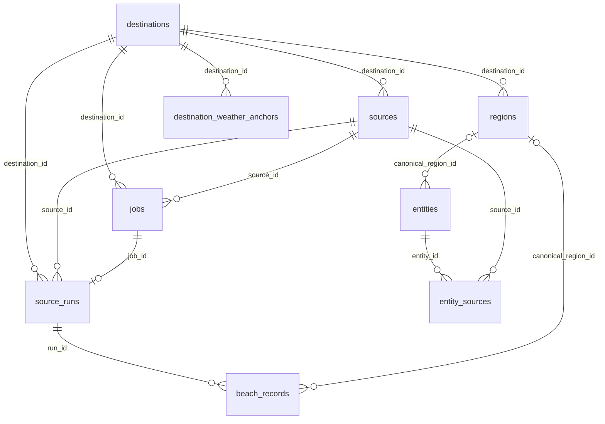

# 30A Studio — inceleme ve bağımsız proje mimarisi

29 Eylül 2026 incelemesi · 1 Ekim 2026 v0.6.0 güncellemesi

## Housing Atlas incelemesi

İnceleme, `C:\Users\1\source\repos\housing-atlas` altındaki kaynak kodu ve kullanıcının önceki konuşmadaki beş ekran görüntüsü üzerinden yapıldı. Bu klasörde hiçbir dosya düzenlenmedi, proje çalıştırılmadı ve yeni projeye dosya kopyalanmadı. `C:\Users\1\HousingAtlas` kaynak kodu değil, mevcut uygulamanın kullanıcı verisi klasörüdür; yalnızca üst düzey dosya adları incelendi, ayar ve veri içerikleri okunmadı.

**Gerçek teknoloji Python 3.12 + FastAPI/Uvicorn + HTML/CSS/JavaScript.** Önceki konuşmadaki PySide6/Qt tahmini doğru değil. Edge veya Chrome, yerel uygulamayı adres çubuğu olmayan bir pencerede gösteriyor.

| Alan | Kodda görülen yapı | İncelenen dosyalar |
|---|---|---|
| Uygulama | FastAPI uygulama fabrikası, yerel Uvicorn sunucusu, statik ön yüz | `pyproject.toml`, `atlas/app.py` |
| Başlatma | Boş port seçimi, tek uygulama denetimi, Edge/Chrome `--app` penceresi, kapanma bekçisi | `atlas/launcher.py`, `README.md`, `docs/TASARIM.md` |
| Arayüz | Çerçevesiz ES modülleri; adres parçasıyla ekran geçişi; ortak durum deposu; her aşama için ekran modülü | `atlas/web/js/app.js`, `store.js`, `screens/` |
| Görsel dil | CSS değişkenleri; lacivert yüzeyler, turuncu vurgu; sabit sol akış, üst bağlam çubuğu, tablo ve ayrıntı alanı, sağ iş paneli | `atlas/web/css/app.css`, ekran görüntüleri |
| Grafik | Ön yüzde bağımlılıksız SVG çizgi grafikleri; video tarafında Matplotlib ve ayrı sahne/render modülleri | `atlas/web/js/charts.js`, `pyproject.toml`, `atlas/studio/` dosya düzeni |
| Veri katmanı | Eyalet/adım klasörleri; JSON/CSV çıktıları; atomik JSON yazımı; tarihli önceki sürümler | `atlas/config.py`, `state.py`, `versions.py`, `docs/TASARIM.md` |
| Akış durumu | Hazır, çalışıyor, onay bekliyor, tamamlandı, hata ve eskimiş durumları; girdi değişince sonraki çıktıların eskime takibi | `atlas/state.py` |
| Playwright | Senkron Playwright arayüzü iş parçacığında; kurulu Chrome ile kalıcı profil veya açık Chrome'a CDP bağlantısı | `atlas/sources/redfin_listings.py:264` |
| Claude | CLI alt süreci; standart girdiden görev; akış halinde JSON olayları; model/efor/tur ayarları; araç izinleri; çıktı şeması ve anlam denetimleri | `atlas/ai/runner.py`, `stages.py`, `validate.py`, `atlas/steps/claude_run.py` |
| Görev kuyruğu | Bellekte FIFO kuyruk; iş başına iş parçacığı; varsayılan en çok dört çalışan; aynı iş türü ve eyalet için tekrar engeli; iptal ve süreç ağacı sonlandırma | `atlas/jobs.py` |
| Canlı ilerleme | Server-Sent Events; ilk bağlantıda iş listesi, sonra güncellemeler; sık olayları seyrekleştirme | `atlas/events.py`, `atlas/web/js/store.js` |
| Gizli bilgiler | Windows Kimlik Bilgisi Yöneticisi üzerinden `keyring`; HousingAtlas hizmet adı | `atlas/secrets.py`, `README.md` |

Bu tespitler mimari incelemedir; Housing Atlas için çalıştırma, entegrasyon testi veya genel kod denetimi yapılmadı. Özellikle canlı Claude ve Playwright davranışları bu çalışmada denenmedi.

## v0.6 destinasyon mimarisi

Python 3.12+, FastAPI/Uvicorn, bağımsız HTML/CSS/JavaScript ve SQLite kullanılır. Node derlemesi yoktur. Lacivert/turuncu görünüm ve sol üretim akışı korunmuştur. Bu sürümün amacı veri katmanını yeni kaynaklara hazırlamaktır.

| Katman | Gerçek davranış |
|---|---|
| app.py | Kaynak/job API, genel source-runs API, mevcut plaj ekranı/CSV uyumluluğu, SSE |
| database.py | Kaynaklar, source_runs, işler, transaction, sürüm farkı ve ham dosya izi |
| migrations.py | Atomik v2→v3 migration, bölge/entity şemaları, collections uyumluluk görünümü |
| jobs.py | Registry'den bulunan connector'ı tek çalışanlı kuyrukta çalıştırır; plaj import'u yok |
| sources/base.py | Connector Protocol, CollectionResult ve kontrollü hata türleri |
| sources/registry.py | Kaynak→connector eşleştirme; BeachesConnector, WeatherConnector ve RestaurantsConnector kayıtlı |
| sources/beaches.py | HTTP, parse/validate, plaj kayıtlarını yazma/okuma ve karşılaştırma alanları |
| destinations/ | İlk kurulum 30A profili ve iş başına SQLite ConnectorContext |
| diagnostics.py | Hata türü ve traceback konumları; exception metni ve locals kaydedilmez |
| web/collection.js | Aynı plaj ekranı; eklenen/kaldırılan/değişen/aynı kayıt özeti |

## Veri ilişkileri

jobs.source_id katalog kontrollerinde NULL'dır. Eski başarısız plaj işlerinin kaynak kimliği bilinmediği için migration sırasında source_runs.source_id de NULL olabilir; yeni kabul edilen çekimler kaynaklarını saklar. Başlangıç/bitiş, kaynak/connector sürümü, hata, ham dosya özeti ve sayılar run'da tutulur. İş ve queued run aynı transaction içinde başlar; domain kayıtları ve başarılı bitiş birlikte commit edilir.

beach_records, eski domain alanlarını korur; source_region_text ve nullable canonical_region_id eklenmiştir. city kaynak metnidir; canonical bölge olarak yorumlanmaz. entities ve entity_sources yalnızca şema temelidir. Otomatik entity matching, entity yönetim API/UI'si veya polygon mapping yoktur. Bu tablolar başlangıçta boştur.

## Migration ve veri koruma

Mevcut veritabanının SQLite backup API ile tutarlı kopyası data/backups içine alınır. DDL ve taşıma işlemleri tek transaction içindedir; executescript'in örtük commit davranışı kullanılmaz. Sonunda foreign_key_check denetlenir; v3→v4 hava tabloları ve v4→v5 restoran tabloları adımları sonrası şema 5 olur. Hata eski şemayı/veriyi korur. Yükseltme yeniden çalıştırıldığında tekrarlı kayıt oluşmaz.

Eski collections kayıtları aynı kimliklerle source_runs'a aktarılır. Beach satırlarının dış anahtarı değiştirilir. collections adı salt okunur bir uyumluluk görünümü olarak kalır; eski /api/collections, CSV ve ham kaynak uçları korunur. beach_collection istek değeri alias olarak kabul edilse de tüm yeni toplama işleri source_collection olarak kaydedilir. Eksik tarihsel bilgiler tahmin edilmez.

Yeni connector eklenirken kaynak desteği, okuma/doğrulama, domain saklama/okuma ve karşılaştırma metotları uygulanıp registry'ye eklenir. Yeni domain için migration/ekran gerekebilir; jobs.py veya genel API yönlendirmesine kaynak başına özel blok gerekmez. Uygulamanın özel plaj ekranı hâlâ plaj domain'ine aittir.

## Fark, yönlendirme ve teşhis

Fark raporu aynı source ve connector'ın önceki başarılı run'ını seçer. External_id esas alınır; başarısız ve iptal edilmiş çekimler atlanır. Olanakların sırası fark sayılmaz; eski satırlar değişmez. Ayrıntılı alan sözleşmesi [TEKNIK-CALISMA-MANTIGI-v0.6.md](TEKNIK-CALISMA-MANTIGI-v0.6.md) içindedir.

HTTP bağlayıcısı en fazla üç yönlendirmeyi yalnızca açık izin listesindeki visitsouthwalton.com veya www.visitsouthwalton.com, HTTPS ve varsayılan/443 port koşuluyla takip eder. İzin listesi dışındaki host, alt alan veya güvenli olmayan adres için istek yapılmaz. Ham HTML çalıştırılmaz. Boyut/zaman sınırları, sınırlı yeniden deneme ve iptal korunmuştur.

Beklenmeyen hata türü ve dosya adı/satır/fonksiyon konumları jobs.diagnostic içinde saklanır. Exception mesajındaki yaygın sır kalıpları gizlenir ve technical_message en fazla 500 karakter saklanır. Traceback yalnızca dosya adı/satır/fonksiyon içerir; kaynak satırı ve locals saklanmaz. Diagnostic normal API/SSE yanıtına katılmaz. Uygulama localhost içindir; uzaktan erişim için hesap/yetki sistemi eklenmemiştir.

## Kapsam sınırı ve doğrulama

Üç gerçek connector vardır: BeachesConnector (HTML içi JSON), WeatherConnector (NWS API) ve RestaurantsConnector (HTML dizin/detay). Claude/OpenAI, Playwright, scheduler, konu/makale/görsel/video üretimi bu sürümde yoktur. Sol içerik aşamaları plan ekranıdır. İçerik onayları ve veri değişince içerik eskime takibi ileride uygulanacaktır.

Testler migration, rollback, kalıcılık, genel connector/job, başarısız run, iptal, domain yazımının transaction bütünlüğü, diff, bölge/entity ilişkileri ve yönlendirmeleri kapsar. Test kodundaki ikinci sentetik connector, jobs.py/app.py özel kodu olmadan genel yolu doğrular; uygulama registry'sinde bulunmaz. Gerçek HTTP testlerde engellenir. GitHub Actions Python 3.12 üzerinde çalışır.

Kullanıcı veritabanının kopyasında 7 kaynak, 1 kaynak geçmişi, 1 eski başarılı run ve 53 plaj satırının korunduğu doğrulandı. Yeni sürümle yapılan canlı çekim yine 53 kayıt verdi; eski sürümle farkı 0 eklenen, 0 kaldırılan, 0 değişen ve 53 aynı kayıttı. Bu sayılar yalnızca o doğrulama anına aittir.

Tam çalışma akışı: [TEKNIK-CALISMA-MANTIGI-v0.6.md](TEKNIK-CALISMA-MANTIGI-v0.6.md). Geliştirme planı: [ASAMALAR.md](ASAMALAR.md).

Kaynak UI durumu genel connector metadata bilgisini kullanır; özel plaj bağlantıları yalnızca plaj connector sonuçlarına aittir. Diff, connector sürümleri farklı olsa da çalışır ve sürüm değişimini üç ek alanla bildirir. Ham SHA-256 yalnızca Database.record_raw_artifact() tarafından diskteki dosyadan hesaplanır; CollectionResult içinde ikinci hash alanı yoktur.

## v0.4 hava domain'i

`sources/weather.py` NWS HTTP, parse/doğrulama ve domain saklamayı; `sources/weather_anchors.py` sabit örnek noktaları ve provenance'ı taşır. HTML içindeki JSON kullanan plajın yanına resmî API kullanan ikinci connector eklenmiştir. `jobs.py` değişmeden generic source_collection yolu kullanılır. CollectionResult.related, kayıt sayısından ayrı lokasyon/alert ilişkilerinin records ile aynı transaction'da saklanmasını sağlar. Connector metadata'sında method ve diff_enabled vardır.

v3→v4 migration dört hava tablosunu ekler; mevcut domain kayıtlarını korur. Kaynaklarda yalnızca tam URL ve eski varsayılan alan değeri eşleştiğinde NWS notu ile NWS/plaj yöntemi güncellenir; kullanıcı değerleri korunur. weather_forecast_periods ve weather_alert_anchors composite foreign key ile run+anchor'a bağlıdır; uyarı ilişkisi ayrıca run+alert'e bağlıdır. Bütün dönem/saatlik kayıtlar saklanır, aktif uyarılar run bazında kimlikle tekilleştirilir. Null ölçümler korunur.

API `/points` üzerinden grid/forecast adreslerini çözümler; takip edilen URL ve yönlendirmeler HTTPS api.weather.gov ve varsayılan/443 ile sınırlandırılır. Retry, timeout, response size ve iptal sınırları vardır. `source.json` paketindeki yanıtlar atomik yazılır; ana artifact hash'i DB katmanında hesaplanır. Gerekli bir anchor verisi eksikse başarı/domain commit olmaz.

`web/weather.js` mevcut Veri toplama aşamasındaki Hava sekmesidir; tarayıcı yerel saatinden bağımsız points.timeZone kullanır. `web/connectors.js` domain hedeflerini seçer. Weather diff_enabled=False olduğu için generic kayıt diff'i kapalıdır. UI bütün dönemleri ve ilk 24 saatlik kaydı gösterir; veri tabanında tümü bulunur.

Batı/orta/doğu noktaları 53 Visit South Walton plaj kaydının boylam sıralamasından seçilmiş örneklerdir; canonical mahalle merkezi değildir. Ayrıntılar [M3-HAVA-VERISI](M3-HAVA-VERISI.md). Tarihsel iklim, istasyon gözlemi/current conditions, zamanlayıcı veya AI bağlantısı eklenmedi.

## v0.5 restoran domain'i

`studio/sources/restaurants.py` filtre keşfi, sayfalama, detay ayrıştırma, HTTP sınırları, manifest ve domain saklama/karşılaştırmayı içerir. `html_tree.py`, standart kütüphane HTMLParser üzerinde küçük bir ağaç sağlar; JavaScript/Playwright çalışmaz. `web/restaurants.js` mevcut görsel düzen içinde üçüncü toplama sekmesi, sürüm, diff, filtre ve ayrıntıları sunar. URL yönlendirmeleri `domainTarget` üzerinden seçilir.

`upgrade_v5` yalnızca restaurant_records/restaurant_regions ve gerekli index'leri ekler; varsayılan seed yöntemi/notunu tam eşleşme koşullarıyla düzeltir. Kayıtlar source_runs'a, mahalle ilişkileri restoran kaydına ve mevcut regions tablosuna bağlıdır. Opaque mahalle ID'leri sabitlenmez; 13 canonical isim doğrudan mevcut region ID'lerine eşlenir. Miramar Beach/Seascape/Sandestin ve Restaurants dışı türler alınmaz. Entity matching uygulanmaz.

Raw depolama ana manifest + ayrı HTML response dosyalarından oluşur. Snapshot yalnızca generic transaction başarıyla bittiğinde görünür. Liste/detay API'leri read-only'dir; raw endpoint yalnızca seçili run'ın manifestini indirir. Menü/fiyat, ratings/reviews, own-site crawling, scheduler ve AI kapsam dışında kalır. Güvenilir kaynak tarihi bulunmadığında source_updated NULL'dır. [Veri sözleşmesi ve testler](M4-RESTORAN-VERISI.md).

## v0.6 sınırları

`migration_v6.py` source/region global unique kısıtlarını destinasyon kapsamına taşır; jobs/runs/entities provenance ve FK alanları ekler. Bootstrap ve SSE sadece seçili destinasyonu okur. Frontend request nesli geçiş sonrası eski yanıtları reddeder. Direct ID endpoint’leri kararlı kimliklerle çalışır; bu yerel ayrım bir erişim yetkilendirme sistemi değildir. [M5 ayrıntıları](M5-DESTINASYON-KATMANI.md).
