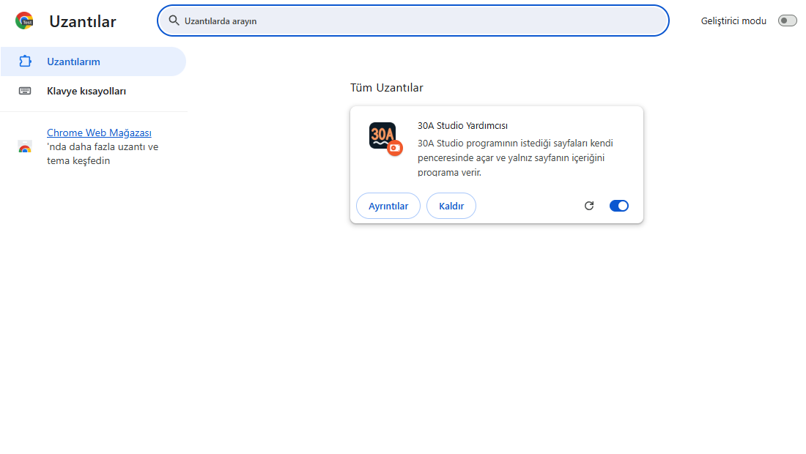
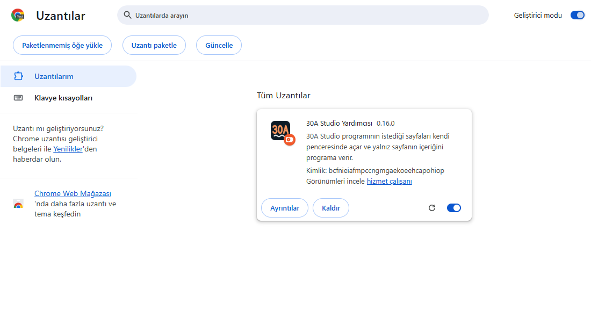
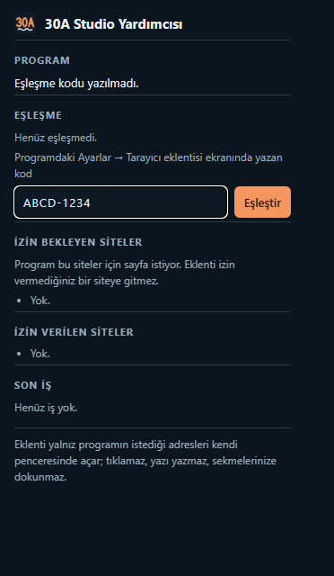

# 30A Studio Yardımcısı — kurulum (bir kez)

Bu eklenti, programın kendi tarayıcısının giremediği bazı sitelerin sayfalarını **sizin günlük Chrome'unuzda** açar ve yalnız sayfanın
içeriğini 30A Studio programına verir. Sayfaları kendi açtığı ayrı bir pencerede açar; sizin sekmelerinize, çerezlerinize, parolalarınıza
ve geçmişinize erişmez. Tıklamaz, yazı yazmaz, form doldurmaz. Giriş ve ödeme sayfalarını okumadan atlar. İzin vermediğiniz bir siteye
gitmez.

Kurulum beş dakikadan kısa sürer. Resimler Chrome'un Türkçe arayüzündendir.

## 1. Uzantılar sayfasını açın

Chrome'da adres çubuğuna `chrome://extensions` yazıp Enter'a basın.

## 2. Geliştirici modunu açın

Sayfanın sağ üstündeki **Geliştirici modu** anahtarını açın. Üstte üç düğme belirir.

## 3. Eklentiyi yükleyin

**Paketlenmemiş öğe yükle** düğmesine basın ve programın klasöründeki `eklenti` klasörünü seçin (Ayarlar → Tarayıcı eklentisi
ekranında klasörün tam yolu yazar). Listede "30A Studio Yardımcısı" kartı görünür (yukarıdaki resimdeki gibi).

## 4. Eklentiyi araç çubuğuna sabitleyin

Chrome'un sağ üstündeki yapboz simgesine tıklayın; listede "30A Studio Yardımcısı"nın yanındaki raptiyeye basın. Turuncu "30A" simgesi
araç çubuğunda kalır.

## 5. Eşleşme kodunu yazın

Programda **Ayarlar → Tarayıcı eklentisi** ekranında bir eşleşme kodu yazar (ör. `K7QM-3XRA`). Chrome'da 30A simgesine tıklayın, açılan
pencereye bu kodu yazıp **Eşleştir**'e basın. "Eşleşti" yazısı görünür. Kod yalnız sizin bilgisayarınızdaki programla eklenti arasındadır;
programda "Kodu yenile" ile değiştirilebilir (o zaman yeni kodu buraya yeniden yazarsınız).

## 6. Deneyin

Programda **Ayarlar → Tarayıcı eklentisi** ekranındaki **Deneme** düğmesine basın. Eklenti programın kendi yerel deneme sayfasını
açar (gerçek bir site değildir) ve sonuç aynı ekranda görünür.

---

## Kullanırken

- **Site izni:** Program bir site için ilk kez sayfa istediğinde eklentinin penceresinde o site "İzin bekleyen siteler" altında görünür.
  **İzin ver**'e basınca Chrome size sorar; izni siz verirsiniz. İzni aynı pencereden kaldırabilirsiniz.
- **Doğrulama sayfası** ("insan mısınız" kontrolü): Eklenti penceresini öne getirir ve "30A Studio: doğrulama bekleniyor" bildirimi
  gösterir. Doğrulamayı siz yaparsınız; eklenti bekler ve sonra devam eder. 15 dakika içinde geçilmezse o sayfa atlanır ve kayda
  yazılır.
- **Chrome kapalıysa:** Programın işi "eklenti bekleniyor" der. Chrome'u açmanız yeter; isterseniz İşler panelindeki
  "Programın tarayıcısına devret" düğmesiyle işi programın kendi tarayıcısına verebilirsiniz.
- **Hız:** Aynı sitede iki sayfa arasında en az 8 saniye beklenir ve bir anda tek sayfa açılır (Ayarlar'dan değiştirilebilir).
- **Kaldırmak:** `chrome://extensions` sayfasında karttaki **Kaldır** düğmesi.
